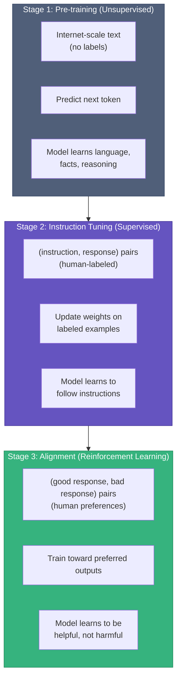
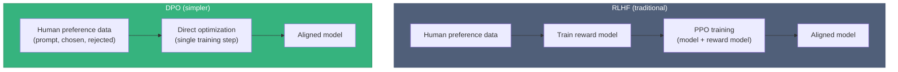
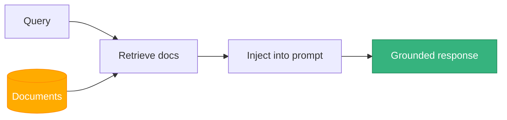
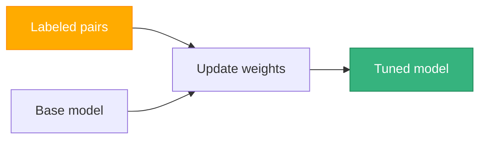
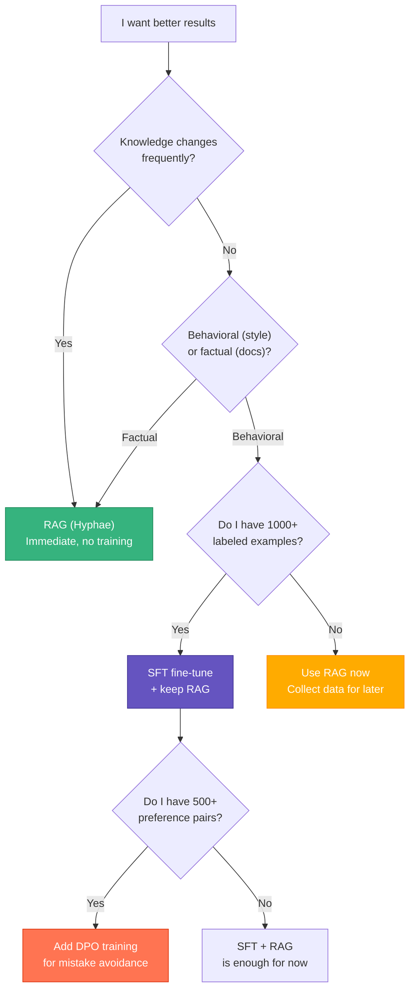
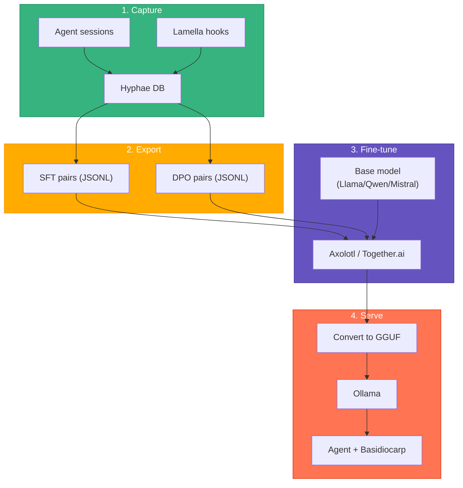

# AI Concepts & How They Map to Basidiocarp

This guide covers the core AI/ML concepts behind modern LLM infrastructure, compares them to AWS Bedrock's offerings, and explains where Basidiocarp fits. Written for developers who build with AI tools but haven't trained models themselves.

## Two Fields, Not One

**Machine Learning** and **AI Agents** are related but distinct:

- **Machine Learning** is about training models. Supervised learning, unsupervised learning, reinforcement learning — these are techniques for teaching a neural network to do something. The output is a model file (weights).
- **AI Agents** are applications built on top of trained models. They add planning, tool use, memory, and multi-step reasoning. The model is a component; the agent is the system.

Basidiocarp is agent infrastructure. It doesn't train models — it makes trained models more effective by giving them memory, context, and compressed inputs.

## Machine Learning Fundamentals

Three learning paradigms. A single LLM uses all three at different stages of its creation.



### Unsupervised Learning

The model reads raw text and finds patterns on its own. No human labels. The training objective is next-token prediction: given "The cat sat on the," predict "mat." Scale this to trillions of tokens and the model learns grammar, facts, reasoning patterns, and code syntax.

This is **pre-training** — the expensive part ($1M+, months on GPU clusters). Only done by large labs (Anthropic, OpenAI, Meta). You won't do this.

Unsupervised learning also appears in smaller contexts: clustering similar documents, detecting anomalies, dimensionality reduction. Hyphae's `extract_lessons` does a lightweight version — grouping memories by keyword overlap without predefined categories.

### Supervised Learning

You give the model labeled examples: (input, correct output) pairs. The model updates its weights to minimize the difference between its output and the correct answer.

This paradigm is used in **two** places:

1. **Pre-training** (partially supervised): some pre-training mixes next-token prediction with supervised objectives like "given this code, predict the docstring."
2. **Fine-tuning**: you take a pre-trained model and train it further on your (instruction, response) pairs. This is the practical one. When people say "fine-tuning" in the context of Bedrock or Together.ai, they mean supervised learning applied to an already-trained model.

Fine-tuning **is** supervised learning. It's not a separate technique — it's supervised learning applied to a model that's already been pre-trained instead of a fresh one.

| What | Data | Cost | Who does it |
|------|------|------|-------------|
| Pre-training | Unlabeled internet text | $1M+ | Large labs |
| Supervised fine-tuning (SFT) | Your (instruction, response) pairs | $10-100 | You, after 1000+ examples |

### Reinforcement Learning (RL)

The model takes actions, receives a reward signal, and learns to maximize reward. In the LLM context, this means:

1. Model generates a response
2. A reward signal scores it (human preference, or a trained reward model)
3. Model weights update to produce higher-scoring responses

This is **Stage 3** — alignment. It's how Claude and ChatGPT learned to be helpful rather than just coherent.

Two approaches:

**RLHF (Reinforcement Learning from Human Feedback):** Train a separate reward model on human preference data, then use PPO (Proximal Policy Optimization) to train the LLM against the reward model. Complex, unstable, requires careful tuning.

**DPO (Direct Preference Optimization):** Skip the reward model entirely. DPO reformulates the RLHF objective as a classification problem: given a (prompt, good response, bad response) triple, train the model to increase the probability of the good response and decrease the probability of the bad one. One training loop instead of two. More stable. Same results in practice.



DPO is the practical choice for fine-tuning with preference data. It needs (prompt, chosen_response, rejected_response) triples. Basidiocarp's correction hooks capture these naturally — every self-correction is a (rejected, chosen) pair.

### How the Paradigms Relate to Each Other

A common misconception: "supervised learning is for training, unsupervised is for something else." In reality, a single model goes through multiple paradigms:

```
Llama 3 lifecycle:
  1. Unsupervised pre-training     → learns language and knowledge
  2. Supervised fine-tuning (SFT)  → learns to follow instructions
  3. DPO alignment                 → learns to be helpful

Your fine-tuning:
  4. Supervised fine-tuning (SFT)  → learns your conventions
  5. DPO (optional)                → learns to avoid your common mistakes
```

Steps 1-3 happen at Meta. Steps 4-5 happen on your data, using Basidiocarp's captured memories and corrections.

---

## The Bedrock Landscape

```mermaid
flowchart TD
    subgraph Platform["AWS Bedrock"]
        Models["Models<br/>Host & serve LLMs"]
        Eval["Evaluations<br/>Benchmark quality"]
        Infer["Inference Optimization<br/>Speed & cost"]
        FT["Fine-tuning<br/>Adapt to your data"]
        KB["Knowledge Bases<br/>RAG pipeline"]
        Distill["Distillation<br/>Compress big → small"]
        Guard["Guardrails<br/>Content filtering"]
        DP["Data Protection<br/>PII, encryption"]
        Gov["Governance<br/>Audit, access control"]
        Halluc["Hallucination Controls<br/>Grounding checks"]
        Agents["Agentic AI<br/>Multi-step workflows"]
    end

    subgraph Basidiocarp["Basidiocarp Ecosystem"]
        Mycelium["Mycelium<br/>Token reduction"]
        Hyphae["Hyphae<br/>Memory + RAG"]
        Rhizome["Rhizome<br/>Code intelligence"]
        Lamella["Lamella<br/>Feedback capture"]
        Cap["Cap<br/>Dashboard"]
    end

    KB -.->|"equivalent"| Hyphae
    Infer -.->|"input-side"| Mycelium
    FT -.->|"data source"| Hyphae
    FT -.->|"data source"| Lamella
    Agents -.->|"infrastructure"| Basidiocarp
    Gov -.->|"partial"| Cap

    style Platform fill:#ff9900,stroke:#cc7a00,color:#fff
    style Basidiocarp fill:#36b37e,stroke:#1f8a5a,color:#fff
```



### Models & Infrastructure

**Models**: foundation neural networks (Claude, Llama, Mistral). Bedrock hosts them; you call an API. **Basidiocarp** doesn't provide models — it wraps around whatever model your MCP client uses.

**Evaluations**: measuring model quality on your tasks. Automated scoring, human-judged quality, A/B comparisons. **Basidiocarp** has qualitative evaluation (`extract_lessons`, Cap analytics) but no structured benchmarking framework.

**Inference Optimization**: making responses faster and cheaper (KV-cache, quantization, batching, speculative decoding). **Basidiocarp's Mycelium** reduces input tokens by 60-90%, which is inference optimization from the input side. They stack.

### Customization

**Fine-tuning**: supervised learning on your data. Bedrock handles GPUs and training loops. **Basidiocarp** captures the data (decisions, errors, corrections, session transcripts) but doesn't run training. See [LLM Training Guide](LLM-TRAINING.md).

**Knowledge Bases (RAG)**: managed retrieval-augmented generation. Upload docs, Bedrock chunks/embeds/retrieves. **Hyphae** does this locally: 3 chunking strategies, fastembed or HTTP embeddings, sqlite-vec vector storage, hybrid FTS5+cosine search.

**Model Distillation**: train a small model to mimic a large one. **Basidiocarp's** session transcripts are natural distillation data — every Claude session is a (task, expert_response) pair.

### Guardrails & Policy

**Responsible AI**: post-generation content filtering. **Basidiocarp** trusts the model's built-in safety.

**Data Protection**: PII detection, encryption, VPC isolation. **Basidiocarp** is local-first by default — SQLite on disk, tree-sitter on your machine. No data leaves unless you call a cloud API. No PII detection built in.

**Governance**: audit trails, access control, compliance. **Basidiocarp** has partial coverage: Mycelium tracks savings, Hyphae logs sessions, Cap shows telemetry. No IAM or compliance certification.

**Hallucination Controls**: grounding checks, citation generation. **Basidiocarp's** RAG reduces hallucination by grounding responses in actual project data. No explicit detection or citation system.

### Agentic AI

Multi-step workflows with tools, knowledge bases, and state. **Basidiocarp** is built for this:

| Agent capability | Basidiocarp |
|-----------------|-------------|
| Tool execution | Hyphae (35 tools) + Rhizome (37 tools) via MCP |
| Knowledge retrieval | Hyphae RAG + auto-context injection |
| Cross-session state | Hyphae memories + session tracking |
| Error learning | Lamella hooks + extract_lessons |
| Code understanding | Rhizome tree-sitter + LSP |
| Cost reduction | Mycelium token compression |

### Full Comparison

| Bedrock capability | Basidiocarp | Gap |
|-------------------|-------------|-----|
| Model hosting | Not provided | Use cloud APIs or Ollama |
| Evaluations | Partial (lessons, analytics) | No structured benchmarking |
| Inference optimization | Mycelium (input reduction) | No output-side optimization |
| Fine-tuning | Data capture only | Need external platform |
| Knowledge Bases (RAG) | Hyphae (full pipeline) | Local-first vs managed |
| Model distillation | Session data as source | Need external training |
| Guardrails | None | Trust model's built-in safety |
| Data protection | Local-first by default | No PII detection |
| Governance | Partial (telemetry, sessions) | No access control |
| Hallucination control | RAG grounding | No explicit detection |
| Agentic AI | Full infrastructure | Not an agent framework itself |

Bedrock is a **platform** — it hosts models, runs training, serves inference, enforces policy. Basidiocarp is **infrastructure** — it makes agents more effective regardless of which platform hosts the model. They're complementary. You could use Bedrock to host a fine-tuned model trained on Basidiocarp's data.

---

## When to Use RAG vs Supervised Learning vs Unsupervised Learning

These solve different problems. The choice depends on what kind of knowledge you're working with.

### RAG (Retrieval-Augmented Generation)

Finds relevant documents at query time, injects them into the prompt. The model's weights don't change. Knowledge stays external.

**Use when:**
- Knowledge changes frequently (code, docs, wiki)
- You need verifiable, sourced answers
- You want results now (no training step)
- You need to attribute claims to documents

**Don't use when:**
- The knowledge is behavioral ("write code in our style")
- You need the model to deeply internalize patterns



**Basidiocarp:** Hyphae provides the full pipeline.

### Supervised Learning (SFT Fine-tuning)

Updates model weights using labeled (input, correct output) pairs. The model internalizes patterns and conventions.

**Use when:**
- You want consistent style without prompting every time
- You have 1,000+ high-quality examples
- You're deploying a smaller model and need it to punch above its weight
- RAG alone isn't enough

**Don't use when:**
- Knowledge changes weekly (model is frozen after training)
- You have fewer than 500 examples
- Information is factual and sourced (RAG is better)



**Basidiocarp:** captures the training data. Hyphae memories become SFT pairs. Export and train externally.

### Unsupervised Learning

Finds patterns in unlabeled data. No (input, output) pairs. The model discovers structure.

**Use when:**
- You have raw data but no labels
- You want to discover structure you didn't define
- Pre-training a foundation model (you're probably not)

**Don't use when:**
- You know what output you want (use supervised)
- You need predictable, specific results

**Basidiocarp:** `extract_lessons` does lightweight unsupervised grouping. Memory decay is unsupervised — frequency-based importance without explicit labels.

### DPO (Direct Preference Optimization)

A specific form of reinforcement learning. Instead of training a separate reward model (RLHF), DPO directly trains the LLM on preference pairs: (prompt, good_response, bad_response). The model learns to increase the probability of preferred outputs.

**The math, simplified:** for each preference triple, DPO computes "how much more likely is the chosen response vs the rejected one?" and nudges the weights to increase that gap. One loss function, one training loop, no reward model.

**Use when:**
- You have preference data (chosen vs rejected responses)
- You want to teach the model to avoid specific mistakes
- SFT alone produces inconsistent quality

**Basidiocarp's connection:** every self-correction captured by `capture-corrections.js` is a natural DPO triple. The original code is "rejected," the corrected code is "chosen." After 500+ corrections, you have a usable DPO dataset.

### Decision Matrix



Start with RAG (Hyphae, works today). Collect training data passively (Lamella hooks). Fine-tune when you have enough data and RAG hits its limits.

---

## Self-Hosting Your Own Model

Complete pipeline from Basidiocarp data to a self-hosted fine-tuned model. See the [LLM Training Guide](LLM-TRAINING.md) for step-by-step instructions.



| Setup | GPU | Cost | Models |
|-------|-----|------|--------|
| Gaming PC | RTX 4090 (24GB) | $0 (owned) | Up to 32B quantized |
| Workstation | 2x RTX 4090 (48GB) | $0 (owned) | 70B quantized |
| Cloud spot | A100 80GB | ~$0.80/hr | Any size |

The fine-tuned model works with every Basidiocarp tool. Hyphae, Rhizome, Mycelium, Lamella don't care which model generates the text.

### RAG-First vs Fine-Tuning-First vs Combined

| Approach | Setup | Cost | Quality | Best for |
|----------|-------|------|---------|----------|
| RAG only (Hyphae) | Minutes | $0 | Good | Getting started, changing knowledge |
| Fine-tuning only | Days | $10-50/run | Good | Static conventions, consistent style |
| RAG + Fine-tuning | Days | $10-50 + $0 | Best | Production |

Combined is what production teams do: fine-tune for behavior, RAG for facts. Basidiocarp supports both paths.

## Related

- [LLM Training Guide](LLM-TRAINING.md) — practical fine-tuning steps
- [Hyphae: Training Data](https://github.com/basidiocarp/hyphae/blob/main/docs/TRAINING-DATA.md) — export formats, volume estimates
- [Lamella: Feedback Capture](https://github.com/basidiocarp/lamella/blob/main/docs/FEEDBACK-CAPTURE.md) — correction/error data flow
- [Hyphae: RAG Pipeline](https://github.com/basidiocarp/hyphae#rag-pipeline) — the RAG implementation
- [Technical Overview](../profile/README.md#technical-overview) — ecosystem architecture
