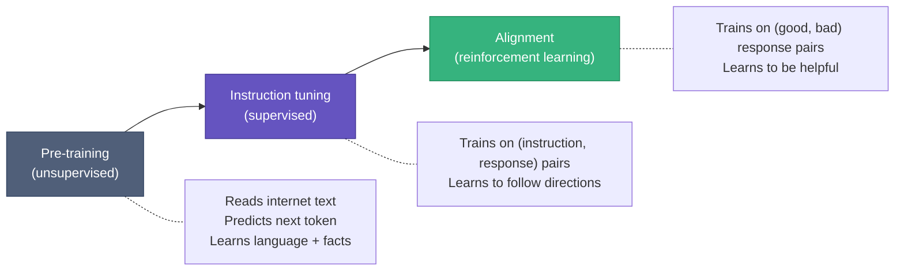
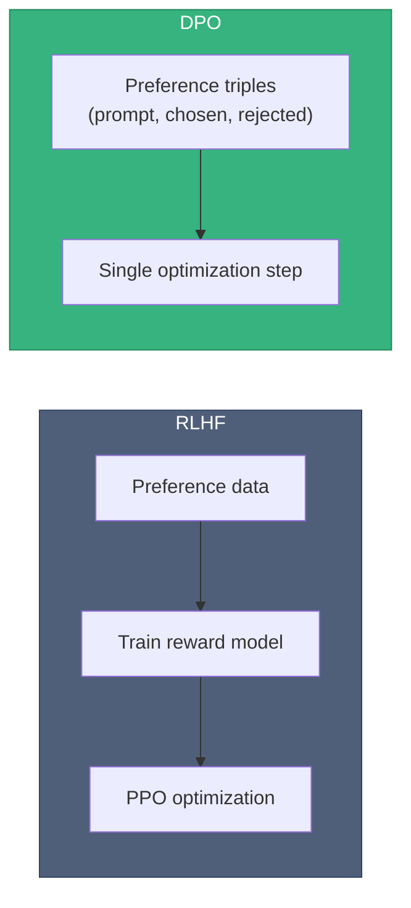
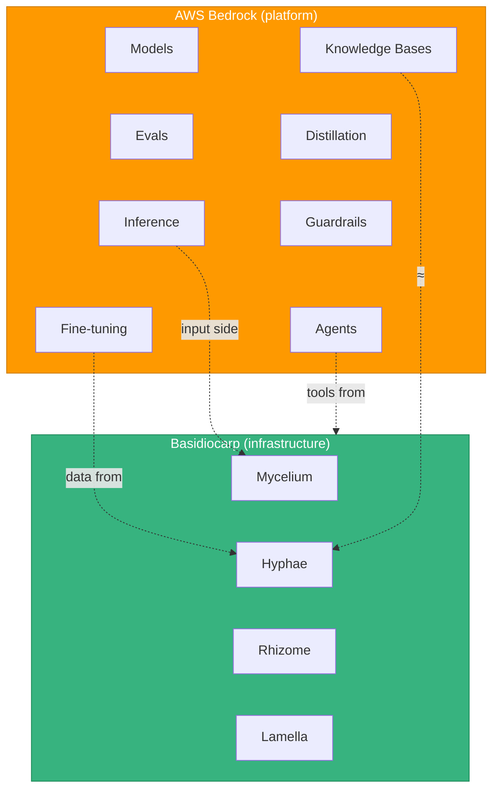
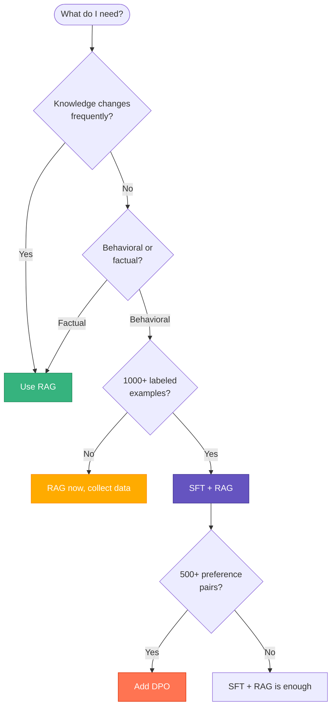
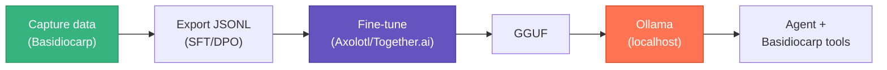

# AI Concepts & Basidiocarp

How ML and agent infrastructure relate, how they compare to AWS Bedrock, and where this ecosystem fits.

## ML vs Agents

Machine learning trains models. AI agents use them. Different disciplines, different outputs.

ML produces a model file — weights that encode knowledge. Agents wrap that model in a loop: observe, plan, act, observe again. The model is a component; the agent is the system.

Basidiocarp is agent infrastructure. It gives trained models memory, context, code intelligence, and compressed inputs. It never touches model weights.

## How an LLM Gets Built

A single LLM goes through three training stages, each using a different ML paradigm.



### Unsupervised Learning (Stage 1)

The model reads raw text and predicts the next token. No labels, no human curation. "The cat sat on the" → predict "mat." Scale to trillions of tokens and the model picks up grammar, facts, reasoning, code syntax.

This is pre-training. It costs $1M+, takes months on GPU clusters, and only happens at labs like Anthropic, OpenAI, and Meta. You won't do this.

Outside LLMs, unsupervised learning also covers clustering, anomaly detection, and dimensionality reduction. Hyphae's `extract_lessons` does a lightweight version: grouping memories by keyword overlap without predefined categories.

### Supervised Learning (Stage 2)

You provide (input, correct output) pairs. The model adjusts weights to minimize the gap between what it produces and what you wanted.

Two contexts where this matters:

1. Instruction tuning at the lab: the model learns to follow directions from curated (instruction, response) pairs.
2. Your fine-tuning: you take a pre-trained model and train it on your (instruction, response) pairs to learn your conventions.

Fine-tuning is supervised learning. Not a separate technique — just supervised learning applied to an already-trained model.

| Stage | Data | Cost | Who |
|-------|------|------|-----|
| Pre-training | Unlabeled text | $1M+ | Large labs |
| Your fine-tuning | Your (instruction, response) pairs | $10–100 | You, after 1000+ examples |

### Reinforcement Learning (Stage 3)

The model generates responses, gets scored, and updates weights to score higher next time. In the LLM context:

1. Model produces a response
2. A reward signal scores it
3. Weights shift toward higher-scoring outputs

Two approaches exist for alignment:

RLHF (Reinforcement Learning from Human Feedback) trains a separate reward model on human preferences, then uses PPO to optimize the LLM against it. Two training loops, finicky to tune.

DPO (Direct Preference Optimization) skips the reward model. Given a triple — (prompt, good response, bad response) — it directly trains the LLM to increase the probability of the good response and decrease the bad one. One loop, more stable, comparable results.



DPO is the practical choice when you have preference data. Basidiocarp's correction hooks produce natural DPO triples: every self-correction is a (rejected, chosen) pair.

### The Full Lifecycle

```
Meta builds Llama 3:
  1. Unsupervised pre-training     → language, facts, reasoning
  2. Supervised instruction tuning → follows directions
  3. DPO alignment                 → helpful, not harmful

You customize it:
  4. Supervised fine-tuning (SFT)  → your conventions
  5. DPO (optional)                → avoids your common mistakes
```

Steps 1–3 cost millions and happen once. Steps 4–5 cost $10–100 and use data Basidiocarp captures.

---

## Bedrock Comparison

AWS Bedrock is a platform: it hosts models, runs training, serves inference, enforces policy. Basidiocarp is infrastructure: it makes agents effective regardless of which platform serves the model. They're complementary.



| Bedrock | Basidiocarp | Notes |
|---------|-------------|-------|
| Model hosting | — | Use cloud APIs or Ollama |
| Evaluations | Partial (lessons, Cap analytics) | No structured benchmarks |
| Inference optimization | Mycelium (60–90% input reduction) | Different mechanism, stacks with server-side |
| Fine-tuning | Data capture (Hyphae + Lamella) | Export JSONL, train externally |
| Knowledge Bases | Hyphae RAG pipeline | Local SQLite vs managed cloud |
| Distillation | Session transcripts as source | Train externally |
| Guardrails | — | Trusts model's built-in safety |
| Data protection | Local-first by default | No PII detection |
| Governance | Partial (sessions, telemetry, Cap) | No IAM or compliance |
| Hallucination control | RAG grounding | No explicit citation |
| Agentic AI | Full tool infrastructure | Not an agent framework itself |

### Bedrock Concepts Explained

Models: the neural networks themselves. Bedrock hosts Claude, Llama, Mistral behind a single API. Basidiocarp wraps around whichever model your client calls.

Evaluations: structured benchmarking — run a model against test cases, score quality. Basidiocarp does qualitative feedback (lessons, analytics) but not formal benchmarking.

Inference optimization: KV-cache, quantization, batching, speculative decoding. Mycelium achieves the same cost/latency reduction from the input side by compressing what goes into the model.

Knowledge Bases: Bedrock's managed RAG. Hyphae does the same thing locally — chunk documents, embed, store in sqlite-vec, retrieve with hybrid FTS5 + cosine search.

Distillation: training a small model to mimic a large one. Session transcripts from Basidiocarp are natural distillation data.

Guardrails: content filtering, PII masking. Basidiocarp has none; everything runs local, which is its own form of data protection.

Agentic AI: multi-step tool-using workflows. Basidiocarp provides the tools (Hyphae 35, Rhizome 37 via MCP), the memory, the code intelligence, and the token compression that agents need.

---

## RAG vs Supervised vs Unsupervised

Different techniques for different problems.

### RAG

Retrieves documents at query time, injects them into the prompt. Weights unchanged. Knowledge stays external and updatable.

Use it when knowledge changes often, you need sourced answers, or you want results immediately. Hyphae provides this today.

Don't use it when the knowledge is behavioral (coding style, conventions) rather than factual.

### Supervised Fine-tuning

Updates model weights on labeled (input, output) pairs. The model internalizes patterns.

Use it when you want consistent behavior without prompting every time and you have 1,000+ examples. Knowledge gets baked into the weights, which means it doesn't change until you retrain.

Don't use it when knowledge changes weekly or you have fewer than 500 examples.

### Unsupervised

Finds patterns in unlabeled data. Discovers structure you didn't define. Pre-training is the big example; clustering and anomaly detection are smaller ones.

You won't use this directly unless you're building a foundation model.

### DPO

Trains the model on preference triples: (prompt, chosen response, rejected response). The model learns to prefer the good output over the bad one. Simpler than RLHF because it skips the reward model — one training loop, one loss function.

Use it after SFT when you have 500+ preference pairs and want to reduce specific failure modes. Basidiocarp's correction hooks produce these pairs automatically.

### When to Use What



The practical path: start with RAG (Hyphae, works today), collect training data passively (Lamella hooks), fine-tune when you have enough examples and RAG alone isn't cutting it.

---

## Self-Hosting

Run your own model instead of paying per token. The pipeline:



Use Basidiocarp with a cloud model for months. Memories, corrections, error resolutions, and session summaries accumulate in Hyphae. Export as JSONL. Fine-tune a Llama or Qwen model. Convert to GGUF, load into Ollama. Your agent now runs locally with all Basidiocarp tools working exactly the same — they don't care which model generates the text.

| Hardware | VRAM | Models | Cost |
|----------|------|--------|------|
| RTX 4090 | 24GB | Up to 32B quantized | $1,600 one-time |
| 2× RTX 4090 | 48GB | 70B quantized | $3,200 one-time |
| A100 (cloud spot) | 80GB | Any size | ~$0.80/hr |

A single RTX 4090 running a fine-tuned 32B model handles most coding tasks and pays for itself in about 2 months vs Claude API costs at moderate usage.

See the [LLM Training Guide](LLM-TRAINING.md) for step-by-step instructions with config files and commands.

### RAG vs Fine-tuning vs Both

| Approach | Setup | Ongoing cost | Best for |
|----------|-------|-------------|----------|
| RAG only | Minutes | $0 | Getting started, changing knowledge |
| Fine-tuning only | Days | $10–50/run | Static conventions |
| Both | Days | $10–50 + $0 | Production |

Production teams combine both: fine-tune for behavioral patterns, RAG for factual retrieval. Basidiocarp captures data for both paths.

## Related

- [LLM Training Guide](LLM-TRAINING.md) — step-by-step fine-tuning with Basidiocarp data
- [Hyphae: Training Data](https://github.com/basidiocarp/hyphae/blob/main/docs/TRAINING-DATA.md) — export formats, volume estimates, SQL queries
- [Lamella: Feedback Capture](https://github.com/basidiocarp/lamella/blob/main/docs/FEEDBACK-CAPTURE.md) — how correction/error data flows
- [Hyphae: RAG Pipeline](https://github.com/basidiocarp/hyphae#rag-pipeline) — ingestion, search, auto-context
- [Technical Overview](../profile/README.md#technical-overview) — ecosystem architecture
