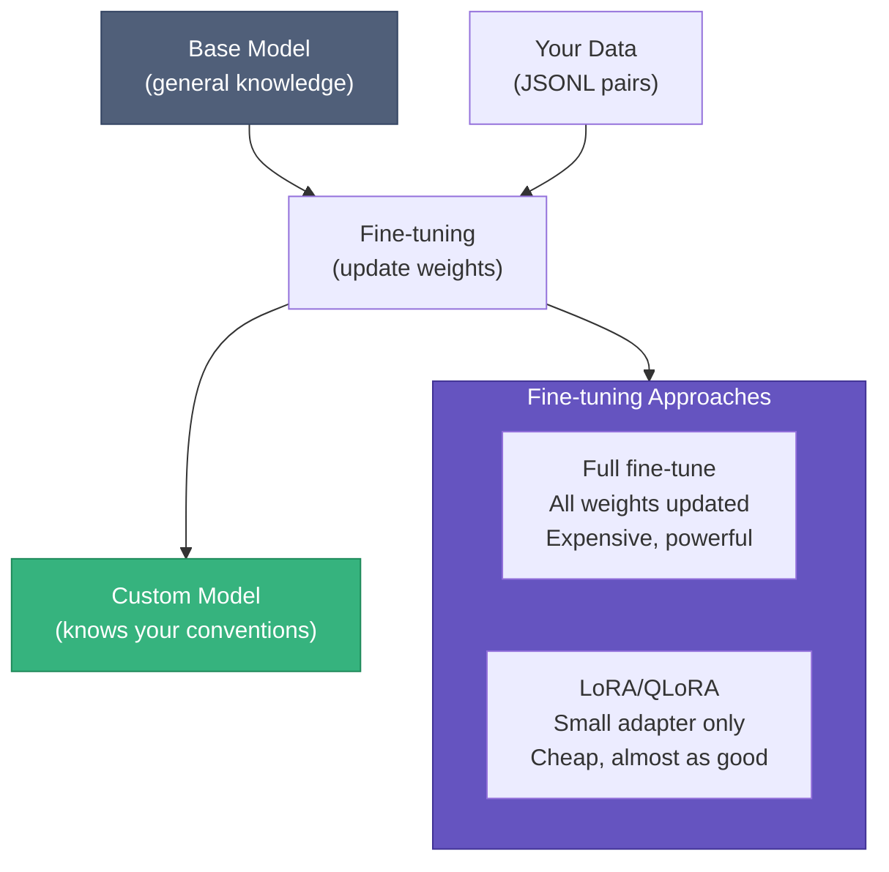
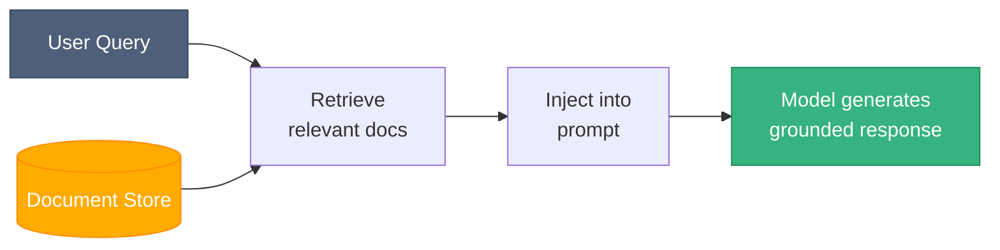
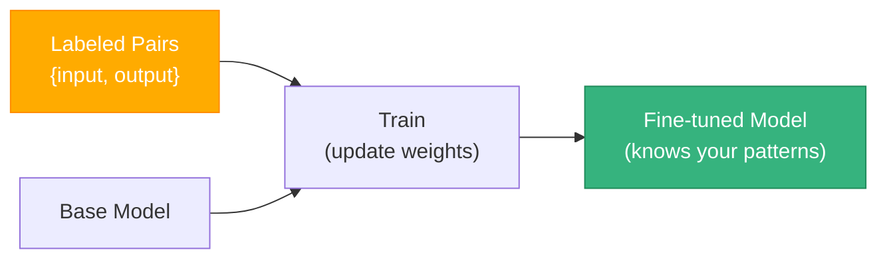
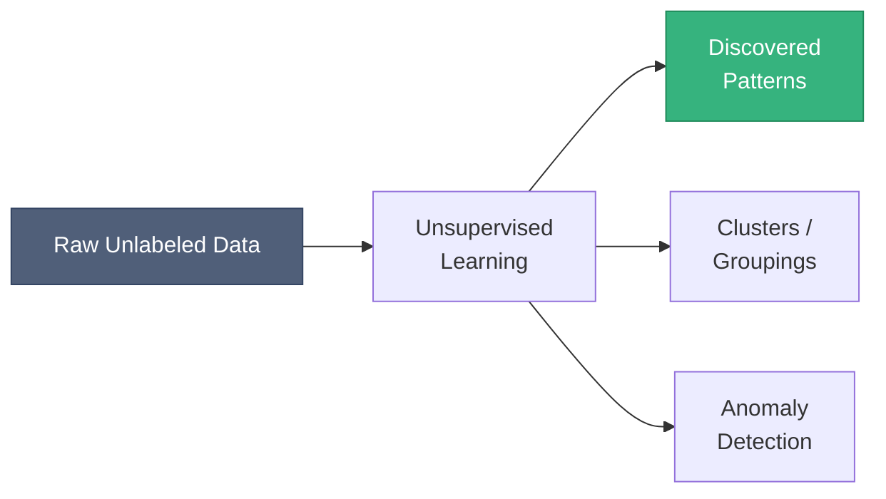
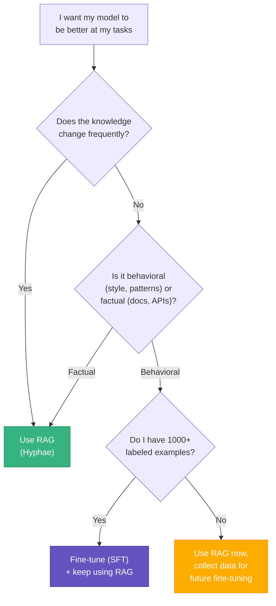
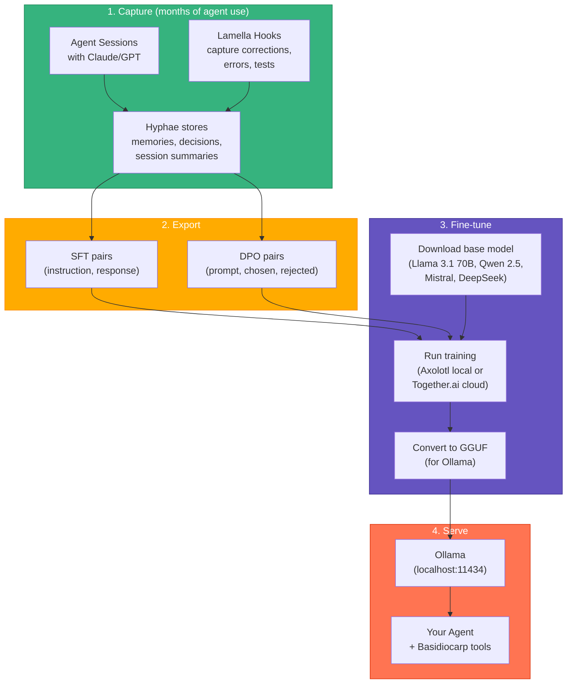
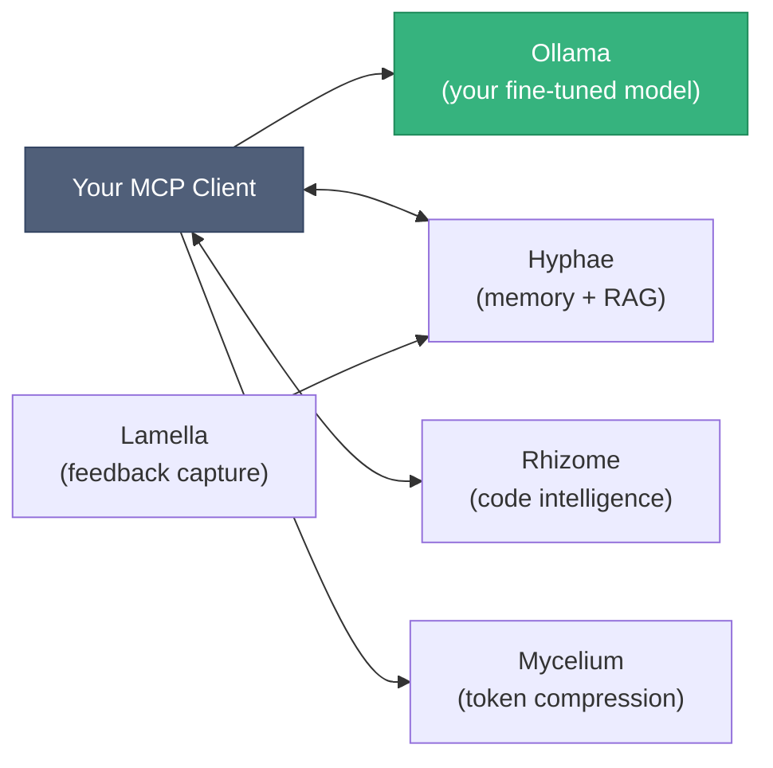

# AI Concepts & How They Map to Basidiocarp

This guide covers the core AI/ML concepts behind modern LLM infrastructure, compares them to AWS Bedrock's offerings, and explains where Basidiocarp fits. It's written for developers who build with AI tools but haven't trained models themselves.

## The Landscape

```mermaid
flowchart TD
    subgraph Platform["AI Platform (e.g., AWS Bedrock)"]
        Models["Models<br/>Host & serve LLMs"]
        Eval["Evaluations<br/>Benchmark quality"]
        Infer["Inference Optimization<br/>Speed & cost"]
        FT["Fine-tuning<br/>Adapt to your data"]
        KB["Knowledge Bases<br/>RAG pipeline"]
        Distill["Distillation<br/>Compress big → small"]
        Guard["Guardrails<br/>Content filtering"]
        DP["Data Protection<br/>PII, encryption"]
        Gov["Governance<br/>Audit, access control"]
        Halluc["Hallucination Controls<br/>Grounding checks"]
        Agents["Agentic AI<br/>Multi-step workflows"]
    end

    subgraph Basidiocarp["Basidiocarp Ecosystem"]
        Mycelium["Mycelium<br/>Token reduction"]
        Hyphae["Hyphae<br/>Memory + RAG"]
        Rhizome["Rhizome<br/>Code intelligence"]
        Lamella["Lamella<br/>Feedback capture"]
        Cap["Cap<br/>Dashboard"]
    end

    KB -.->|"equivalent"| Hyphae
    Infer -.->|"input-side"| Mycelium
    FT -.->|"data source"| Hyphae
    FT -.->|"data source"| Lamella
    Agents -.->|"infrastructure"| Basidiocarp
    Gov -.->|"partial"| Cap

    style Platform fill:#ff9900,stroke:#cc7a00,color:#fff
    style Basidiocarp fill:#36b37e,stroke:#1f8a5a,color:#fff
```



## Models & Infrastructure

### Models

A foundation model is a neural network trained on internet-scale data. It's a statistical function: text in, text out. The model's knowledge is frozen in its weights at training time. It doesn't learn from your conversations unless you fine-tune it.

Bedrock gives you Claude, Llama, Mistral, and others through a single API. You pick a model, send a prompt, get a response. AWS runs the GPUs.

**Basidiocarp:** doesn't provide or host models. It wraps around whatever model your MCP client uses. Claude Code talks to Claude's API; Cursor talks to its own backend. Basidiocarp never touches the model weights.

### Evaluations

Measuring how well a model performs on your tasks. You run it against a test set — 100 coding questions with known answers — and score accuracy. Without evaluation, you're guessing whether fine-tuning helped.

Evaluation types:
- **Automated**: exact match, BLEU score, code execution (does the output compile/pass tests?)
- **Human-judged**: reviewers rate quality on a rubric
- **A/B testing**: compare two models on the same prompts

**Basidiocarp:** `hyphae_extract_lessons` surfaces qualitative patterns. Cap's analytics show usage metrics. No structured benchmarking framework exists — you can't run "fine-tuned model vs base model on our 100 coding tasks."

### Inference Optimization

Making the model respond faster and cheaper. Techniques:

| Technique | What it does | Where it lives |
|-----------|-------------|---------------|
| KV-cache | Reuse computation across tokens in a sequence | Model server |
| Quantization | Reduce weight precision (32-bit → 4-bit) | Model conversion |
| Batching | Group multiple requests to fill GPU utilization | Serving framework |
| Speculative decoding | Small model drafts, big model verifies | Model server |
| Provisioned throughput | Reserved GPU capacity for consistent latency | Cloud platform |
| **Input reduction** | Fewer tokens in = less compute = faster + cheaper | **Mycelium** |

**Basidiocarp:** Mycelium reduces input tokens by 60-90%. Different mechanism than server-side optimization, but same outcome: lower cost and latency. They stack — use both for maximum savings.

## Customization

### Fine-tuning (Supervised Learning)

Taking a pre-trained model and training it further on your data. The model updates its weights (or a small adapter) to learn your patterns.



**Basidiocarp:** captures the data (decisions, errors, session transcripts). Doesn't run the training. See [LLM Training Guide](LLM-TRAINING.md) and [Hyphae Training Data](https://github.com/basidiocarp/hyphae/blob/main/docs/TRAINING-DATA.md).

### Knowledge Bases (RAG)

Bedrock's managed RAG. Upload documents, Bedrock chunks/embeds/stores them. At query time, relevant chunks are retrieved and injected into the prompt. The model sees fresh context without retraining.

**Basidiocarp:** Hyphae does exactly this. Chunking (3 strategies), embedding (fastembed or HTTP), vector storage (sqlite-vec), hybrid search (FTS5 + cosine). The difference: Bedrock is managed cloud; Hyphae is local SQLite.

### Model Distillation

Training a small model to mimic a large one. Run Claude on 10,000 prompts, record outputs, fine-tune Llama 8B on those (prompt, claude_response) pairs. The small model approximates the big model's behavior at 1/100th the cost.

**Basidiocarp:** session transcripts are natural distillation data. Every session where Claude solves a coding task is a (task, expert_response) pair. The ecosystem captures this data but doesn't run the distillation.

## Guardrails & Policy

### Responsible AI / Guardrails

Post-generation filters that block harmful outputs (hate speech, PII, dangerous instructions) before they reach the user. Configured as deny topics, word filters, content categories.

**Basidiocarp:** trusts the model's built-in safety. No output filtering layer.

### Data Protection

PII detection, encryption at rest/in transit, VPC isolation. Ensures company code and data stay within your control boundary.

**Basidiocarp:** strong by default. Everything is local-first — SQLite files on your disk, tree-sitter parsing on your machine, no cloud dependencies. Data only leaves when you call a cloud LLM API. No PII detection/redaction built in.

### Governance

Audit trails, access control, compliance. Who used the model, when, with what data, at what cost.

**Basidiocarp:** partial. Mycelium tracks command savings, Hyphae logs sessions, Cap shows telemetry. No access control, IAM, or compliance certification.

### Hallucination Controls

Grounding checks (does the response match retrieved documents?), citation generation, confidence scoring.

**Basidiocarp:** RAG via Hyphae reduces hallucination by grounding in actual project data. Code graphs from Rhizome provide real structure. No explicit detection or citation system.

## Agentic AI

Multi-step AI workflows. Define tools, knowledge bases, action sequences. The agent plans, executes, handles errors, maintains state.

**Basidiocarp:** this is the ecosystem's core purpose. It doesn't build agents — it's the infrastructure that makes them effective:

| Agent capability | Basidiocarp component |
|-----------------|----------------------|
| Tool execution | Hyphae (35 tools) + Rhizome (37 tools) via MCP |
| Knowledge retrieval | Hyphae RAG + auto-context injection |
| Cross-session state | Hyphae memories + session tracking |
| Error learning | Lamella hooks + hyphae_extract_lessons |
| Code understanding | Rhizome tree-sitter + LSP |
| Cost reduction | Mycelium token compression |

---

## When to Use RAG vs Supervised Learning vs Unsupervised Learning

This is the most common point of confusion. These are three different techniques that solve different problems.

### RAG (Retrieval-Augmented Generation)

**What it does:** finds relevant documents at query time and stuffs them into the prompt. The model's weights don't change.

**When to use it:**
- Your knowledge changes frequently (code, docs, wiki pages)
- You need the model to reference specific, verifiable sources
- You want results immediately (no training step)
- You need to attribute answers to source documents

**When NOT to use it:**
- The knowledge you want is behavioral ("write code in our style"), not factual
- Your retrieval corpus is too large for the context window even after chunking
- You need the model to deeply internalize patterns, not just reference them



**Basidiocarp:** Hyphae provides the full RAG pipeline. This is the default approach — works immediately, no training needed.

### Supervised Learning (Fine-tuning / SFT)

**What it does:** updates the model's weights using labeled (input, correct output) pairs. The model internalizes patterns.

**When to use it:**
- You want the model to consistently follow a style or convention without being told every time
- You have 1,000+ high-quality examples
- RAG alone isn't enough — the model needs to "just know" your patterns
- You're deploying a smaller model and need it to punch above its weight

**When NOT to use it:**
- Your knowledge changes weekly (the model is frozen after training)
- You have fewer than 500 examples
- The information is factual and sourced (RAG is better for this)



**Basidiocarp:** captures the training data. Hyphae memories (decisions, errors) become SFT pairs. Lamella corrections become DPO pairs. You'd export and train externally.

### Unsupervised Learning

**What it does:** finds patterns in unlabeled data. No (input, output) pairs — just raw data. The model discovers structure on its own.

**When it applies to LLMs:**
- **Pre-training** is unsupervised: the model reads internet text and learns to predict the next token. No human labels needed.
- **Clustering**: group similar memories by topic without predefined categories
- **Anomaly detection**: identify unusual agent behaviors or error patterns

**When to use it:**
- You have lots of raw data but no labels
- You want to discover structure you didn't know existed
- You're doing the initial pre-training of a foundation model (you're not doing this)

**When NOT to use it:**
- You know what you want the model to do (use supervised learning)
- You need specific, predictable outputs (unsupervised is exploratory)



**Basidiocarp:** `hyphae_extract_lessons` does a lightweight form of unsupervised learning — it groups memories by keyword overlap without predefined categories. The memory decay model is also unsupervised: frequently accessed memories surface naturally without explicit labeling.

### Decision Matrix



The practical answer for most teams: **start with RAG** (Hyphae provides this today), **collect training data passively** (Lamella hooks do this automatically), and **fine-tune later** when you have enough data and the RAG approach hits its limits.

---

## Self-Hosting Your Own Model

If you want to run your own model instead of calling Claude or GPT APIs, here's the complete pipeline using Basidiocarp data.

### Why Self-Host?

- **Privacy**: code never leaves your network
- **Cost**: $0 per token after hardware investment (vs $3-15/M tokens for cloud APIs)
- **Control**: customize model behavior, no API rate limits, no terms-of-service restrictions
- **Offline**: works without internet

### The Pipeline



### Step 1: Collect Data (Automatic)

Use Basidiocarp with a cloud model (Claude, GPT) for your normal coding work. The ecosystem captures training data passively:

| What's captured | How | Topic in Hyphae |
|----------------|-----|-----------------|
| Architecture decisions | Agent calls `hyphae_memory_store` | `decisions/{project}` |
| Error resolutions | `capture-errors.js` hook | `errors/resolved` |
| Self-corrections | `capture-corrections.js` hook | `corrections` |
| Test fix patterns | `capture-test-results.js` hook | `tests/resolved` |
| Session summaries | `session-summary.sh` hook | `session/{project}` |
| Code structure | Rhizome auto-export | Memoirs |

After ~200 sessions you'll have enough data for a useful SFT fine-tune. After ~500 sessions, enough for DPO.

### Step 2: Export Training Data

Export from Hyphae's SQLite database. Until `hyphae export-training-data` is built, query directly:

```bash
# SFT pairs from decisions
sqlite3 ~/Library/Application\ Support/hyphae/hyphae.db \
  "SELECT json_object('instruction', 'What is our convention for: ' || topic, 'response', summary) FROM memories WHERE topic LIKE 'decisions/%' AND weight > 0.3" \
  > sft_decisions.jsonl

# SFT pairs from error resolutions
sqlite3 ~/Library/Application\ Support/hyphae/hyphae.db \
  "SELECT json_object('instruction', 'How to fix: ' || substr(summary, 1, 100), 'response', summary) FROM memories WHERE topic = 'errors/resolved'" \
  > sft_errors.jsonl

# DPO pairs from corrections (requires parsing the summary field)
sqlite3 ~/Library/Application\ Support/hyphae/hyphae.db \
  "SELECT summary FROM memories WHERE topic = 'corrections'" \
  > raw_corrections.jsonl
```

### Step 3: Choose a Base Model

| Model | Size | VRAM needed | Strengths |
|-------|------|-------------|-----------|
| Llama 3.1 8B | 8B params | 8GB | Fast, good for task-specific fine-tuning |
| Llama 3.1 70B | 70B params | 48GB (quantized: 24GB) | Strong coding, close to Claude for many tasks |
| Qwen 2.5 Coder 32B | 32B params | 24GB | Best open-source coding model |
| Mistral 7B | 7B params | 8GB | Efficient, good base for LoRA |
| DeepSeek Coder V2 | 236B MoE | 48GB | State-of-art open coding (MoE = fast inference) |

For a solo developer with a consumer GPU (RTX 4090, 24GB): Qwen 2.5 Coder 32B quantized to 4-bit.

For a team with a server (A100 80GB or 2x RTX 4090): Llama 3.1 70B with QLoRA.

### Step 4: Fine-tune

**Option A: Local with Axolotl** (free, needs GPU)

```bash
pip install axolotl
axolotl train config.yaml
```

Minimal `config.yaml`:
```yaml
base_model: Qwen/Qwen2.5-Coder-32B-Instruct
dataset:
  path: ./sft_decisions.jsonl
  type: instruction
adapter: qlora
lora_r: 16
lora_alpha: 32
micro_batch_size: 1
num_epochs: 3
learning_rate: 2e-4
output_dir: ./output
```

Training time: ~2 hours on RTX 4090 for 5,000 examples.

**Option B: Cloud with Together.ai** (easiest, costs money)

```bash
# Upload dataset
together files upload sft_decisions.jsonl

# Start fine-tuning
together fine-tuning create \
  --model meta-llama/Llama-3.1-8B-Instruct \
  --training-file file_abc123 \
  --n-epochs 3
```

### Step 5: Convert and Serve

```bash
# Convert to GGUF (for Ollama)
python llama.cpp/convert.py ./output --outfile model.gguf --outtype q4_K_M

# Create Ollama model
cat > Modelfile <<'EOF'
FROM ./model.gguf
SYSTEM "You are a coding assistant trained on our team's conventions and patterns."
PARAMETER temperature 0.7
PARAMETER num_ctx 8192
EOF

ollama create myteam-coder -f Modelfile

# Test it
ollama run myteam-coder "How do we handle auth in our backend?"
```

### Step 6: Connect to Basidiocarp

Your self-hosted model works with every Basidiocarp tool. Point your MCP client at Ollama instead of a cloud API. Hyphae, Rhizome, Mycelium, and Lamella work identically — they don't care which model generates the text.



### Hardware Requirements

| Setup | GPU | VRAM | Models you can run | Monthly cost |
|-------|-----|------|--------------------|-------------|
| Consumer laptop | None (CPU) | N/A | 7B quantized (slow) | $0 |
| Gaming PC | RTX 4090 | 24GB | Up to 32B quantized | $0 (owned) |
| Workstation | 2x RTX 4090 | 48GB | 70B quantized | $0 (owned) |
| Cloud (on-demand) | A100 80GB | 80GB | Any size | ~$2/hr |
| Cloud (spot) | A100 80GB | 80GB | Any size | ~$0.80/hr |

For most solo developers or small teams: a single RTX 4090 ($1,600) runs a fine-tuned 32B model that handles most coding tasks. The investment pays for itself in ~2 months vs Claude API costs at moderate usage.

---

## Comparison: RAG-First vs Fine-Tuning-First vs Combined

| Approach | Setup time | Ongoing cost | Quality ceiling | Best for |
|----------|-----------|-------------|----------------|----------|
| RAG only (Hyphae) | Minutes | $0 (local) | Good — limited by context window | Getting started, changing knowledge |
| Fine-tuning only | Days | $10-50/run | Good — limited by training data | Static conventions, consistent style |
| RAG + Fine-tuning | Days | $10-50/run + $0 ongoing | Best — internalized patterns + fresh context | Production deployment |

The combined approach is what production teams do: fine-tune for behavioral patterns (coding style, conventions, common fixes), use RAG for factual retrieval (docs, recent decisions, code structure). Basidiocarp's data capture supports both paths.

## Related

- [LLM Training Guide](LLM-TRAINING.md) — practical fine-tuning steps with Basidiocarp data
- [Hyphae: Training Data](https://github.com/basidiocarp/hyphae/blob/main/docs/TRAINING-DATA.md) — data export formats and volume estimates
- [Lamella: Feedback Capture](https://github.com/basidiocarp/lamella/blob/main/docs/FEEDBACK-CAPTURE.md) — how correction/error data is captured
- [Hyphae: RAG Pipeline](https://github.com/basidiocarp/hyphae#rag-pipeline) — the RAG implementation
- [Technical Overview](../profile/README.md#technical-overview) — full ecosystem architecture
