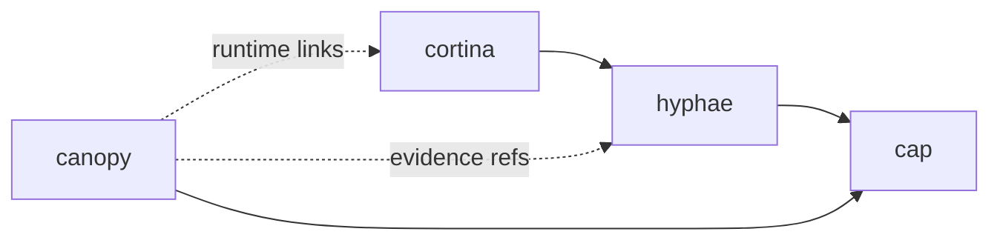

# Canopy

Use `canopy` when you need coordination runtime state, not just memory or lifecycle capture.

`canopy` is optional. Most single-agent setups do not need it.

## Use Canopy When

- multiple agents are active at the same time
- you need explicit task ownership
- you need handoff tracking
- you need operator attention views for active work
- you need coordination state that should not be overloaded into Hyphae memory

## Do Not Reach for Canopy When

- you only need long-term memory or recall
  - use `hyphae`
- you only need lifecycle capture
  - use `cortina`
- you only need install or repair flows
  - use `stipe`
- you only need a dashboard for memory and health
  - use `cap`

## Boundary

| Concern | Owner |
|---------|-------|
| task ownership and handoffs | `canopy` |
| long-term memory and recall | `hyphae` |
| lifecycle event capture | `cortina` |
| operator dashboard view | `cap` |
| install and host setup | `stipe` |

## Runtime Position

## Practical Rule

If the question is:

- "what happened?"
  - start with `hyphae`, `cortina`, or `cap`
- "who owns this task and what is blocked?"
  - start with `canopy`

## Related

- [Tool Selection](./TOOL-SELECTION.md)
- [Ecosystem Architecture](./ECOSYSTEM-ARCHITECTURE.md)
- [Cap](./CAP.md)
