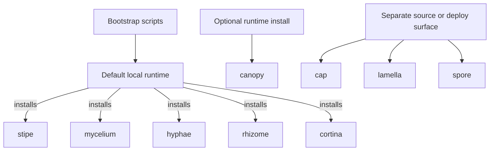

# What Gets Installed

Basidiocarp is an ecosystem repo. Not every project is a bootstrap-installed binary.

Use this page for the practical question: "What lands on my machine when I run the installer?"

## Bootstrap Scripts

The top-level bootstrap scripts install this default binary set:

- `stipe`
- `mycelium`
- `hyphae`
- `rhizome`
- `cortina`

Those scripts do not install every repository in the ecosystem. After the binaries land, `stipe init` configures supported hosts and editor integrations.



## Optional Runtime Tools

`canopy` is part of the ecosystem, but it is not installed by the bootstrap scripts today.

Install it when you want local coordination-runtime coverage:

```bash
stipe install canopy
```

Or install the broader runtime profile:

```bash
stipe install --profile full-stack
```

`canopy` is optional outside the coordination path. `stipe doctor` should surface it without failing the whole stack when it is absent.

## Source or Build Surfaces

These projects are part of Basidiocarp, but they are not installed by the bootstrap scripts as standalone local-user binaries:

- `cap`
  - Web dashboard and operator surface.
  - Run from source or deploy it separately.
- `lamella`
  - Packaging, templates, skills, commands, hooks, and exports.
  - Not an end-user binary.
- `spore`
  - Shared Rust library used by other tools.
  - Not installed directly.

## Project Map

| Project | Default bootstrap install | How you get it | When you need it |
|---------|---------------------------|----------------|------------------|
| `stipe` | Yes | Bootstrap scripts | Install, init, doctor, update, host setup |
| `mycelium` | Yes | Bootstrap scripts | Command shaping and token reduction |
| `hyphae` | Yes | Bootstrap scripts | Memory, recall, training-data export |
| `rhizome` | Yes | Bootstrap scripts | Code intelligence and code graph export |
| `cortina` | Yes | Bootstrap scripts | Lifecycle capture and session runtime |
| `canopy` | No | `stipe install canopy` or `stipe install --profile full-stack` | Multi-agent coordination runtime |
| `cap` | No | Run from source or deploy separately | Operator dashboard and review surface |
| `lamella` | No | Repo or packaged exports | Templates, skills, prompts, wrappers |
| `spore` | No | Dependency of other Rust tools | Shared editor and path primitives |

## Update Scope

There are two different update paths:

- `update.sh`
  - Legacy narrow updater for `mycelium`, `hyphae`, and `rhizome`
- `stipe update --all`
  - Ecosystem-aware updater

If you are operating the current stack, prefer `stipe update --all`.

## Related

- [Host Support](./HOST-SUPPORT.md)
- [Ecosystem Architecture](./ECOSYSTEM-ARCHITECTURE.md)
- [How the Projects Connect](./INTEGRATION.md)
