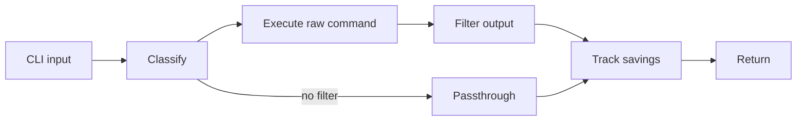
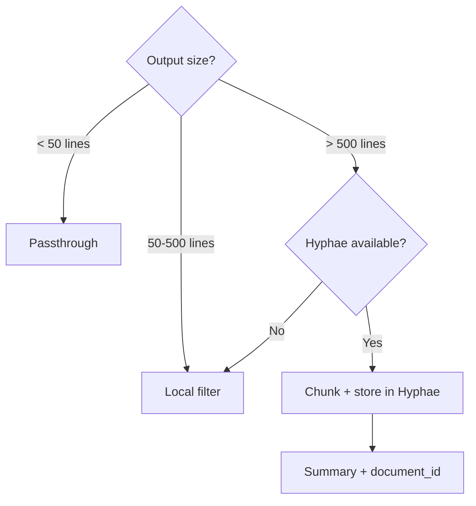
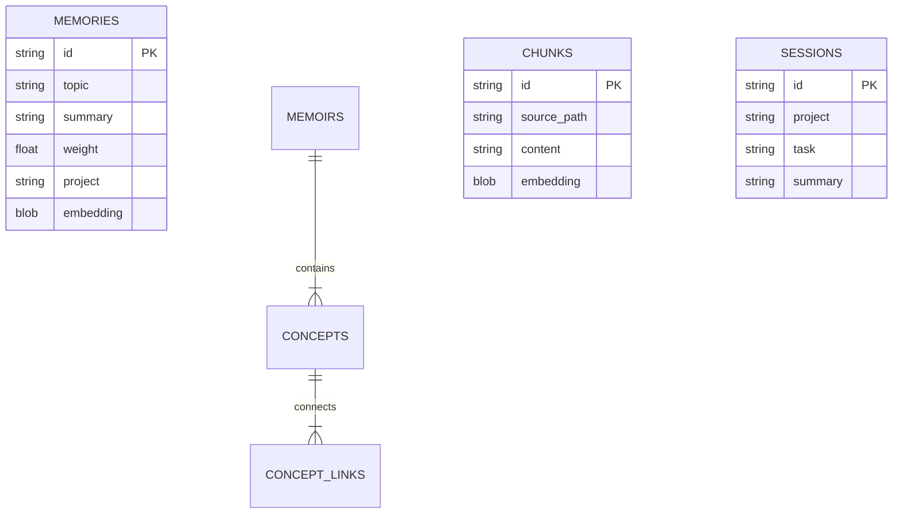
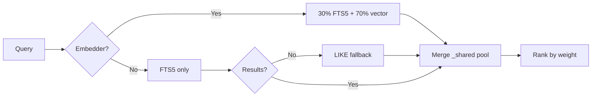
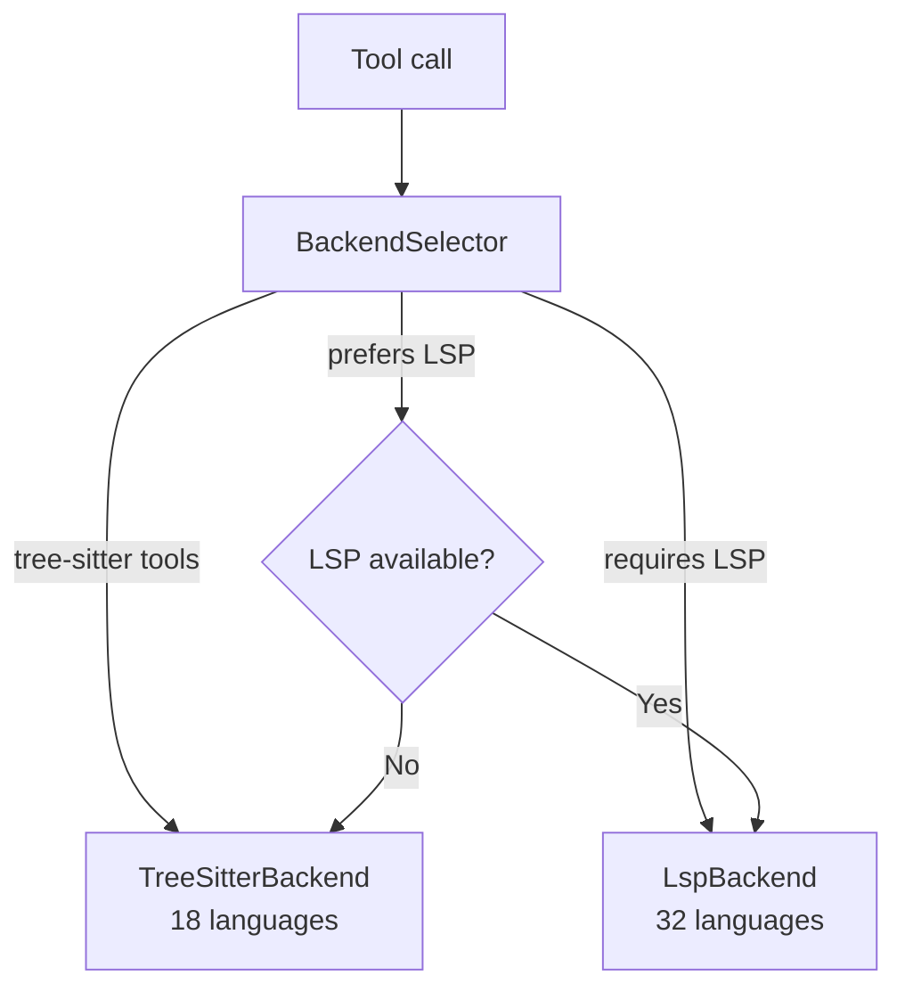
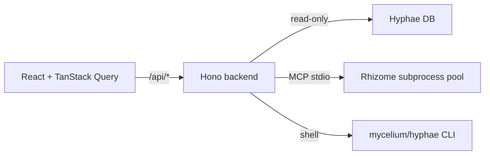
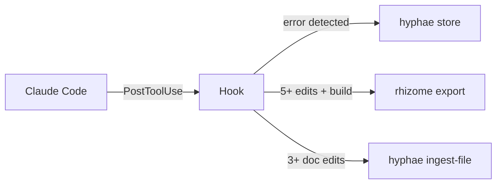
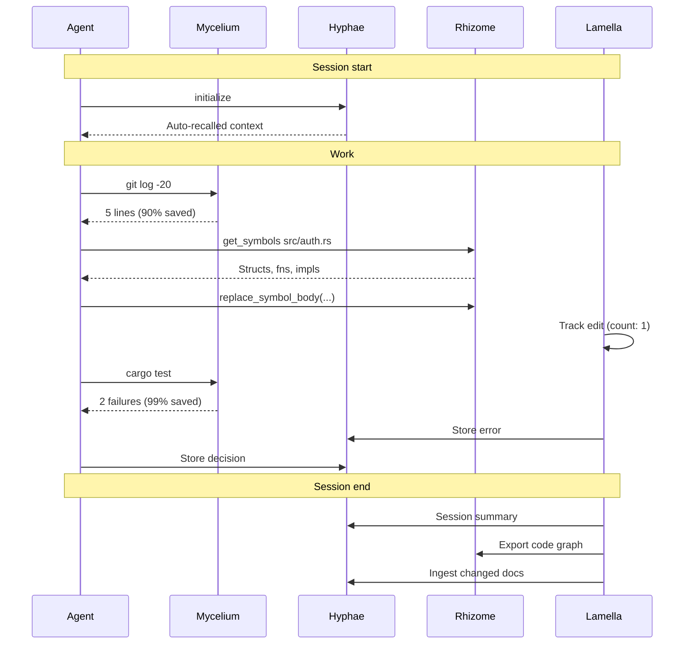

# How the Projects Connect

Each Basidiocarp project is a standalone tool. They work alone. They work better together. This doc covers both: what happens inside each project, and what happens between them.

## Internal Architecture

### Mycelium

Five-stage pipeline. A command enters, gets classified, filtered, tracked, and returned.

The registry maps commands to filters. `git status` hits `filters/git.rs`. `cargo test` hits `filters/cargo.rs`. Unrecognized commands pass through unchanged.

For large outputs (500+ lines), the pipeline forks:

If Hyphae is available, the output gets chunked and stored for later retrieval. The agent receives a summary with a `document_id`. If Hyphae is down, local filtering handles it.

### Hyphae

Two storage models in one SQLite database. Episodic memories decay over time; semantic memoirs persist as knowledge graphs.

The MCP server reads JSON-RPC from stdin, dispatches to 35 tool handlers. On initialize, it queries the database and injects recent sessions, decisions, and errors into the instructions. The agent gets context before calling any tools.

Search pipeline:

### Rhizome

Dual backend, single interface. The `BackendSelector` picks tree-sitter or LSP per tool call.

Tree-sitter has two tiers: 10 languages with dedicated S-expression queries get precise extraction; 8 more fall through to a generic AST walker matching common node types.

The LSP backend manages multiple server processes keyed by (language, project root). A Rust file in `/project-a` and one in `/project-b` get separate `rust-analyzer` instances. Servers auto-install to `~/.rhizome/bin/`.

### Cap

React frontend → Hono backend. Backend reads Hyphae's SQLite directly (read-only) and manages a pool of Rhizome MCP subprocesses.

The `RhizomeRegistry` holds up to 3 subprocesses (one per project). LRU eviction kills the oldest when a fourth is selected. Write operations shell out to the Hyphae CLI rather than touching SQLite directly.

### Spore

Shared Rust library. Four modules: tool discovery (`OnceLock` cached), JSON-RPC encoding, project detection (git root + language heuristics), subprocess MCP client (line-delimited framing). Every Rust project in the ecosystem imports it.

### Lamella

JavaScript hooks that run as Claude Code PostToolUse handlers. Read tool results from stdin, detect patterns, store signals in Hyphae via CLI. Must never block; exit 0 regardless. Errors go to `/tmp/hyphae-hook-errors.log`.

---

## External Interactions

### Session Lifecycle

### Communication Protocols

| Connection | How | Direction |
|-----------|-----|-----------|
| Agent → Hyphae | MCP (JSON-RPC, stdio) | Bidirectional |
| Agent → Rhizome | MCP (JSON-RPC, stdio) | Bidirectional |
| Agent → Mycelium | Shell (PreToolUse hook rewrites) | One-way |
| Lamella → Hyphae | CLI (`hyphae store`) | Fire-and-forget |
| Lamella → Rhizome | CLI (`rhizome export`) | Fire-and-forget |
| Cap → Hyphae | SQLite (direct, read-only) | Read |
| Cap → Rhizome | MCP (subprocess pool) | Bidirectional |
| Cap → Mycelium | CLI (`mycelium gain`) | Read |
| Rhizome → Hyphae | MCP (one-shot spawn) | Write |
| Mycelium → Hyphae | MCP (persistent, reconnectable) | Write |
| Spore | Rust library (compile-time) | Linked |

### Failure Modes

No single tool failure breaks the ecosystem.

| What breaks | What happens | Recovery |
|------------|-------------|----------|
| Hyphae down | Agent loses memory; Mycelium filters locally | Auto-reconnect next call |
| Rhizome down | Agent loses code intel; Cap shows error | Cap restarts subprocess |
| Hyphae DB missing | Cap shows empty; memories not persisted | `hyphae stats` creates it |
| LSP not installed | Falls back to tree-sitter | `rhizome lsp install <lang>` |
| Hook fails | Feedback not captured | Logged to `/tmp/hyphae-hook-errors.log` |
| Mycelium gone | Commands run unfiltered | Agent works, uses more tokens |

### Discovery

Mycelium, Hyphae, and Rhizome find each other through spore's `discover(Tool::X)`, which probes PATH and caches the result. Cap uses config constants from environment variables. Lamella hooks check `commandExists()` at runtime.

No project requires any other. Every integration has a fallback.

## Related

- [Technical Overview](../profile/README.md#technical-overview)
- [AI Concepts](AI-CONCEPTS.md)
- [LLM Training](LLM-TRAINING.md)
- [Mycelium: Ecosystem Setup](https://github.com/basidiocarp/mycelium/blob/main/docs/ECOSYSTEM-SETUP.md)
- [Rhizome: Architecture](https://github.com/basidiocarp/rhizome/blob/main/docs/ARCHITECTURE.md)
- [Cap: API Reference](https://github.com/basidiocarp/cap/blob/main/docs/API.md)
- [Lamella: Feedback Capture](https://github.com/basidiocarp/lamella/blob/main/docs/FEEDBACK-CAPTURE.md)
