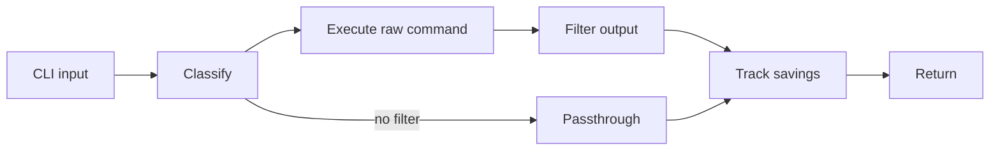
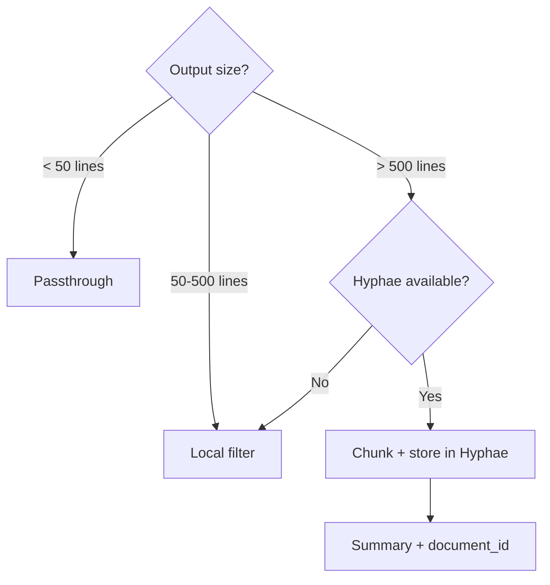
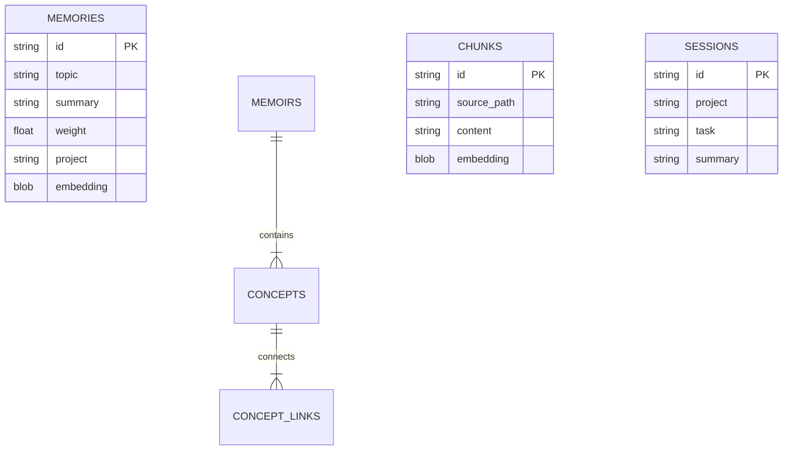
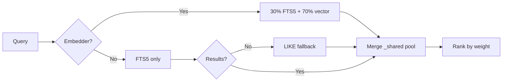
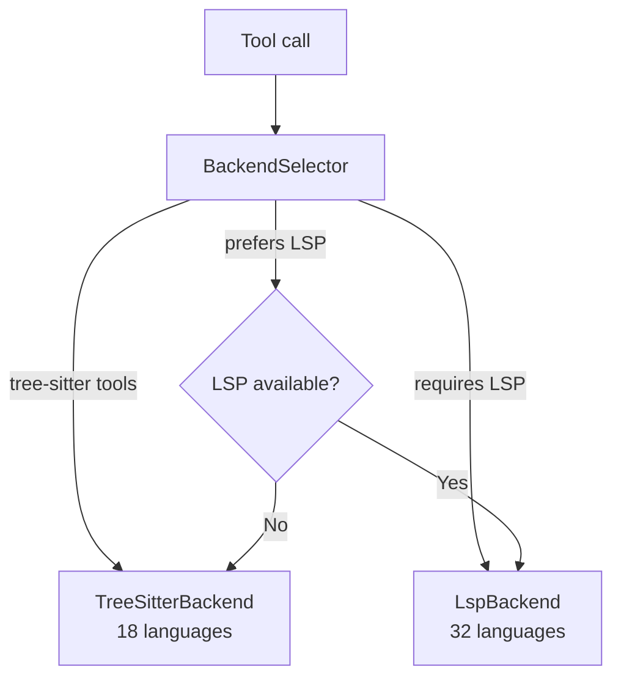
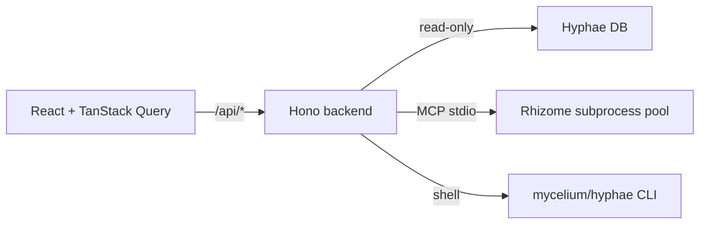
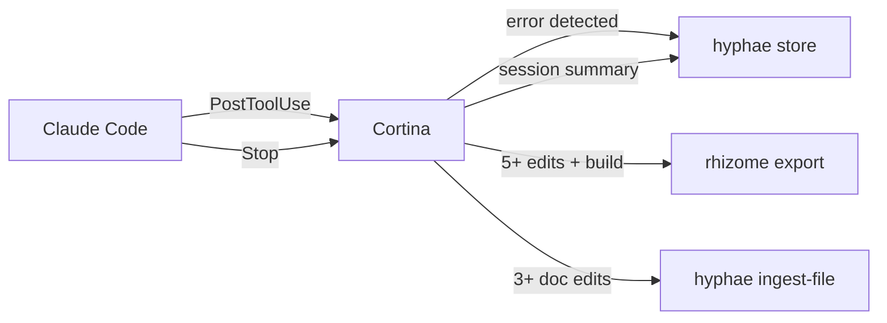

# How the Projects Connect

Each Basidiocarp project works on its own. Together they form a feedback loop: the agent works, the tools observe, memories accumulate, and future sessions start smarter. This doc covers what happens inside each project and what happens between them.

## Internal Architecture

### Mycelium

Five-stage pipeline. A command enters, gets classified, filtered, tracked, and returned.

The registry maps commands to filters. `git status` hits `filters/git.rs`; `cargo test` hits `filters/cargo.rs`. Unrecognized commands pass through unchanged. Runtime invocation and shell dispatch now go through a shared platform-aware layer instead of assuming one POSIX shell.

For large outputs (500+ lines), the pipeline forks:

When Hyphae is reachable, the output gets chunked and stored. The agent receives a summary with a `document_id` it can use to retrieve specific chunks later. When Hyphae is down, local filtering handles it.

### Hyphae

Two storage models in one SQLite database. Episodic memories decay over time; semantic memoirs persist as knowledge graphs.

The MCP server reads JSON-RPC from stdin and dispatches to its tool handlers. On `initialize`, it queries the database and injects recent sessions, decisions, and errors into the instructions. The agent gets context before it calls a single tool.

Search runs through a three-tier pipeline:

FTS5 now includes a `project` column (UNINDEXED) so project-scoped searches skip the JOIN entirely.

### Rhizome

Dual backend, single interface. The `BackendSelector` picks tree-sitter or LSP per tool call.

Tree-sitter has two tiers: 10 languages with dedicated S-expression queries get precise extraction; 8 more use a generic AST walker that matches common node types. Parsed trees are cached in a process-wide LRU (100 entries, invalidated by mtime) so repeated access to the same file doesn't re-parse.

The LSP backend manages multiple server processes keyed by (language, project root). A Rust file in `/project-a` and one in `/project-b` get separate `rust-analyzer` instances. Servers auto-install to `~/.rhizome/bin/`.

### Cap

React frontend, Hono backend. The backend reads Hyphae's SQLite directly (read-only) and manages a pool of Rhizome MCP subprocesses.

`RhizomeRegistry` holds up to 3 subprocesses, one per project. LRU eviction kills the oldest when a fourth project is selected. Write operations shell out to the Hyphae CLI rather than touching SQLite directly. The dashboard also surfaces resolved config and database paths with provenance so users can see which file is active and why.

### Canopy

Optional coordination runtime. Canopy does not replace Hyphae memory or Cortina lifecycle capture. It adds task-scoped multi-agent runtime state: active agents, task ownership, handoffs, and operator attention. Cap should consume Canopy through an explicit read surface when coordination views are needed instead of inferring that state from Hyphae alone.

### Spore

Shared Rust library. Nine modules: tool discovery (`OnceLock` cached), JSON-RPC encoding, project detection (git root + language heuristics), subprocess MCP client with timeout enforcement, TOML config loading, platform path resolution, editor config registration, token estimation, tracing init, and self-update from GitHub releases. Every Rust project in the ecosystem imports it.

### Stipe

Ecosystem manager. Downloads binaries from GitHub releases, registers MCP servers with multiple hosts, initializes the Hyphae database, and runs health checks. `stipe doctor` validates the full stack in one command and now treats host inventory and platform-aware repair paths as first-class concerns.

### Cortina

Rust lifecycle runner. The current Claude Code adapter exposes three hook types: PreToolUse (command rewriting), PostToolUse (error, correction, and code change capture), and Stop (session summary). Cortina now normalizes those host events behind an adapter boundary before the shared signal pipeline runs. It must never block the agent; exits 0 regardless of internal errors.

### Lamella

Plugin system for Claude Code: 230 skills, 175 agents, 20 plugins. Packaging, templates, wrappers, and fallback glue live here. Lifecycle runtime semantics moved to Cortina.

---

## External Interactions

### Session Lifecycle

### Communication Protocols

| Connection | How | Direction |
|-----------|-----|-----------|
| Agent → Hyphae | MCP (JSON-RPC, stdio) | Bidirectional |
| Agent → Rhizome | MCP (JSON-RPC, stdio) | Bidirectional |
| Agent → Mycelium | Shell (PreToolUse hook rewrites) | One-way |
| Cortina → Hyphae | CLI (`hyphae store`) | Fire-and-forget |
| Cortina → Rhizome | CLI (`rhizome export`) | Fire-and-forget |
| Cap → Hyphae | SQLite (direct, read-only) | Read |
| Cap → Rhizome | MCP (subprocess pool) | Bidirectional |
| Cap → Mycelium | CLI (`mycelium gain`) | Read |
| Rhizome → Hyphae | MCP (one-shot spawn) | Write |
| Mycelium → Hyphae | MCP (persistent, reconnectable) | Write |
| Spore | Rust library (compile-time) | Linked |

### Failure Modes

No single tool failure breaks the ecosystem.

| What breaks | What happens | Recovery |
|------------|-------------|----------|
| Hyphae down | Agent loses memory; Mycelium filters locally | Auto-reconnect next call |
| Rhizome down | Agent loses code intel; Cap shows error | Cap restarts subprocess |
| Hyphae DB missing | Cap shows empty; memories not persisted | `hyphae stats` creates it |
| LSP not installed | Falls back to tree-sitter | `rhizome lsp install <lang>` |
| Cortina hook fails | Feedback not captured | Logged to the configured Hyphae hook error log in the system temp directory |
| Mycelium gone | Commands run unfiltered | Agent works, uses more tokens |

### Discovery

Tools find each other through spore's `discover(Tool::X)`, which probes PATH and caches the result for the process lifetime. Shared path helpers now resolve config, cache, and data locations in a platform-aware way instead of assuming Unix defaults. Cap surfaces the resulting paths and their provenance. Cortina checks binary availability at runtime before shelling out. Stipe discovers everything for health checks and updates.

No project requires any other. Every integration has a fallback.

## Related

- [Ecosystem Architecture](./ECOSYSTEM-ARCHITECTURE.md)
- [Technical Overview](../profile/README.md#how-it-works)
- [AI Concepts](AI-CONCEPTS.md)
- [LLM Training](LLM-TRAINING.md)
- [Stipe](https://github.com/basidiocarp/stipe)
- [Cortina](https://github.com/basidiocarp/cortina)
- [Rhizome Architecture](https://github.com/basidiocarp/rhizome/blob/main/docs/ARCHITECTURE.md)
- [Cap API](https://github.com/basidiocarp/cap/blob/main/docs/API.md)
