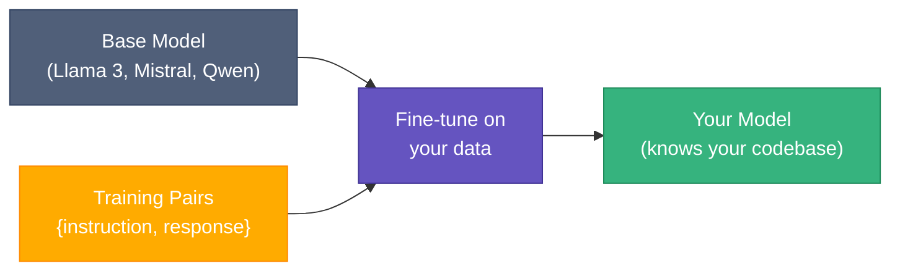
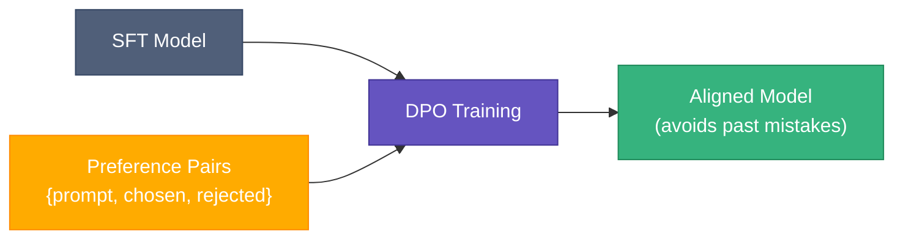
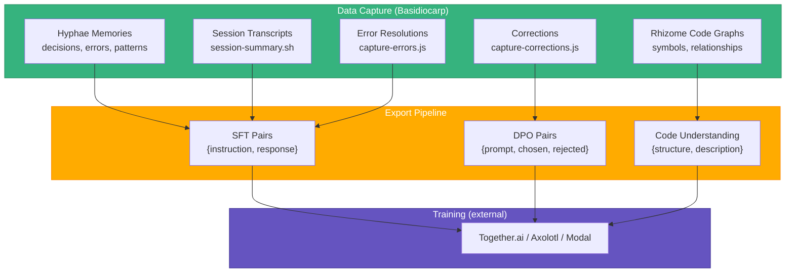
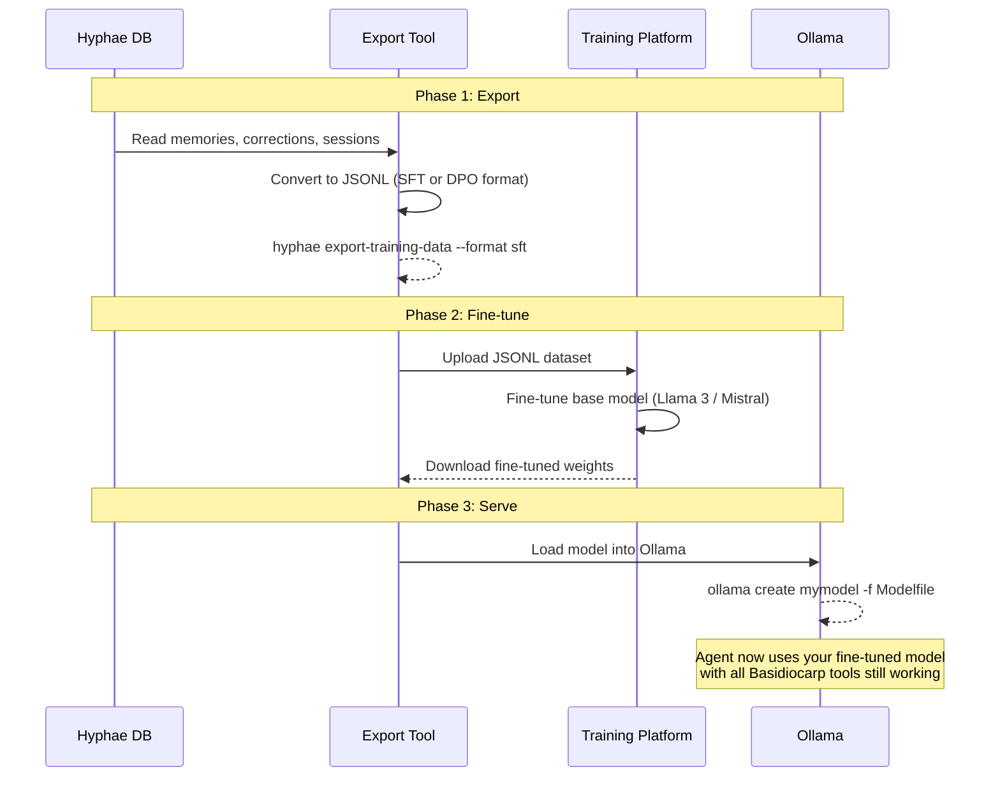

# LLM Training with Basidiocarp

Basidiocarp operates **around** an LLM, not inside one. It makes existing models more effective through memory, context, and token compression. The LLM itself is a black box your tools never touch.

That said, the ecosystem captures data that's valuable for fine-tuning. This guide explains what's possible, what's not, and the realistic path from "I have agent data" to "I have a fine-tuned model."

## Where Basidiocarp Sits

```mermaid
flowchart LR
    subgraph Basidiocarp["Basidiocarp Ecosystem"]
        Hyphae["Hyphae<br/>Memory + RAG"]
        Rhizome["Rhizome<br/>Code Intelligence"]
        Mycelium["Mycelium<br/>Token Compression"]
        Lamella["Lamella<br/>Feedback Capture"]
    end

    subgraph LLM["LLM (black box)"]
        Model["Claude / GPT / Llama / Mistral"]
    end

    subgraph Training["Training Infrastructure (not Basidiocarp)"]
        Data["Training Data<br/>JSONL"]
        Compute["GPU Cluster<br/>A100/H100"]
        Framework["Axolotl / DeepSpeed<br/>/ Cloud API"]
        FT["Fine-tuned Model"]
    end

    Agent["AI Coding Agent"] <--> Basidiocarp
    Agent <--> Model

    Basidiocarp -->|"export"| Data
    Data --> Framework
    Framework --> Compute
    Compute --> FT
    FT -->|"serve via Ollama"| Agent

    style Basidiocarp fill:#36b37e,stroke:#1f8a5a,color:#fff
    style LLM fill:#505f79,stroke:#344563,color:#fff
    style Training fill:#6554c0,stroke:#403294,color:#fff
```



Basidiocarp can **export training data**. It cannot train, fine-tune, or serve models. Those are separate concerns with existing solutions.

## Three Types of Training

### 1. Full Pre-training

Teaching a model from scratch on raw text. Costs $1M+ in compute, requires TB of data, takes weeks. Not relevant for most teams. Used by Anthropic, OpenAI, Meta to build foundation models.

### 2. Supervised Fine-tuning (SFT)

Adapting a pre-trained model to your data. You show it (instruction, correct response) pairs and it learns your conventions, coding style, and domain knowledge. This is the practical starting point.



**Cost**: $10-100 per run on Together.ai or Modal. Free locally with Axolotl + a consumer GPU (24GB+ VRAM).

**What you need**: 1,000-10,000 instruction/response pairs in JSONL format.

### 3. RLHF / DPO (Preference Learning)

You show the model pairs of (good response, bad response) and train it to prefer the good one. This is how ChatGPT was aligned. DPO (Direct Preference Optimization) is the simpler version that skips the reward model.



**Cost**: Same as SFT. Needs preference pairs, not just instruction/response.

**What you need**: 500-5,000 (prompt, chosen_response, rejected_response) triples.

## What Basidiocarp Data Is Useful For



| Data source | Training use | Format | Project |
|-------------|-------------|--------|---------|
| Hyphae memories (decisions, patterns) | SFT — teach company conventions | `{instruction: "How do we handle auth?", response: "We use JWT with..."}` | [Hyphae](https://github.com/basidiocarp/hyphae) |
| Self-corrections (capture-corrections.js) | DPO — learn from mistakes | `{prompt: "Fix the auth bug", chosen: corrected_code, rejected: original_code}` | [Lamella](https://github.com/basidiocarp/lamella) |
| Session transcripts | SFT — learn real coding workflows | `{instruction: user_request, response: agent_actions}` | [Mycelium](https://github.com/basidiocarp/mycelium) |
| Error → resolution patterns | SFT — teach debugging | `{instruction: "Error: X", response: "Fix: Y because Z"}` | [Lamella](https://github.com/basidiocarp/lamella) |
| Rhizome code graphs | Code understanding pre-training | `{structure: symbol_graph, description: "AuthService calls TokenValidator..."}` | [Rhizome](https://github.com/basidiocarp/rhizome) |

The corrections data deserves special attention. Every time an agent writes code, then immediately edits it, that's a natural (rejected, chosen) pair for DPO. The `capture-corrections.js` hook already records these.

## What You'd Need to Build

Basidiocarp captures data. It doesn't export it in training format or run training jobs. Here's what the pipeline looks like:



### Phase 1: Training Data Export (to build)

A `hyphae export-training-data` command that reads from the database and outputs ready-to-use JSONL:

**SFT format:**
```jsonl
{"instruction": "How should we handle database migrations?", "response": "We use sqlx migrations with..."}
{"instruction": "What caused the auth timeout bug?", "response": "The JWT expiry was set to..."}
```

**DPO format:**
```jsonl
{"prompt": "Implement the retry logic", "chosen": "fn retry(f, max) { for i in 0..max { ... } }", "rejected": "fn retry(f) { loop { ... } }"}
```

### Phase 2: Fine-tuning (use existing tools)

| Platform | Local? | Cost | Best for |
|----------|--------|------|----------|
| [Together.ai](https://together.ai) | No | $0.50/M tokens | Easiest, API-based |
| [Modal](https://modal.com) | No | Pay per GPU-second | Scalable, serverless |
| [Axolotl](https://github.com/OpenAccess-AI-Collective/axolotl) | Yes | Free (need GPU) | Full control, privacy |
| [Unsloth](https://github.com/unslothai/unsloth) | Yes | Free (need GPU) | Fast LoRA fine-tuning |

You don't build these. You use them.

### Phase 3: Serving (use existing tools)

Run your fine-tuned model locally with Ollama (which Hyphae already integrates with for embeddings):

```bash
# Create a Modelfile
cat > Modelfile <<EOF
FROM ./my-finetuned-model.gguf
SYSTEM "You are a coding assistant trained on our team's conventions."
EOF

# Load into Ollama
ollama create mymodel -f Modelfile

# Use with any MCP client
# Point your agent at localhost:11434
```

The fine-tuned model benefits from all Basidiocarp tools just like Claude or GPT does. Memory, code intelligence, token compression — none of that depends on which model you use.

## What Basidiocarp Cannot Do

| Capability | Status | Why |
|-----------|--------|-----|
| Export training data | Planned | Data exists, needs JSONL export |
| Run fine-tuning | No | Requires GPU infrastructure |
| Train from scratch | No | Requires massive compute |
| Serve models | No | Use Ollama, vLLM, or TGI |
| RLHF reward modeling | No | Requires training infrastructure |
| Online learning (adapt in real-time) | No | Would need model weight access |

## Practical Recommendation

Start with what works today, not what requires new infrastructure:

1. **Now**: Use Basidiocarp's RAG + memory + feedback loop with a hosted model (Claude, GPT). This gets you 80% of the benefit of fine-tuning without any training.

2. **When you have 1,000+ sessions**: Export training data, fine-tune a Llama 3 or Mistral model on your coding conventions. Serve via Ollama. Cost: $10-50.

3. **When you have 500+ correction pairs**: Run DPO training to teach the model to avoid your team's common mistakes. The corrections hook is already capturing this data.

4. **Never**: Train from scratch, build custom training infrastructure, or try to replace the foundation model. Use what exists.

## Related Documentation

- [Hyphae: RAG Pipeline](https://github.com/basidiocarp/hyphae#rag-pipeline) — ingestion, embeddings, hybrid search
- [Hyphae: Feedback Signals](https://github.com/basidiocarp/hyphae#feedback-signals) — what's captured and where
- [Hyphae: Configuring Embeddings](https://github.com/basidiocarp/hyphae/blob/main/docs/GUIDE.md#configuring-embeddings) — local vs HTTP embedders
- [Lamella: Capture Hooks](https://github.com/basidiocarp/lamella) — error, correction, test, PR review capture
- [Technical Overview](https://github.com/basidiocarp/.github/blob/main/profile/README.md#technical-overview) — full ecosystem architecture
