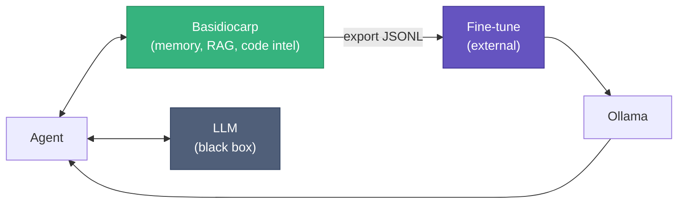
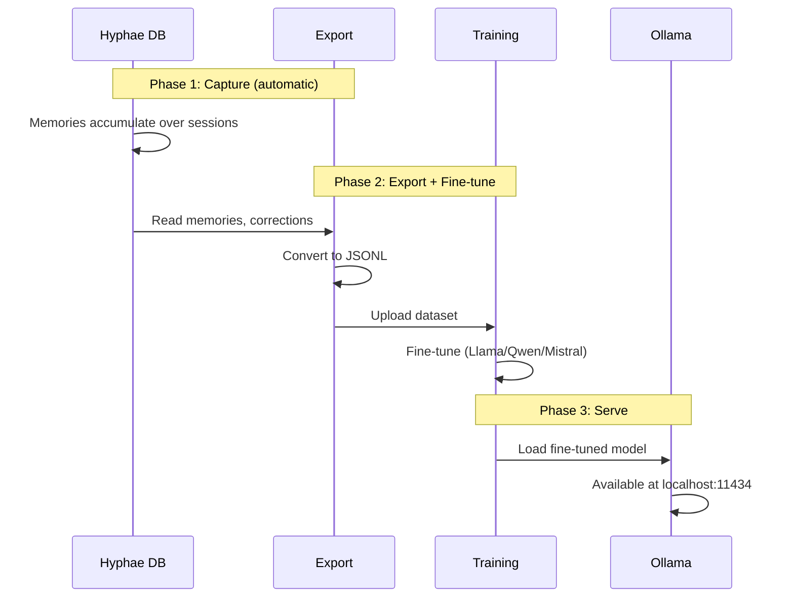

# LLM Training with Basidiocarp

Basidiocarp wraps around an LLM. It doesn't train, fine-tune, or serve models. It captures data that's valuable for all three.

This guide covers the path from "I have agent session data" to "I have a fine-tuned model running locally."

For the underlying ML concepts (supervised vs unsupervised, DPO, how training stages work), see the [AI Concepts Guide](AI-CONCEPTS.md).

## Where Basidiocarp Fits



Basidiocarp captures training data. Training and serving happen elsewhere.

## What Data Exists

| Source | What it captures | Training use | Topic in Hyphae |
|--------|-----------------|-------------|-----------------|
| Hyphae memories | Decisions, patterns, conventions | SFT instruction pairs | `decisions/{project}` |
| capture-errors.js | Error → resolution sequences | SFT debugging pairs | `errors/resolved` |
| capture-corrections.js | Self-corrections (original → fixed) | DPO preference pairs | `corrections` |
| capture-test-results.js | Test failure → fix sequences | SFT test-fix pairs | `tests/resolved` |
| session-summary.sh | Task, files, tools, outcome | SFT workflow pairs | `session/{project}` |
| Rhizome export | Code symbols and call graphs | Code understanding | Memoirs |

Corrections deserve special attention. Every time the agent writes code then immediately revises it, the hook records both versions. That's a natural (rejected, chosen) pair for DPO training.

## Training Formats

SFT (supervised fine-tuning) needs instruction/response pairs:

```jsonl
{"instruction": "What protocol do we use for internal services?", "response": "gRPC. Switched from REST — latency dropped from 45ms to 8ms."}
{"instruction": "cargo test panics at auth.rs:42", "response": "Add null check on token expiry. JWT parser returns None for expired tokens."}
```

DPO needs preference triples:

```jsonl
{"prompt": "Write token validation", "chosen": "fn validate(t: &str) -> Result<Claims> { decode(t)? }", "rejected": "fn validate(t: &str) { t.len() > 0 }"}
```

## The Pipeline

Three phases. Phase 1 happens automatically as you use Basidiocarp. Phases 2 and 3 use external tools.



### Phase 1: Capture

Use Basidiocarp with a cloud model (Claude, GPT) for your normal work. Data accumulates passively. After ~200 sessions you have enough for SFT; after ~500, enough for DPO.

### Phase 2: Export and Train

Until `hyphae export-training-data` is built, query SQLite directly:

```bash
# SFT pairs from decisions
sqlite3 ~/Library/Application\ Support/hyphae/hyphae.db \
  "SELECT json_object('instruction', topic, 'response', summary) \
   FROM memories WHERE topic LIKE 'decisions/%' AND weight > 0.3" \
  > sft_decisions.jsonl

# Error resolution pairs
sqlite3 ~/Library/Application\ Support/hyphae/hyphae.db \
  "SELECT json_object('instruction', 'Fix: ' || substr(summary,1,80), 'response', summary) \
   FROM memories WHERE topic = 'errors/resolved'" \
  > sft_errors.jsonl
```

Then fine-tune with one of:

| Platform | Local? | Cost | Notes |
|----------|--------|------|-------|
| Together.ai | No | ~$0.50/M tokens | Easiest; upload JSONL, pick model, done |
| Axolotl | Yes | Free (need 24GB+ GPU) | Full control, privacy |
| Unsloth | Yes | Free (need GPU) | Fast LoRA, low memory |
| Modal | No | Per GPU-second | Scalable, serverless |

Axolotl config for local fine-tuning:

```yaml
base_model: Qwen/Qwen2.5-Coder-32B-Instruct
dataset:
  path: ./sft_decisions.jsonl
  type: instruction
adapter: qlora
lora_r: 16
micro_batch_size: 1
num_epochs: 3
learning_rate: 2e-4
output_dir: ./output
```

~2 hours on an RTX 4090 for 5,000 examples.

### Phase 3: Serve

Convert and load into Ollama:

```bash
python llama.cpp/convert.py ./output --outfile model.gguf --outtype q4_K_M

cat > Modelfile <<'EOF'
FROM ./model.gguf
SYSTEM "You are a coding assistant trained on our team's conventions."
PARAMETER temperature 0.7
PARAMETER num_ctx 8192
EOF

ollama create myteam-coder -f Modelfile
ollama run myteam-coder "How do we handle auth?"
```

The fine-tuned model works with every Basidiocarp tool. Hyphae, Rhizome, Mycelium, Lamella don't care which model generates text.

## Hardware

| Setup | VRAM | Runs | Cost |
|-------|------|------|------|
| RTX 4090 | 24GB | Up to 32B quantized | $1,600 one-time |
| 2× RTX 4090 | 48GB | 70B quantized | $3,200 one-time |
| A100 (spot) | 80GB | Any size | ~$0.80/hr |

A single RTX 4090 with a fine-tuned Qwen 32B handles most coding tasks. Pays for itself in ~2 months vs Claude API costs at moderate usage.

## What Basidiocarp Can't Do

| Capability | Status |
|-----------|--------|
| Export training data | Planned (query SQLite manually for now) |
| Run fine-tuning | No — use Axolotl, Together.ai, or Modal |
| Train from scratch | No — requires $1M+ compute |
| Serve models | No — use Ollama, vLLM, or TGI |
| Real-time learning | No — would need weight access |

## Practical Path

1. Now: RAG + memory + feedback loop with a hosted model. Gets you 80% of fine-tuning's benefit.
2. After 1,000 sessions: export SFT data, fine-tune on your conventions. $10–50.
3. After 500 correction pairs: add DPO to avoid recurring mistakes.
4. Never: train from scratch or build custom training infrastructure.

## Related

- [AI Concepts](AI-CONCEPTS.md) — supervised vs unsupervised, DPO explained, Bedrock comparison
- [Hyphae: Training Data](https://github.com/basidiocarp/hyphae/blob/main/docs/TRAINING-DATA.md) — data formats, volume estimates, SQL queries
- [Lamella: Feedback Capture](https://github.com/basidiocarp/lamella/blob/main/docs/FEEDBACK-CAPTURE.md) — how correction/error hooks work
- [Hyphae: Embeddings](https://github.com/basidiocarp/hyphae/blob/main/docs/GUIDE.md#configuring-embeddings) — local vs HTTP embedding config
