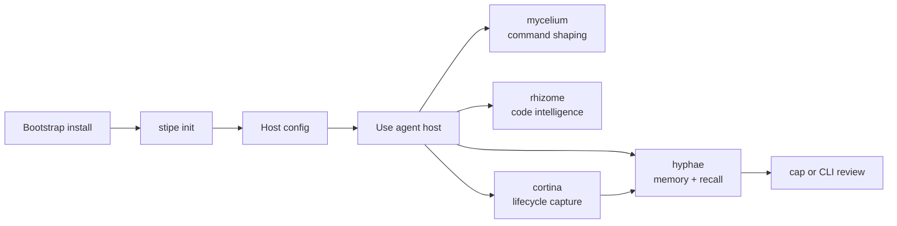

# Operator Quickstart

This is the shortest path from a fresh machine to a usable Basidiocarp stack.

Use this page after installation, not as a full architecture reference.

## 1. Install the Default Runtime

On macOS or Linux:

```bash
curl -fsSL https://raw.githubusercontent.com/basidiocarp/.github/main/install.sh | sh
```

On Windows PowerShell:

```powershell
irm https://raw.githubusercontent.com/basidiocarp/.github/main/install.ps1 | iex
```

The bootstrap install gives you:

- `stipe`
- `mycelium`
- `hyphae`
- `rhizome`
- `cortina`

## 2. Initialize Host Integrations

Run:

```bash
stipe init
```

This registers MCP servers, installs supported host integrations, and creates the local Hyphae database if it is missing.

## 3. Verify Health

Run:

```bash
stipe doctor
```

What you want to see:

- the core binaries are installed
- supported host config files are present
- Hyphae and Rhizome registration is visible where expected
- Claude hooks or Codex notify are configured if that host is installed

If you need one host only:

```bash
stipe host doctor
stipe host doctor claude-code
stipe host doctor codex
stipe host doctor cursor
```

## 4. Understand the Runtime Shape



## 5. Know Which Tool to Reach For

- `stipe`
  - install, init, doctor, host setup, updates
- `mycelium`
  - command shaping and token reduction
- `hyphae`
  - memory, recall, search, training export
- `rhizome`
  - code intelligence, symbol and edit workflows
- `cortina`
  - lifecycle capture and per-worktree runtime state
- `cap`
  - operator dashboard and review surface
- `canopy`
  - optional coordination runtime for multi-agent work

## 6. Optional Next Steps

Install the coordination runtime:

```bash
stipe install canopy
```

Or install the broader runtime profile:

```bash
stipe install --profile full-stack
```

If you want a dashboard, run or deploy `cap` separately.

## 7. If Something Looks Wrong

Start here:

```bash
stipe doctor
mycelium doctor 2>/dev/null || true
cortina doctor --json 2>/dev/null || true
```

Then use:

- [Troubleshooting](./TROUBLESHOOTING.md)
- [Host Support](./HOST-SUPPORT.md)
- [What Gets Installed](./INSTALL-SCOPE.md)
- [Tool Selection](./TOOL-SELECTION.md)
