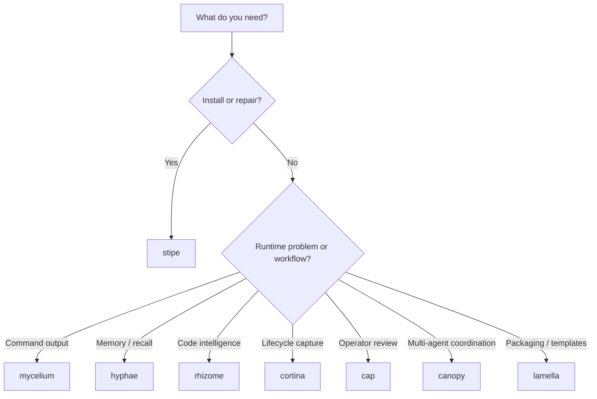

# Tool Selection

Use this page when the question is not "how does the ecosystem work?" but "which tool should I use right now?"

## Short Version

| Need | Tool |
|------|------|
| Install, configure, repair, or update the stack | `stipe` |
| Reduce command output and token usage | `mycelium` |
| Store or recall memory | `hyphae` |
| Inspect symbols or make code-intelligent edits | `rhizome` |
| Capture lifecycle signals and session outcomes | `cortina` |
| Review status and memory in a dashboard | `cap` |
| Coordinate multiple agents and handoffs | `canopy` |
| Package templates, hooks, skills, commands, and wrappers | `lamella` |
| Reuse shared editor and path primitives in Rust tools | `spore` |

## Decision Guide



## Common Scenarios

### "The host cannot see the tools"

Use `stipe`.

```bash
stipe doctor
stipe host doctor
```

### "The agent is wasting tokens on shell output"

Use `mycelium`.

### "I need the agent to remember previous sessions"

Use `hyphae`.

### "I need references, renames, or symbol-level edits"

Use `rhizome`.

### "I need to know what happened during the session"

Use `cortina`.

### "I need a human-readable operational view"

Use `cap`.

### "I need to coordinate multiple active agents"

Use `canopy`.

### "I need to package or export shared prompts and hook templates"

Use `lamella`.

### "I am writing Rust tooling that needs shared editor primitives"

Use `spore`.

## Boundary Reminders

- `stipe` owns ecosystem policy.
- `spore` owns shared editor primitives.
- `cortina` owns lifecycle runtime semantics.
- `lamella` owns packaging and templates.
- `canopy` owns coordination runtime state, not long-term memory.
- `hyphae` owns long-term memory and structured recall.

## Related

- [Ecosystem Architecture](./ECOSYSTEM-ARCHITECTURE.md)
- [Operator Quickstart](./OPERATOR-QUICKSTART.md)
- [What Gets Installed](./INSTALL-SCOPE.md)
