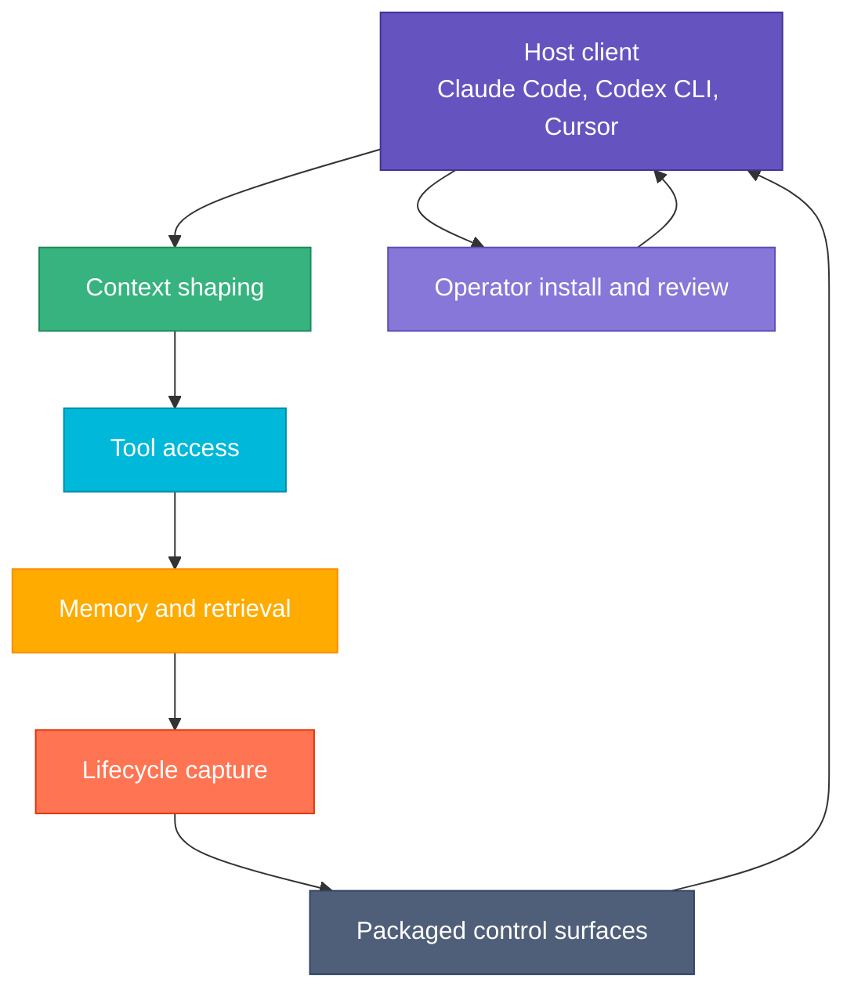

# Harness Composition

Use this page when the question is not just "which repo owns this?" but "how do the repos combine into one working
harness?"

## The Big Picture

Basidiocarp is not one agent binary. It is a harness assembled from several repos that each own one part of the loop.

The important point is that these are cooperating pieces, not feature duplicates.

## Repo-to-Harness Map

| Harness function             | Primary repo | What it contributes                                                          | What it does not own                      |
|------------------------------|--------------|------------------------------------------------------------------------------|-------------------------------------------|
| Execution-host runtime       | `volva`      | backend dispatch, runtime invocation, host-context shaping                   | long-term memory, payload governance      |
| Context shaping              | `mycelium`   | command filtering, compaction, prompt-efficiency, runtime invocation shaping | long-term memory, code intelligence       |
| Memory and retrieval         | `hyphae`     | recall, episodic storage, memoirs, document search, sessions                 | host lifecycle hooks, packaging           |
| Code-aware tool use          | `rhizome`    | symbol navigation, diagnostics, structured code edits                        | long-term memory policy                   |
| Lifecycle capture            | `cortina`    | host event normalization, corrections, session capture                       | memory storage model, packaging           |
| Packaged control surfaces    | `lamella`    | skills, hooks, commands, wrappers, templates, export surfaces                | lifecycle runtime semantics               |
| Cross-tool contracts         | `septa`      | shared payload shapes, fixtures, schema governance                           | host execution, lifecycle runtime         |
| Host installation and policy | `stipe`      | setup, doctor, registration, repair, host inventory                          | memory retrieval, code intelligence       |
| Operator visibility          | `cap`        | read surfaces, dashboards, operational review                                | primary storage or lifecycle capture      |
| Coordination runtime         | `canopy`     | active-agent coordination, handoffs, ownership                               | long-term memory, lifecycle normalization |
| Workflow orchestration       | `hymenium`   | workflow dispatch, phase gating, retry and recovery                          | coordination ledger, memory storage       |
| Operator utilities           | `annulus`    | cross-ecosystem statusline, tiered operator tooling                          | primary memory or lifecycle capture       |
| Shared plumbing              | `spore`      | path resolution, tool discovery, subprocess and editor primitives            | top-level host policy                     |

## How the Pieces Connect

### 1. The host starts with a client

A host such as Claude Code or Codex CLI is the entry point. It supplies the model runtime, prompt loop, and
host-specific configuration surfaces.

Basidiocarp does not replace the host. It equips it.

### 2. `stipe` installs and registers the harness

`stipe` is the operator-facing assembly layer:

- installs binaries
- registers MCP servers
- configures supported hosts
- runs repair and doctor flows

Without `stipe`, the pieces still exist as repos. With `stipe`, they become an installable system.

### 3. `lamella` packages reusable behavior

`lamella` provides the shared authoring and export layer for:

- skills
- hooks
- commands
- wrappers
- templates

This is how repeated control-surface logic becomes distributable instead of repo-local prose.

### 4. `volva` owns the execution-host boundary

`volva` is the runtime boundary when work is executed through a dedicated host surface instead of directly through an editor-integrated client.

It is where backend routing, runtime invocation, and host-context shaping live.

### 5. `mycelium` shapes active context

Before or around tool execution, `mycelium` reduces noisy command output and makes the active loop cheaper and more
legible.

This is a current-turn optimization layer, not the memory system.

### 6. `hyphae` and `rhizome` provide the main tool layer

These two repos give the host the capabilities it would otherwise lack:

- `hyphae` for recall, sessions, and document retrieval
- `rhizome` for symbol-aware code intelligence and edits

Together they cover two major tool categories:

- knowledge retrieval
- code-aware action

### 7. `cortina` captures what happened

`cortina` watches lifecycle events and turns them into signals worth keeping:

- corrections
- summaries
- changes
- session outcomes

Those signals become useful when they flow into `hyphae`.

### 8. `septa` keeps the seams explicit

`septa` holds the shared payload contracts and fixtures for cross-tool boundaries.

If more than one repo depends on the same shape, it should become explicit here instead of remaining an ad hoc struct or JSON blob hidden inside one implementation.

### 9. `cap` and `canopy` add read and coordination surfaces

- `cap` is the human-readable operational view
- `canopy` is the active coordination runtime when one agent is no longer enough

Neither replaces the underlying memory or tool systems.

## One Loop, Not Many Isolated Tools

A healthy run looks like this:

1. host starts with repo guidance and active prompt context
2. `volva` may own execution-host routing when the workload runs through that boundary
3. `mycelium` reduces avoidable prompt waste
4. the host calls `hyphae` and `rhizome` through MCP
5. work happens in the codebase or memory layer
6. `cortina` captures lifecycle events from the host side
7. `hyphae` stores the resulting knowledge for later recall
8. `septa` keeps shared cross-tool payloads explicit where multiple repos depend on them
9. `cap` exposes the state to an operator
10. `canopy` becomes relevant only if coordination itself is part of the workload

## Why the Separation Matters

This split keeps the ecosystem maintainable:

- memory can improve without changing code intelligence
- host policy can change without redesigning storage
- packaging can evolve without absorbing runtime semantics
- coordination can stay optional

That is the harness design principle here: separate the layers that change for different reasons.

## Related

- [Ecosystem Architecture](./ecosystem-architecture.md)
- [How the Projects Connect](./integration.md)
- [Agent Harness](../concepts/agent-harness.md)
- [Repo to Concept Map](../concepts/repo-to-concept-map.md)
