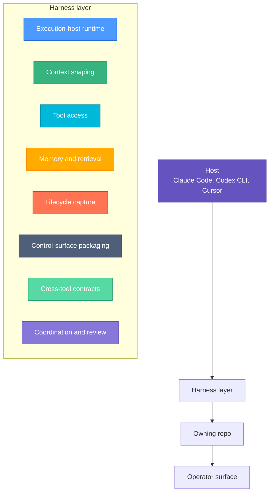
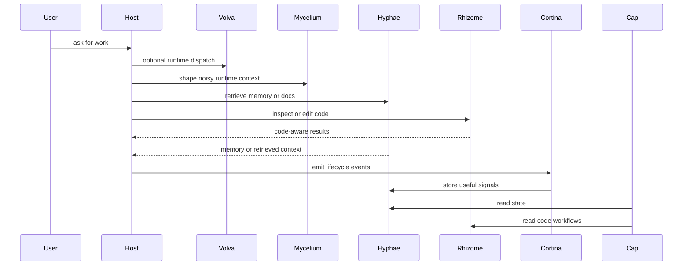

# Harness Overview

Use this page when you want the shortest end-to-end explanation of how the Basidiocarp ecosystem fits together.

## One Sentence Version

Basidiocarp builds the harness around the model: it shapes context, provides tools and memory, captures lifecycle
signals, packages reusable behavior, keeps cross-tool contracts explicit, and exposes operator surfaces around those
layers.

## The Stack at a Glance

The host is where the model runs. The harness is everything that makes that model useful in practice.

## Host to Harness to Repo

| Host need                                     | Harness function          | Primary repo | Operator surface                                        |
|-----------------------------------------------|---------------------------|--------------|---------------------------------------------------------|
| run through a dedicated execution host        | execution-host runtime    | `volva`      | backend dispatch, host-context shaping, runtime entry   |
| reduce noise in the active loop               | context shaping           | `mycelium`   | CLI behavior, token savings, diagnostics                |
| remember previous work                        | memory and retrieval      | `hyphae`     | recall tools, search, sessions, memory review           |
| inspect or edit code structurally             | code-aware tool use       | `rhizome`    | symbol navigation, diagnostics, structured edits        |
| capture what happened during work             | lifecycle capture         | `cortina`    | hook behavior, summaries, learning signals              |
| reuse prompts, hooks, wrappers, and templates | packaged control surfaces | `lamella`    | shared skills, hooks, commands, exports                 |
| keep payload shapes explicit across repos     | cross-tool contracts      | `septa`      | schema docs, fixtures, shared payload governance        |
| install and repair host integration           | host adaptation           | `stipe`      | setup, doctor, repair, registration                     |
| review the stack as a human                   | operator visibility       | `cap`        | dashboard and state review                              |
| coordinate multiple active agents             | coordination runtime      | `canopy`     | handoffs, ownership, attention                          |
| share low-level primitives across repos       | shared substrate          | `spore`      | internal plumbing rather than a direct operator surface |

## The Main Loop

This is the practical meaning of "harness" in this ecosystem: not one repo, but a loop assembled from multiple
specialized repos.

## What Each Layer Is For

### Context shaping

Keep the active loop efficient and legible.

Primary repo: `mycelium`

### Execution-host runtime

Own backend routing and host-context assembly when work should run through a dedicated execution surface.

Primary repo: `volva`

### Memory and retrieval

Make relevant information survive beyond the current turn.

Primary repo: `hyphae`

### Tool use

Let the model operate on real systems instead of guessing from weights.

Primary repos: `hyphae`, `rhizome`

### Lifecycle capture

Turn events, corrections, and outcomes into reusable signals.

Primary repo: `cortina`

### Control surfaces

Package reusable behavior so it is not trapped in one repo or one prompt.

Primary repo: `lamella`

### Cross-tool contracts

Keep shared payloads, fixtures, and schemas explicit instead of letting repo-to-repo integrations drift.

Primary repo: `septa`

### Host adaptation

Connect the harness to real clients and environments.

Primary repo: `stipe`

### Review and coordination

Give humans and multi-agent workflows a place to observe and coordinate.

Primary repos: `cap`, `canopy`

## Read This Next

If this page makes sense and you want more detail:

1. [Harness Composition](./harness-composition.md)
2. [Repo to Concept Map](../concepts/repo-to-concept-map.md)
3. [How the Projects Connect](./integration.md)
4. [Agent Harness](../concepts/agent-harness.md)

## Related

- [Harness Composition](./harness-composition.md)
- [Ecosystem Architecture](./ecosystem-architecture.md)
- [Repo to Concept Map](../concepts/repo-to-concept-map.md)
- [Agent Harness](../concepts/agent-harness.md)
