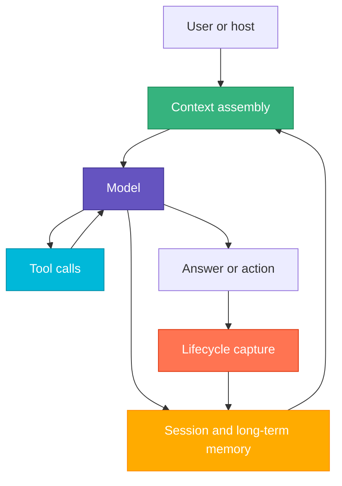

# Agent Harness

Use this page when the question is "what are we actually building around the model?" rather than "which repo owns this
file?"

## What a Harness Is

The harness is the operational system around the model.

The model supplies language and reasoning. The harness makes that reasoning useful by deciding:

- what context the model sees
- what tools it can call
- what memory persists across sessions
- what lifecycle events get captured
- what control surfaces shape behavior

Without the harness, the model is just a stateless text engine.

## The Core Parts

Every useful agent harness has the same moving parts:

| Part             | Purpose                                        | Basidiocarp surface                       |
|------------------|------------------------------------------------|-------------------------------------------|
| Model            | Generates text, plans, and tool decisions      | external model host                       |
| Context          | Decides what enters the prompt window          | `mycelium`, repo guidance, retrieved docs |
| Memory           | Preserves information across turns or sessions | `hyphae`, `cortina`                       |
| Tools            | Let the model inspect, retrieve, edit, or act  | `rhizome`, `hyphae`, shell, MCP servers   |
| Lifecycle        | Captures what happened and when                | `cortina`                                 |
| Packaging        | Ships reusable prompts, hooks, and wrappers    | `lamella`                                 |
| Operator surface | Installs, repairs, and presents state          | `stipe`, `cap`                            |

## Mental Model

The harness decides what reaches the model before a turn, what the model can do during a turn, and what gets remembered
after a turn.

## Why This Matters

Most agent failures are harness failures, not model failures.

Common examples:

- wrong or missing context
- stale or noisy retrieval
- poor tool descriptions or weak tool boundaries
- no durable memory
- no lifecycle capture, so nothing improves over time
- too many control surfaces fighting each other

This is why Basidiocarp is useful even though it does not train models itself. It improves the operating system around
the model.

## Basidiocarp As Harness Infrastructure

Basidiocarp splits the harness into smaller tools on purpose:

- `mycelium` reduces prompt waste and shapes runtime input
- `hyphae` stores recallable memory and structured knowledge
- `rhizome` gives the agent code-aware actions instead of raw text edits
- `cortina` captures lifecycle signals and corrections
- `lamella` packages reusable host assets
- `stipe` installs and repairs the host-facing parts
- `cap` gives operators a human-readable view of state
- `canopy` adds coordination when one agent is no longer enough

This is a harness architecture, not a monolithic "agent framework."

## Design Rule

When a behavior is weak, ask which harness layer failed:

1. context
2. memory
3. tool access
4. lifecycle capture
5. control surface

That usually gets you to the right repo faster than blaming the model first.

## Related

- [Context and Memory](./context-and-memory.md)
- [Tool Use and MCP](./tool-use-and-mcp.md)
- [Prompting and Control Surfaces](./prompting-and-control-surfaces.md)
- [Single vs Multi-Agent](./single-vs-multi-agent.md)
