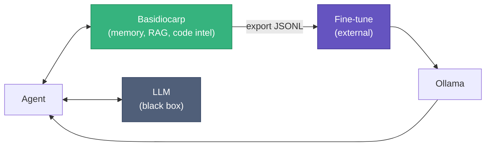
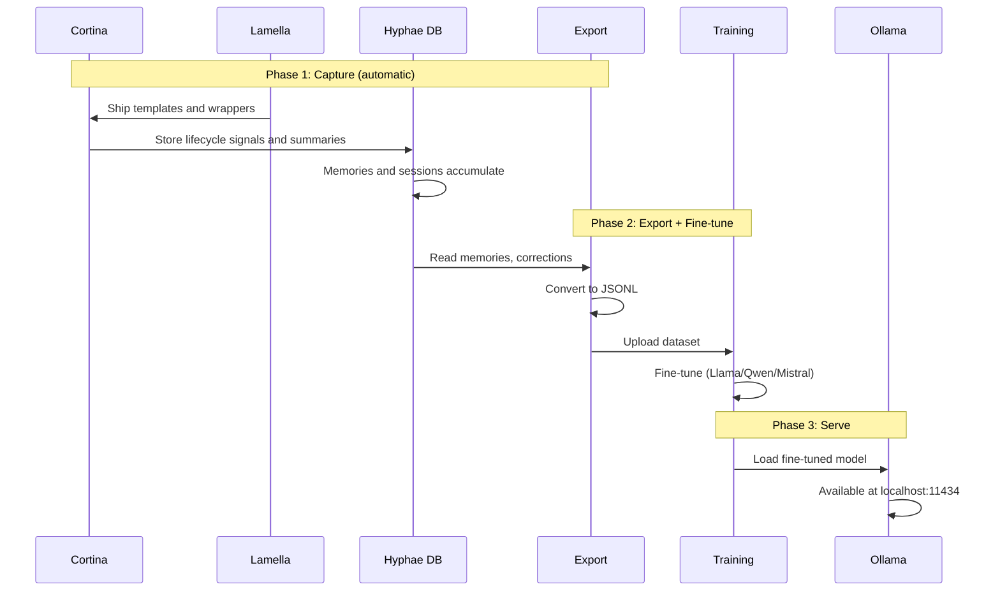

# LLM Training with Basidiocarp

Basidiocarp wraps around an LLM. It doesn't train, fine-tune, or serve models. It captures data that's valuable for all
three.

This guide covers the path from "I have agent session data" to "I have a fine-tuned model running locally."

For the underlying ML concepts (supervised vs unsupervised, DPO, how training stages work), see
the [AI Concepts Guide](./ai-concepts.md).

## Where Basidiocarp Fits



Basidiocarp captures training data. Training and serving happen elsewhere.

## What Data Exists

| Source                             | What it captures                            | Training use                      | Stored in                               |
|------------------------------------|---------------------------------------------|-----------------------------------|-----------------------------------------|
| Hyphae memories and sessions       | Decisions, patterns, conventions, summaries | SFT instruction pairs             | Hyphae memories and structured sessions |
| Cortina error and recovery capture | Error → resolution sequences                | SFT debugging pairs               | `errors/resolved` and feedback signals  |
| Cortina self-correction capture    | Self-corrections (original → fixed)         | DPO preference pairs              | `corrections` and feedback signals      |
| Cortina validation capture         | Test and build failures or recoveries       | SFT test-fix and validation pairs | `tests/*` topics and feedback signals   |
| Rhizome export                     | Code symbols and call graphs                | Code understanding                | Memoirs                                 |
| Lamella templates and wrappers     | Packaging and deployment of hook surfaces   | Not a training source by itself   | Export layer, not storage               |

Corrections deserve special attention. Every time the agent writes code then immediately revises it, Cortina records
both versions as a natural `(rejected, chosen)` pair for DPO training.

## Training Formats

SFT (supervised fine-tuning) needs instruction/response pairs:

```jsonl
{"instruction": "What protocol do we use for internal services?", "response": "gRPC. Switched from REST — latency dropped from 45ms to 8ms."}
{"instruction": "cargo test panics at auth.rs:42", "response": "Add null check on token expiry. JWT parser returns None for expired tokens."}
```

DPO needs preference triples:

```jsonl
{"prompt": "Write token validation", "chosen": "fn validate(t: &str) -> Result<Claims> { decode(t)? }", "rejected": "fn validate(t: &str) { t.len() > 0 }"}
```

## The Pipeline

Three phases. Phase 1 happens automatically as you use Basidiocarp. Phases 2 and 3 use external tools.



### Phase 1: Capture

Use Basidiocarp with a cloud model (Claude, GPT) for your normal work. Data accumulates passively. After ~200 sessions
you have enough for SFT; after ~500, enough for DPO.

### Phase 2: Export and Train

Export memories and structured recall as training JSONL using the CLI:

```bash
# SFT pairs from decisions
hyphae export-training --format sft --topic "decisions-api" -o sft_decisions.jsonl

# Error resolution pairs
hyphae export-training --format sft --topic "errors/resolved" -o sft_errors.jsonl

# DPO pairs from corrections (self-corrections)
hyphae export-training --format dpo --topic "corrections" -o dpo_pairs.jsonl

# Alpaca format (all memories)
hyphae export-training --format alpaca -o full_training.jsonl
```

`hyphae export-training-data` remains available as a compatibility alias, but `hyphae export-training` is the current
command name.

Or query SQLite directly for custom exports. First inspect the active database path with `hyphae stats`, then substitute
that path in the query:

```bash
# Custom SFT from multiple topics
sqlite3 /path/to/hyphae.db \
  "SELECT json_object('instruction', topic, 'response', summary) \
   FROM memories WHERE topic LIKE 'decisions/%' OR topic LIKE 'errors/resolved' AND weight > 0.3" \
  > combined.jsonl
```

Then fine-tune with one of:

| Platform    | Local? | Cost                  | Notes                                   |
|-------------|--------|-----------------------|-----------------------------------------|
| Together.ai | No     | ~$0.50/M tokens       | Easiest; upload JSONL, pick model, done |
| Axolotl     | Yes    | Free (need 24GB+ GPU) | Full control, privacy                   |
| Unsloth     | Yes    | Free (need GPU)       | Fast LoRA, low memory                   |
| Modal       | No     | Per GPU-second        | Scalable, serverless                    |

Axolotl config for local fine-tuning:

```yaml
base_model: Qwen/Qwen2.5-Coder-32B-Instruct
dataset:
  path: ./sft_decisions.jsonl
  type: instruction
adapter: qlora
lora_r: 16
micro_batch_size: 1
num_epochs: 3
learning_rate: 2e-4
output_dir: ./output
```

~2 hours on an RTX 4090 for 5,000 examples.

### Phase 3: Serve

Convert and load into Ollama:

```bash
python llama.cpp/convert.py ./output --outfile model.gguf --outtype q4_K_M

cat > Modelfile <<'EOF'
FROM ./model.gguf
SYSTEM "You are a coding assistant trained on our team's conventions."
PARAMETER temperature 0.7
PARAMETER num_ctx 8192
EOF

ollama create myteam-coder -f Modelfile
ollama run myteam-coder "How do we handle auth?"
```

The fine-tuned model works with every Basidiocarp tool. Hyphae, Rhizome, Mycelium, Cortina, and Lamella do not care
which model generates text.

## Hardware

| Setup       | VRAM | Runs                | Cost            |
|-------------|------|---------------------|-----------------|
| RTX 4090    | 24GB | Up to 32B quantized | $1,600 one-time |
| 2× RTX 4090 | 48GB | 70B quantized       | $3,200 one-time |
| A100 (spot) | 80GB | Any size            | ~$0.80/hr       |

A single RTX 4090 with a fine-tuned Qwen 32B handles most coding tasks. Pays for itself in ~2 months vs Claude API costs
at moderate usage.

## What Basidiocarp Can't Do

| Capability           | Status                                  |
|----------------------|-----------------------------------------|
| Export training data | Yes — `hyphae export-training`          |
| Run fine-tuning      | No — use Axolotl, Together.ai, or Modal |
| Train from scratch   | No — requires $1M+ compute              |
| Serve models         | No — use Ollama, vLLM, or TGI           |
| Real-time learning   | No — would need weight access           |

## Practical Path

1. Now: RAG + memory + feedback loop with a hosted model. Gets you 80% of fine-tuning's benefit.
2. After 1,000 sessions: export SFT data, fine-tune on your conventions. $10–50.
3. After 500 correction pairs: add DPO to avoid recurring mistakes.
4. Never: train from scratch or build custom training infrastructure.

## Related

- [AI Concepts](./ai-concepts.md) — supervised vs unsupervised, DPO explained, Bedrock comparison
- [Hyphae: Training Data](https://github.com/basidiocarp/hyphae/blob/main/docs/TRAINING-DATA.md) — data formats, volume
  estimates, SQL queries
- [Cortina](https://github.com/basidiocarp/cortina) — lifecycle capture runtime
- [Lamella: Feedback Capture](https://github.com/basidiocarp/lamella/blob/main/docs/FEEDBACK-CAPTURE.md) — packaging and
  hook templates around the capture path
- [Hyphae: Embeddings](https://github.com/basidiocarp/hyphae/blob/main/docs/GUIDE.md#configuring-embeddings) — local vs
  HTTP embedding config
