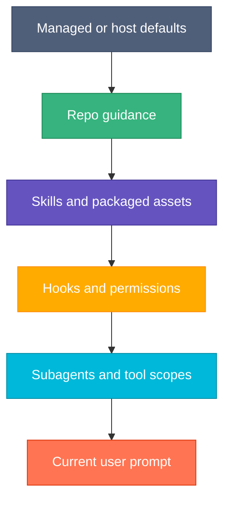

# Prompting and Control Surfaces

Use this page when the question is "what is shaping the agent's behavior?" rather than "why did this one answer look
odd?"

## The Core Idea

The harness is controlled by more than a single prompt.

Behavior usually comes from a stack of control surfaces:

- base host instructions
- repo guidance like `CLAUDE.md` and `AGENTS.md`
- skills and packaged prompt assets
- hooks and permission rules
- subagents and their tool limits
- the immediate user prompt

If two surfaces disagree, behavior gets confusing fast.

## Control Surface Stack

The current turn matters, but it is rarely the only thing controlling the result.

## What Each Surface Is Good For

| Surface          | Good for                                  | Bad for                    |
|------------------|-------------------------------------------|----------------------------|
| Repo guidance    | durable project rules and boundaries      | transient tasks            |
| Skills           | reusable capabilities and workflows       | repo-global policy         |
| Hooks            | enforcement and automation around events  | broad conceptual guidance  |
| Subagents        | isolation, specialization, tool limits    | replacing clear repo rules |
| Per-turn prompts | immediate intent and task-specific nuance | durable operating policy   |

## Basidiocarp Mapping

- `lamella` packages shared skills, hooks, wrappers, and templates
- repo `.claude/` config shapes local host behavior
- `CLAUDE.md` and `AGENTS.md` define repo routing and workflow constraints
- host settings decide permissions, sandboxing, and hook activation

This is why behavior debugging is often "find the controlling surface" rather than "rewrite the prompt."

## Common Failure Shapes

### Too many overlapping instructions

The agent gets similar guidance from the host, repo files, skills, and the turn prompt. Small differences become
unstable behavior.

### Wrong surface for the job

A temporary task instruction gets baked into a durable skill, or a durable repo rule is repeated manually in every
prompt.

### Hidden enforcement

Hooks or permission rules change what the agent can do, but the visible prompt does not explain it.

## Design Rule

Put guidance at the narrowest surface that can own it well:

1. one task: prompt
2. repeated workflow: skill
3. event-based enforcement: hook
4. repo-wide rule: repo guidance
5. isolated specialist behavior: subagent

That keeps the harness legible.

## Related

- [Agent Harness](./agent-harness.md)
- [Tool Use and MCP](./tool-use-and-mcp.md)
- [Claude Code](../getting-started/claude-code.md)
