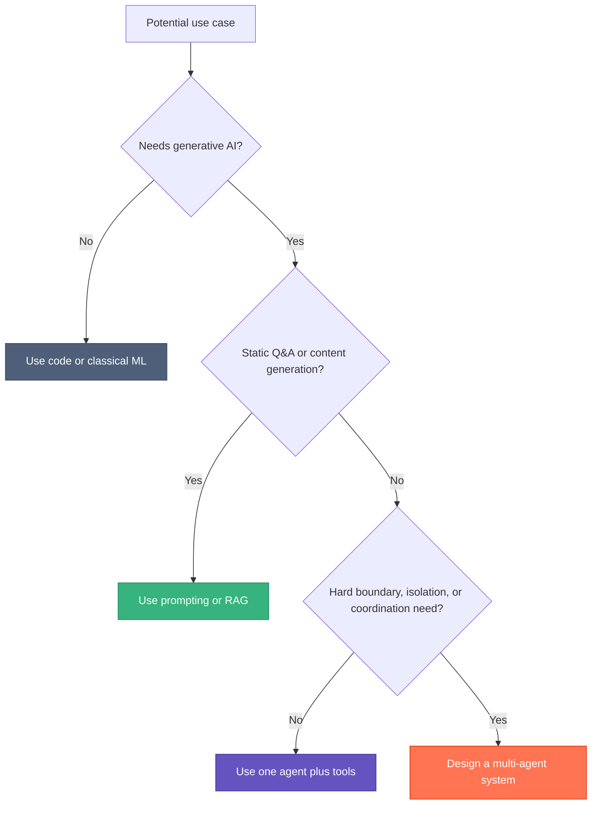

# Single vs Multi-Agent

Use this page when the question is whether the harness needs one agent, several agents, or no agent loop at all.

## Default Position

Start smaller than you think.

- if the task is retrieval or transformation, use prompting or RAG
- if the task needs planning plus actions, start with one agent and tools
- only add more agents when there is a real boundary or scaling reason

## Decision Guide

## Good Reasons for Multiple Agents

- separate permissions or compliance zones
- distinct teams or domains with independent ownership
- parallel exploration or validation is materially useful
- one coordinator becomes too overloaded to stay coherent

## Weak Reasons for Multiple Agents

- the workflow has named roles like planner, reviewer, and implementer
- it "sounds more agentic"
- prompt length feels messy but there is no real boundary problem

Many role-based workflows are still best handled by one agent with better control surfaces.

## Useful Shapes

### Single Agent With Tools

Best default for most product and coding work.

Pros:

- simpler debugging
- cheaper coordination cost
- fewer failure points

### Orchestrator and Workers

One coordinator decomposes and delegates.

Pros:

- good parallelism
- easier specialization

Cost:

- more coordination overhead
- harder state tracking

### Producer and Reviewer

One agent creates, another critiques or validates.

Pros:

- stronger correctness loop

Cost:

- slower and more expensive than a single pass

## Basidiocarp Angle

Basidiocarp supports both shapes, but it does not force you into multi-agent systems.

- `hyphae`, `rhizome`, and `mycelium` already make a single-agent loop much stronger
- `canopy` becomes useful when coordination itself is a real system concern
- `lamella` helps package the prompt and workflow assets either way

## Design Rule

Prove that one agent is insufficient before adding more agents.

That usually means one of three things is true:

1. isolation is mandatory
2. parallel work changes throughput enough to matter
3. validation or coordination is now a first-class problem

## Related

- [Agent Harness](./agent-harness.md)
- [Prompting and Control Surfaces](./prompting-and-control-surfaces.md)
- [Tool Use and MCP](./tool-use-and-mcp.md)
