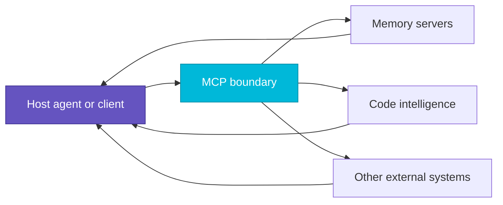

# Tool Use and MCP

Use this page when the model needs to reach outside its own weights.

## Why Tool Use Matters

A strong model without tools is still bounded by:

- stale training data
- no direct access to your code or files
- no ability to take actions
- no durable connection to your systems

Tool use is what turns reasoning into work.

## Tool Use vs Retrieval

Do not collapse these into one thing.

| Need                             | Pattern                                   |
|----------------------------------|-------------------------------------------|
| fetch knowledge into the prompt  | retrieval or RAG                          |
| inspect or mutate external state | tool call                                 |
| do both                          | retrieve first, then call tools as needed |

RAG gives the model better evidence. Tool use lets the model interact with real systems.

## What MCP Adds

MCP standardizes the connection between hosts and tools.

Instead of every host inventing a new integration shape, MCP gives you a consistent way to expose:

- tool schemas
- resource reads
- prompts
- structured server capabilities

That matters because the harness should not have to relearn tool plumbing for every editor or CLI.

## Mental Model

MCP is not the intelligence. It is the standard connection layer that makes tool use composable.

## Basidiocarp Mapping

In this workspace:

- `hyphae` exposes memory and document retrieval
- `rhizome` exposes code-aware navigation and edits
- hosts such as Claude Code, Codex CLI, and Cursor consume those servers through `stipe`-managed setup paths
- `spore` provides shared path and editor primitives beneath the host setup layer

## Good Tool Design

Tools work well when:

- the name and description make selection obvious
- parameters are narrow and structured
- side effects are clear
- output is concise enough to fit back into the loop

This is why tool surfaces and token shaping belong together. A powerful tool that returns junk still degrades the
harness.

## Design Rule

When adding capability, ask:

1. should this be retrieval?
2. should this be an MCP tool?
3. should this stay outside the agent entirely?

Not every integration belongs in the prompt loop.

## Related

- [Agent Harness](./agent-harness.md)
- [Context and Memory](./context-and-memory.md)
- [Host Support](../getting-started/host-support.md)
- [Claude Code](../getting-started/claude-code.md)
