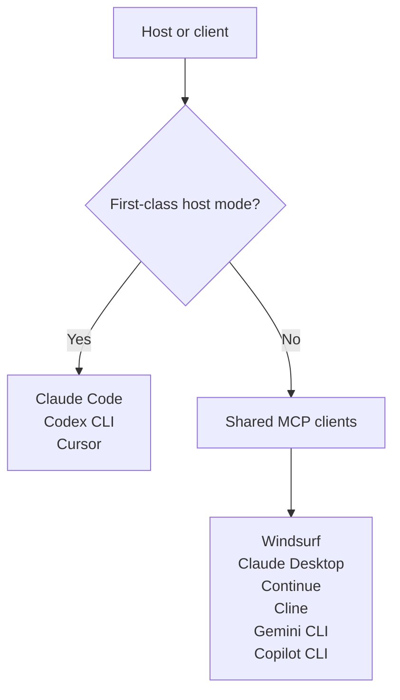

# Host Support

Basidiocarp does not treat every editor or CLI host the same way.

There are two layers:

- host modes
  - first-class setup and doctor flows in `stipe`
- shared MCP clients
  - editor or CLI configs that `stipe` can register with shared primitives

Use this page to answer "what is fully managed?" versus "what is shared MCP coverage?"



## First-Class Host Modes

These hosts have explicit `stipe host setup` and `stipe host doctor` flows:

| Host mode   | Adapter shape | What gets configured                                  |
|-------------|---------------|-------------------------------------------------------|
| Claude Code | hooks + MCP   | Hyphae and Rhizome MCP plus Cortina lifecycle hooks   |
| Codex CLI   | MCP + notify  | Hyphae and Rhizome MCP plus Hyphae notify integration |
| Cursor      | MCP           | Hyphae and Rhizome MCP registration                   |

These are the current first-class operator paths.

## Shared MCP Client Coverage

`stipe` also manages shared MCP registration for clients that reuse the same editor primitives:

- Cursor
- Windsurf
- Claude Desktop
- Continue
- Cline
- Gemini CLI
- Copilot CLI
- Codex CLI

This is not the same as saying every client has its own dedicated host mode. Shared MCP coverage means Basidiocarp can
register servers in the client config, not that every client gets its own hook, notify, or lifecycle flow.

## Where the Boundaries Live

- `stipe`
  - host inventory
  - install profiles
  - doctor severity
  - repair guidance
- `spore`
  - editor detection
  - config paths
  - MCP config writes
  - editor capability differences
- `cortina`
  - lifecycle runtime semantics
- `lamella`
  - templates, wrappers, and fallback packaging

## What to Expect Per Host

| Host                                                               | Current expectation                                  |
|--------------------------------------------------------------------|------------------------------------------------------|
| Claude Code                                                        | Best lifecycle coverage today                        |
| Codex CLI                                                          | Strong MCP plus notify path                          |
| Cursor                                                             | Managed MCP path                                     |
| Windsurf, Claude Desktop, Continue, Cline, Gemini CLI, Copilot CLI | Shared MCP coverage, narrower host-specific behavior |

## Operator Commands

Use these commands instead of guessing the host state:

```bash
stipe host list
stipe host setup claude-code
stipe host setup codex
stipe host setup cursor
stipe host doctor
stipe doctor
```

## Related

- [What Gets Installed](./install-scope.md)
- [Ecosystem Architecture](../architecture/ecosystem-architecture.md)
