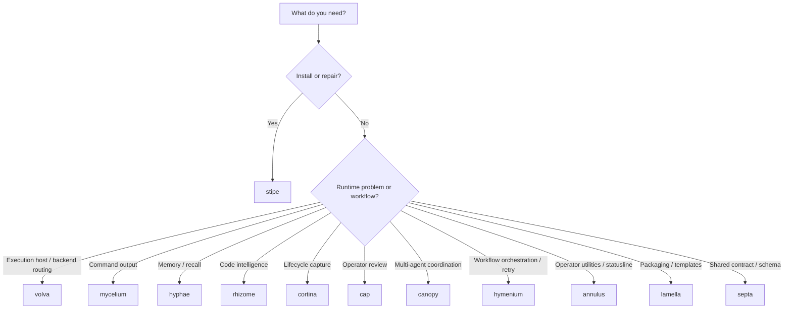

# Tool Selection

Use this page when the question is not "how does the ecosystem work?" but "which tool should I use right now?"

## Short Version

| Need                                                     | Tool       |
|----------------------------------------------------------|------------|
| Run through a dedicated execution-host runtime           | `volva`    |
| Install, configure, repair, or update the stack          | `stipe`    |
| Reduce command output and token usage                    | `mycelium` |
| Store or recall memory                                   | `hyphae`   |
| Inspect symbols or make code-intelligent edits           | `rhizome`  |
| Capture lifecycle signals and session outcomes           | `cortina`  |
| Review status and memory in a dashboard                  | `cap`      |
| Coordinate multiple agents and handoffs                  | `canopy`   |
| Orchestrate multi-step workflows with retry and recovery | `hymenium` |
| Cross-ecosystem operator utilities and statusline        | `annulus`  |
| Package templates, hooks, skills, commands, and wrappers | `lamella`  |
| Define a shared payload, schema, or cross-tool fixture   | `septa`    |
| Reuse shared editor and path primitives in Rust tools    | `spore`    |

## Decision Guide



## Common Scenarios

### "The host cannot see the tools"

Use `stipe`.

```bash
stipe doctor
stipe host doctor
```

### "I need backend routing or a dedicated execution-host runtime"

Use `volva`.

### "The agent is wasting tokens on shell output"

Use `mycelium`.

### "I need the agent to remember previous sessions"

Use `hyphae`.

### "I need references, renames, or symbol-level edits"

Use `rhizome`.

### "I need to know what happened during the session"

Use `cortina`.

### "I need a human-readable operational view"

Use `cap`.

### "I need to coordinate multiple active agents"

Use `canopy`.

### "I need multi-step workflow dispatch, phase gating, or retry and recovery"

Use `hymenium`.

### "I need operator utilities or a statusline across the ecosystem"

Use `annulus`.

### "I need to package or export shared prompts and hook templates"

Use `lamella`.

### "I need a shared schema or fixture that multiple tools depend on"

Use `septa`.

### "I am writing Rust tooling that needs shared editor primitives"

Use `spore`.

## Boundary Reminders

- `stipe` owns ecosystem policy.
- `volva` owns execution-host runtime and backend routing.
- `spore` owns shared editor primitives.
- `cortina` owns lifecycle runtime semantics.
- `lamella` owns packaging and templates.
- `canopy` owns coordination runtime state, not long-term memory.
- `hymenium` owns workflow dispatch, phase gating, and retry and recovery.
- `annulus` owns cross-ecosystem operator utilities and statusline.
- `hyphae` owns long-term memory and structured recall.
- `septa` owns shared payload contracts and fixtures.

## Related

- [Ecosystem Architecture](../architecture/ecosystem-architecture.md)
- [Operator Quickstart](./operator-quickstart.md)
- [What Gets Installed](./install-scope.md)
