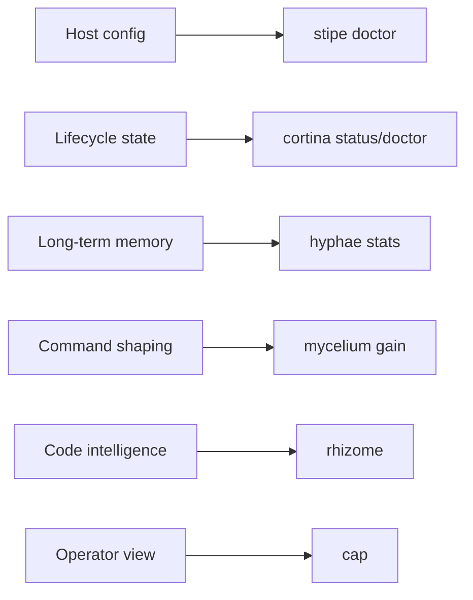

# Data and State Locations

Use this page to answer two questions:

- which tool owns this state?
- how do I inspect the active path instead of guessing?

Do not treat this page as a substitute for tool-local `doctor` or `status` commands. Prefer inspection commands when
they exist.

## Ownership Matrix

| State                               | Primary owner                    | Typical contents                                             | How to inspect                                   |
|-------------------------------------|----------------------------------|--------------------------------------------------------------|--------------------------------------------------|
| MCP client config                   | `stipe` using `spore` primitives | host registration for Hyphae and Rhizome                     | `stipe doctor`, `stipe host doctor`              |
| Hook and notify config              | `stipe`                          | Claude hook setup, Codex notify setup                        | `stipe doctor`, `stipe host doctor`              |
| Long-term memory DB                 | `hyphae`                         | memories, memoirs, chunks, sessions                          | `hyphae stats`, `cap`                            |
| Command analytics and rewrite state | `mycelium`                       | gain and tracking data                                       | `mycelium gain`, `mycelium gain --diagnostics`   |
| Code graph and symbol state         | `rhizome`                        | tree-sitter or LSP derived code intelligence                 | `rhizome` commands, `cap`                        |
| Lifecycle temp state                | `cortina`                        | scoped session state, pending ingest/export, outcome ledgers | `cortina status --json`, `cortina doctor --json` |
| Coordination runtime state          | `canopy`                         | active agents, tasks, handoffs, attention                    | `canopy` read surface when installed             |
| Dashboard config and runtime        | `cap`                            | dashboard server config and read-only operational views      | `cap` runtime and UI status pages                |

## Current Inspection Path



## Common Path Questions

### Which config file is active?

Use:

```bash
stipe doctor
stipe host doctor
```

These commands are the right place to inspect active host config paths and drift.

### Which Hyphae database is active?

Use:

```bash
hyphae stats
```

Use `cap` if you need a human-facing view of the same runtime data.

### Which Cortina state files are active?

Use:

```bash
cortina status --json
cortina doctor --json
```

If you are diagnosing a different worktree:

```bash
cortina status --cwd /path/to/worktree --json
cortina doctor --cwd /path/to/worktree --json
```

### Where does coordination state live?

When installed, `canopy` owns coordination-runtime state. It should not overload Hyphae session storage for task
ownership or handoff state.

## Platform Notes

Do not hardcode one Unix path model in your mental model.

- `spore` owns shared path primitives
- `stipe` owns host-aware setup policy
- the Rust tools now resolve platform-aware config, cache, and data locations through shared layers

That means the right answer is usually "inspect the active path" rather than "assume it is in one fixed directory."

## Related

- [Troubleshooting](./troubleshooting.md)
- [Host Support](../getting-started/host-support.md)
- [What Gets Installed](../getting-started/install-scope.md)
