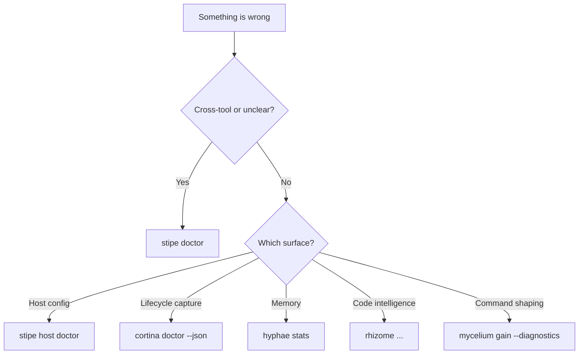

# Troubleshooting

Use this page for common operator failures.

Start with:

```bash
stipe doctor
```

Then narrow to the affected host or tool.

## Fast Triage

| Symptom                             | First command                            | What it usually means                             |
|-------------------------------------|------------------------------------------|---------------------------------------------------|
| MCP tools not visible in the host   | `stipe doctor`                           | missing or stale MCP registration                 |
| Claude lifecycle capture missing    | `stipe host doctor claude-code`          | hooks missing or pointed at the wrong runtime     |
| Codex lifecycle notes missing       | `stipe host doctor codex`                | notify config missing or stale                    |
| Recall seems empty                  | `hyphae stats`                           | wrong DB path, empty DB, or missing ingest        |
| Symbol tools fail or are incomplete | `rhizome doctor 2>/dev/null              |                                                   | true` | missing LSP support or project detection issue |
| Token shaping seems absent          | `mycelium gain --diagnostics 2>/dev/null |                                                   | true` | command is passthrough, not rewritten, or Mycelium is bypassed |
| Session capture looks wrong         | `cortina status --json`                  | scoped session or pending-state issue             |
| Operator view is confusing          | check `cap` or `stipe doctor` first      | runtime is healthy but state ownership is unclear |

## Missing MCP Registration

Symptoms:

- `hyphae` or `rhizome` tools do not appear in the host
- the host config exists, but tool calls fail

Commands:

```bash
stipe doctor
stipe host list
stipe host doctor
```

Common causes:

- host config file exists but is stale
- the registered binary path points at an old location
- the host was installed after Basidiocarp and never initialized

Typical fix:

```bash
stipe init
stipe host setup claude-code
stipe host setup codex
stipe host setup cursor
```

## Claude Hooks Are Not Firing

Symptoms:

- no new correction or error signals
- no session summaries
- `cortina` never appears in the lifecycle path

Commands:

```bash
stipe host doctor claude-code
cortina doctor --json
cortina status --json
```

Common causes:

- `settings.json` points at old hook commands
- hook files are missing
- project-local Claude settings override user settings

## Codex Notify Is Missing

Symptoms:

- Codex has MCP tools, but Hyphae does not receive lifecycle notes

Commands:

```bash
stipe host doctor codex
stipe doctor
```

Common causes:

- `.codex/config.toml` is missing notify entries
- notify points at the wrong `hyphae` binary

## Hyphae DB Path Confusion

Symptoms:

- expected memories are missing
- one command shows data and another does not

Commands:

```bash
hyphae stats
stipe doctor
```

Use [Data and State Locations](./state-locations.md) to understand which tool owns which path and how to inspect it.

## Rhizome LSP Is Unavailable

Symptoms:

- tree-sitter-based operations work, but reference or rename workflows fail

Commands:

```bash
rhizome lsp install rust 2>/dev/null || true
rhizome --help
```

Common causes:

- language server not installed yet
- project root detection is wrong

## Cortina Session State Looks Stale

Symptoms:

- session summaries do not match the current worktree
- pending export or ingest counts never drain

Commands:

```bash
cortina status --json
cortina doctor --json
```

What to check:

- wrong `--cwd` scope
- stale per-worktree state files
- required downstream tools missing for export or ingest

## Which Doctor Command Should I Use?



## Related

- [Operator Quickstart](../getting-started/operator-quickstart.md)
- [Host Support](../getting-started/host-support.md)
- [Data and State Locations](./state-locations.md)
