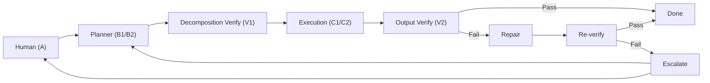
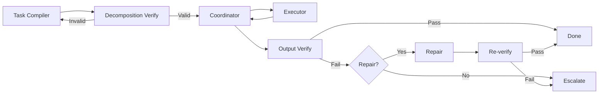
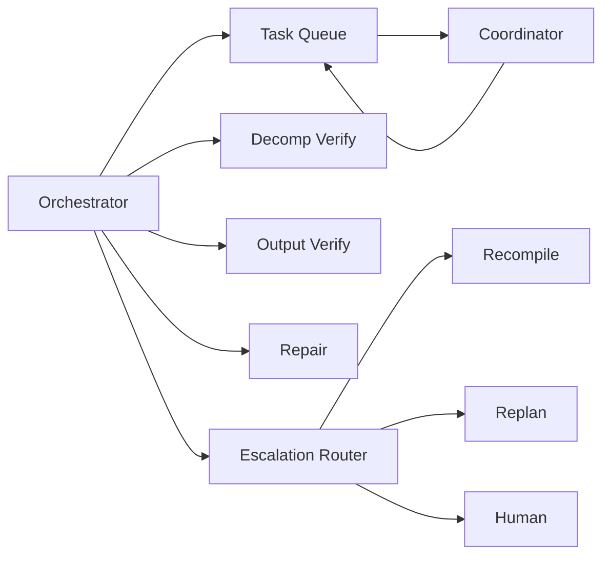
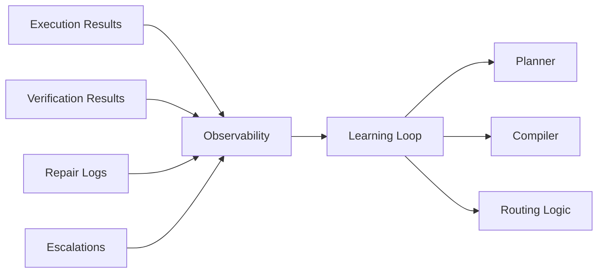
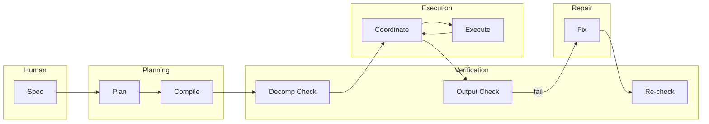
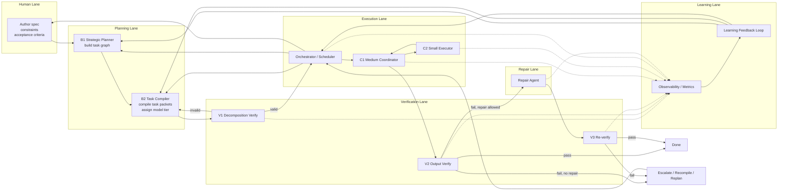
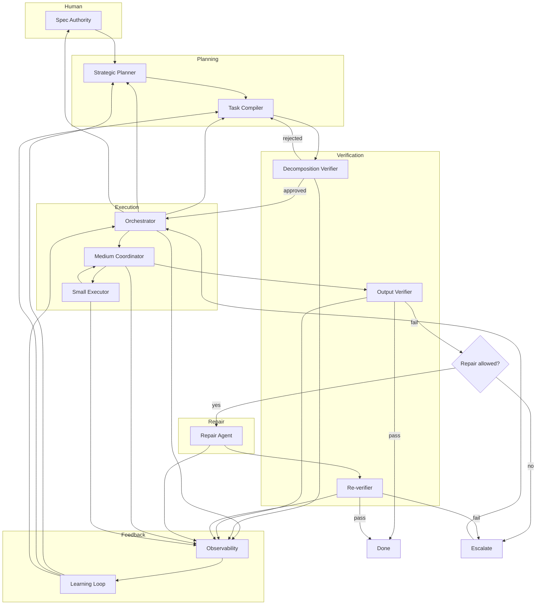
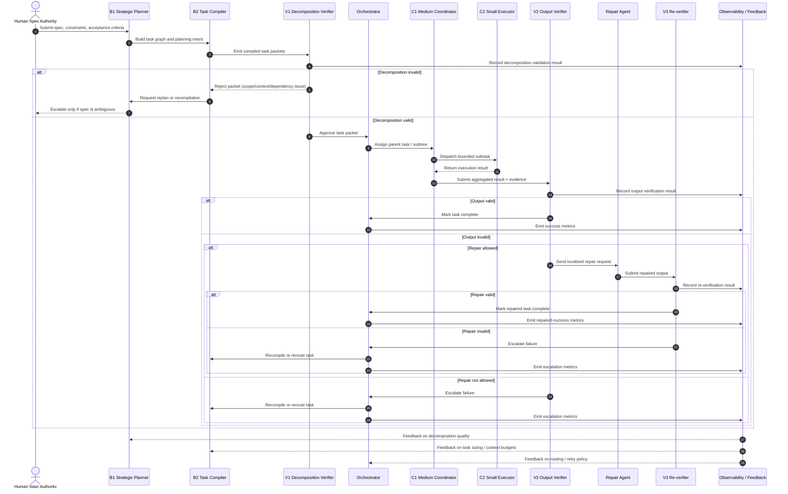
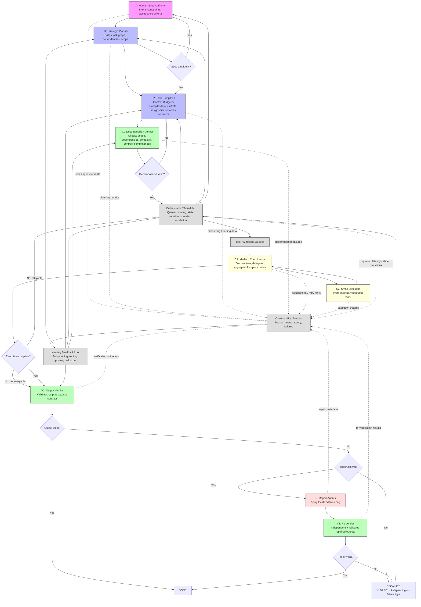
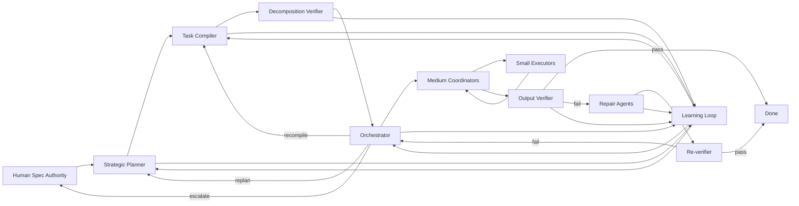

## High Level

---

## Execution Pipeline

---

## Control Plane

---

## Feedback Loop

---

## Swimlanes
### Swimlane A

### Swimlanes B

### Swimlanes C

---

## Sequence Diagrams

---

---

