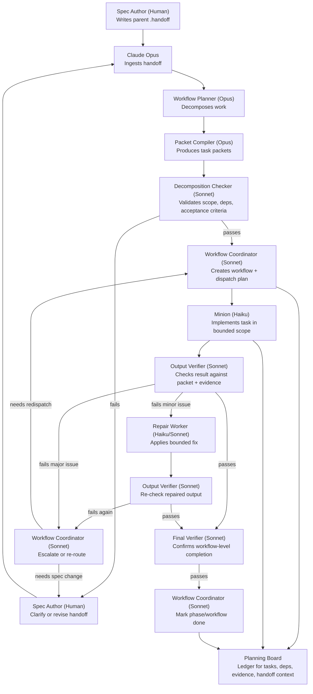

```mermaid
flowchart TD
    A["Spec Author (Human)
    Writes parent .handoff"] --> B["Claude Opus
    Ingests handoff"]
    B --> C["Workflow Planner (Opus)
    Decomposes work"]
    C --> D["Packet Compiler (Opus)
    Produces task packets"]
    D --> E["Decomposition Checker (Sonnet)
    Validates scope, deps, acceptance criteria"]

    E -->|fails| R1["Spec Author (Human)
    Clarify or revise handoff"]
    R1 --> B

    E -->|passes| F["Workflow Coordinator (Sonnet)
    Creates workflow + dispatch plan"]
    F --> G["Planning Board
    Ledger for tasks, deps, evidence, handoff context"]

    F --> H["Minion (Haiku)
    Implements task in bounded scope"]
    H --> G
    H --> I["Output Verifier (Sonnet)
    Checks result against packet + evidence"]

    I -->|passes| J["Final Verifier (Sonnet)
    Confirms workflow-level completion"]
    J -->|passes| K["Workflow Coordinator (Sonnet)
    Mark phase/workflow done"]
    K --> G

    I -->|fails minor issue| L["Repair Worker (Haiku/Sonnet)
    Applies bounded fix"]
    L --> M["Output Verifier (Sonnet)
    Re-check repaired output"]

    M -->|passes| J
    M -->|fails again| N["Workflow Coordinator (Sonnet)
    Escalate or re-route"]

    I -->|fails major issue| N
    N -->|needs spec change| R1
    N -->|needs redispatch| F
```
