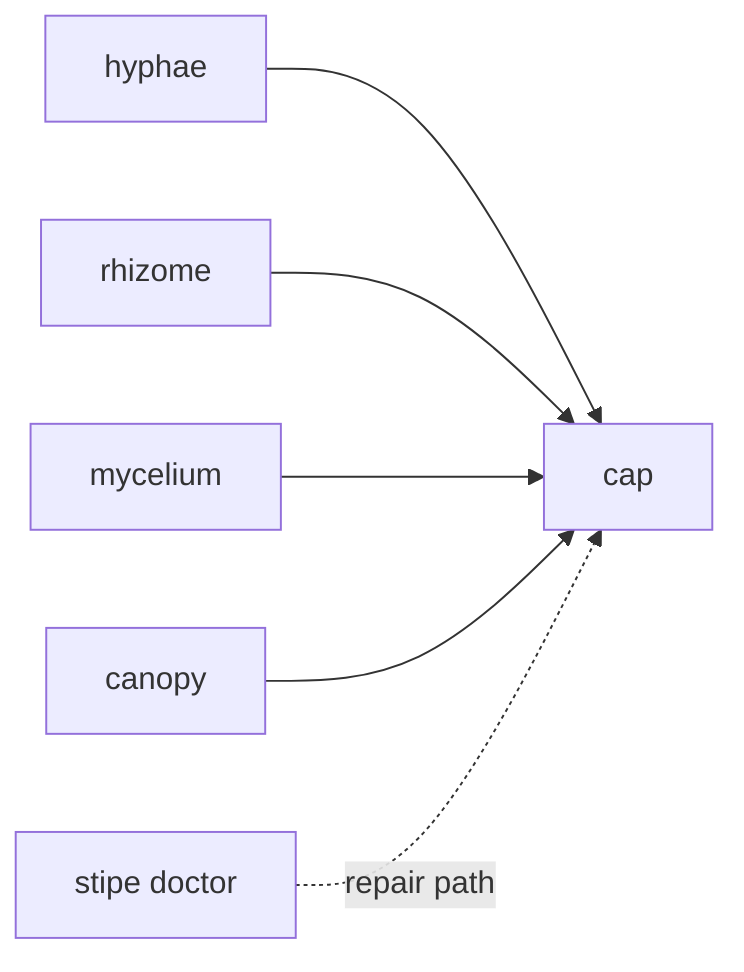

# Cap

Use `cap` when you want an operator view instead of another CLI result.

`cap` is the dashboard and review surface for the ecosystem. It is not the place to perform installation, host repair,
or lifecycle capture itself.

## Use Cap When

- you want a human-readable operational view
- you want to browse memories and memoirs
- you want to inspect resolved paths and their provenance
- you want to review analytics or status across multiple tools
- you want one place to look at memory, code intelligence, and ecosystem health together

## Use the CLI When

- you need to install or repair the stack
  - use `stipe`
- you need to capture or inspect lifecycle state
  - use `cortina`
- you need memory recall, export, or direct inspection
  - use `hyphae`
- you need command-shaping diagnostics
  - use `mycelium`
- you need symbol or code-intelligence workflows
  - use `rhizome`

## Cap Versus CLI

| Need                         | Use `cap` | Use CLI                             |
|------------------------------|-----------|-------------------------------------|
| Overview of system state     | Yes       | Sometimes                           |
| Repair or reconfigure hosts  | No        | `stipe`                             |
| Inspect lifecycle temp state | No        | `cortina`                           |
| Export training data         | No        | `hyphae export-training`            |
| Run symbol operations        | No        | `rhizome`                           |
| Review memories visually     | Yes       | Optional                            |
| Investigate path provenance  | Yes       | `stipe doctor` or tool-local status |

## Runtime Position

## What Cap Does Not Replace

- `stipe doctor`
  - still the first command for install and host drift
- `cortina status` and `cortina doctor`
  - still the right commands for scoped lifecycle state
- `hyphae` CLI
  - still the right place for memory export and direct operator actions

## Related

- [Tool Selection](../getting-started/tool-selection.md)
- [Troubleshooting](../operate/troubleshooting.md)
- [Data and State Locations](../operate/state-locations.md)
