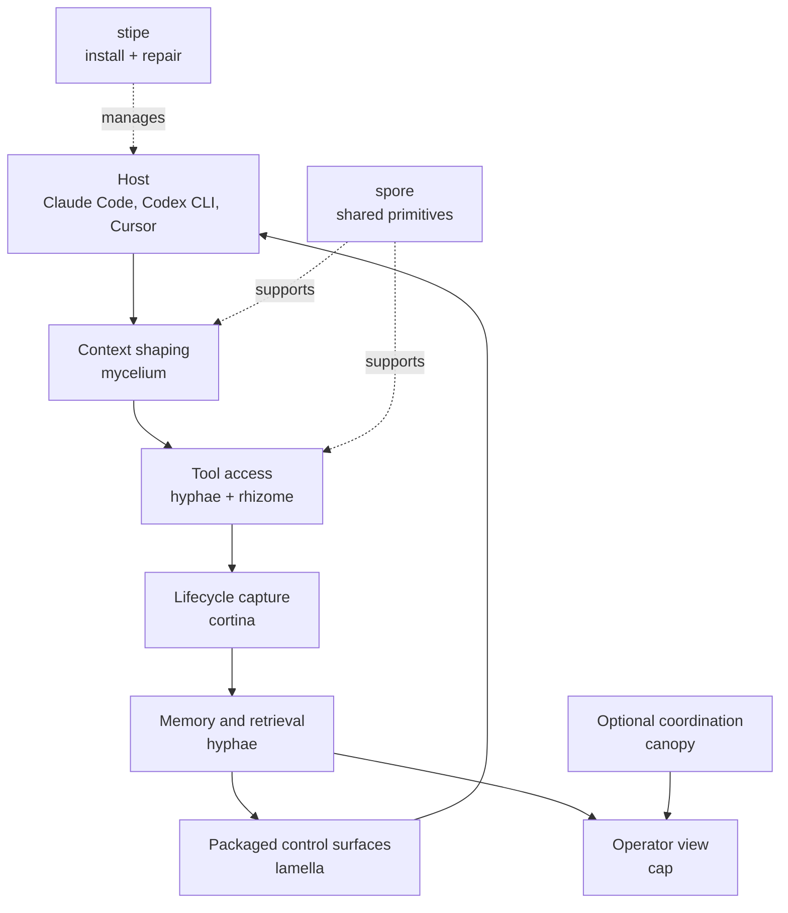
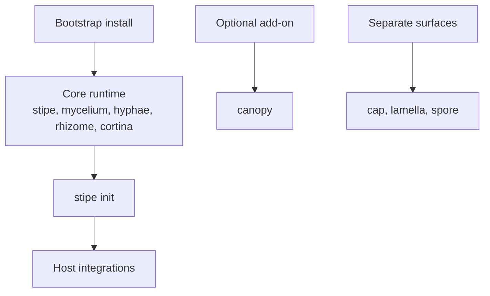
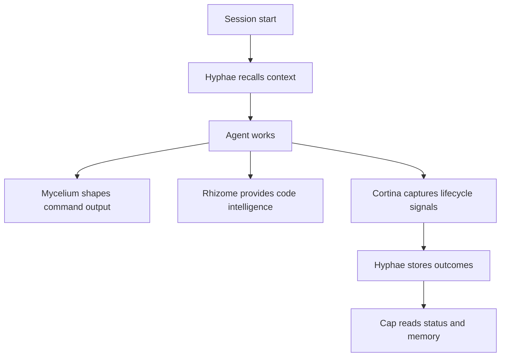

# Basidiocarp

Tools that make AI coding agents better at their job. Memory that persists across sessions, token compression that cuts
costs 60-90%, code intelligence across 32 languages, and feedback capture that turns mistakes into lessons.

Everything runs locally. No cloud services, no API keys for the core stack. SQLite all the way down.

Basidiocarp is best thought of as a harness around the model, not a single agent binary. The host still runs the model.
Basidiocarp shapes context, provides tools and memory, captures lifecycle signals, packages reusable control surfaces,
and exposes operator views around that loop.

## Install

On macOS and Linux:

```bash
curl -fsSL https://raw.githubusercontent.com/basidiocarp/.github/main/install.sh | sh
```

On Windows PowerShell:

```powershell
irm https://raw.githubusercontent.com/basidiocarp/.github/main/install.ps1 | iex
```

The bootstrap scripts install the default local runtime set, then hand host setup to `stipe`. Today that means `stipe`,
`mycelium`, `hyphae`, `rhizome`, and `cortina`. `canopy` is optional, `cap` is a separate dashboard surface, `lamella`
is the packaging layer, and `spore` is a shared library. Run `stipe doctor` to confirm everything landed.

Both scripts install into a local user bin directory by default:

- macOS and Linux: `~/.local/bin`
- Windows: `%LOCALAPPDATA%\Basidiocarp\bin`

## First Run

```bash
stipe init
stipe doctor
```

Use [Operator Quickstart](../docs/getting-started/operator-quickstart.md) for the task-oriented path after the binaries
land.

## Projects

| Project                                             | What it does                                                                                                                                                                        |
|-----------------------------------------------------|-------------------------------------------------------------------------------------------------------------------------------------------------------------------------------------|
| [Mycelium](https://github.com/basidiocarp/mycelium) | CLI proxy. Rewrites command output before it reaches the agent. 70+ filters, 60-90% token savings. [Docs](https://github.com/basidiocarp/mycelium/tree/main/docs)                   |
| [Hyphae](https://github.com/basidiocarp/hyphae)     | Agent memory. Episodic recall, knowledge graphs, RAG with hybrid search, training data export, and MCP tool workflows. [Docs](https://github.com/basidiocarp/hyphae/tree/main/docs) |
| [Rhizome](https://github.com/basidiocarp/rhizome)   | Code intelligence. Tree-sitter + LSP, symbol extraction, file editing, code graphs. 37 MCP tools, 32 languages. [Docs](https://github.com/basidiocarp/rhizome/tree/main/docs)       |
| [Volva](https://github.com/basidiocarp/volva)       | Execution-host runtime. Backend routing, host-context shaping, and runtime invocation across supported execution paths.                                                              |
| [Cap](https://github.com/basidiocarp/cap)           | Web dashboard. Browse memories, view token analytics, inspect resolved config paths, and see why each path was chosen. [Docs](https://github.com/basidiocarp/cap/tree/main/docs)    |
| [Spore](https://github.com/basidiocarp/spore)       | Shared Rust library. Discovery, JSON-RPC, editor config registration, self-update, platform paths.                                                                                  |
| [Stipe](https://github.com/basidiocarp/stipe)       | Ecosystem manager. Multi-host, platform-aware install, init, doctor, and update.                                                                                                    |
| [Cortina](https://github.com/basidiocarp/cortina)   | Adapter-first lifecycle runner. Captures errors, corrections, code changes, and session summaries in Rust.                                                                          |
| [Canopy](https://github.com/basidiocarp/canopy)     | Coordination runtime. Tracks active agents, task ownership, handoffs, and operator attention for multi-agent work.                                                                  |
| [Lamella](https://github.com/basidiocarp/lamella)   | Packaging layer. Skills, agents, hooks, commands, wrappers, and templates for supported hosts. [Docs](https://github.com/basidiocarp/lamella/blob/main/docs)                        |
| [Septa](https://github.com/basidiocarp/septa)       | Cross-tool contract layer. Shared payload shapes, fixtures, and schema governance across the ecosystem.                                                                             |

## Guides

| Guide                                                                                  | Covers                                                                 |
|----------------------------------------------------------------------------------------|------------------------------------------------------------------------|
| [Docs Index](../docs/README.md)                                                        | Entry point for the full docs set                                      |
| [Operator Quickstart](../docs/getting-started/operator-quickstart.md)                  | Install, init, doctor, and the first commands to run                   |
| [Troubleshooting](../docs/operate/troubleshooting.md)                                  | Common failures, recovery commands, and doctor routing                 |
| [Tool Selection](../docs/getting-started/tool-selection.md)                            | Which tool owns which operator task                                    |
| [Data and State Locations](../docs/operate/state-locations.md)                         | What state each tool owns and how to inspect active paths              |
| [Cap](../docs/tools/cap.md)                                                            | When to use the dashboard versus CLI tools                             |
| [Canopy](../docs/tools/canopy.md)                                                      | When coordination runtime matters and when it does not                 |
| [Release and Install Matrix](../docs/operate/release-and-install-matrix.md)            | Platform and delivery-mode summary                                     |
| [What Gets Installed](../docs/getting-started/install-scope.md)                        | Default bootstrap binaries, optional tools, source-only surfaces       |
| [Host Support](../docs/getting-started/host-support.md)                                | First-class host modes, shared MCP clients, setup expectations         |
| [Harness Overview](../docs/architecture/harness-overview.md)                           | Host, harness layer, owning repo, and operator surface on one page     |
| [Harness Composition](../docs/architecture/harness-composition.md)                     | How the repos compose one working harness around the model             |
| [Repo to Concept Map](../docs/concepts/repo-to-concept-map.md)                         | Which AI concepts each repo is implementing                            |
| [Ecosystem Architecture](../docs/architecture/ecosystem-architecture.md)               | Ownership boundaries, host adapters, platform paths, memory vs memoirs |
| [Integration](../docs/architecture/integration.md)                                     | How the projects connect, protocols, failure modes                     |
| [AI Concepts](../docs/concepts/ai-concepts.md)                                         | RAG, DPO, fine-tuning, self-hosting, Bedrock comparison                |
| [LLM Training](../docs/concepts/llm-training.md)                                       | Data export, Axolotl, Together.ai, Ollama serving                      |
| [Training Data](https://github.com/basidiocarp/hyphae/blob/main/docs/TRAINING-DATA.md) | Formats, volume estimates, SQL export                                  |

## Architecture



## Install and Runtime Surfaces



## How It Works

The short version: the host runs the model, and the Basidiocarp repos provide the harness layers around it.

Hyphae stores two kinds of data in one SQLite database. Memories are episodic: they decay over time based on importance
and access frequency. Memoirs are permanent knowledge graphs with typed relations between concepts. Search blends FTS5
full-text (30% weight) with cosine vector similarity (70%) using fastembed locally or any OpenAI-compatible endpoint.

`effective_decay = base_rate * importance_multiplier / (1 + access_count * 0.1)`

Critical memories never decay. Frequently accessed ones slow down. The decay runs automatically on every recall.

Rhizome parses code with tree-sitter (18 languages, 10 with dedicated queries) and fills gaps with LSP servers (32
languages, 20+ auto-installed). The `BackendSelector` picks the right backend per tool call: tree-sitter for symbol
extraction, LSP for references and renames. It also exports code structure graphs into Hyphae memoirs so the agent can
query "what calls this function?" from memory.

Mycelium sits between the agent and the shell. `git log -20` returns 5 lines instead of 200. `cargo test` with 500
passing tests returns only the 2 failures. Small outputs pass through untouched; medium ones get filtered; large ones
get chunked into Hyphae for later retrieval. 70+ filters cover git, cargo, npm, docker, kubectl, and more.

Cortina now uses an adapter-first event model. Today the Claude Code adapter has the richest lifecycle coverage, but the
core signal pipeline is no longer tied to one host envelope. On each event it checks for errors, self-corrections, and
code changes. On session end, it writes structured feedback into Hyphae and exports the code graph to Rhizome. Over
time, `extract_lessons` surfaces patterns from these signals, and `evaluate` measures whether the agent is getting
better. The accumulated data exports as SFT/DPO pairs for fine-tuning via `hyphae export-training`. See
the [AI Concepts](../docs/concepts/ai-concepts.md), [LLM Training](../docs/concepts/llm-training.md),
and [Repo to Concept Map](../docs/concepts/repo-to-concept-map.md).

Canopy is the optional coordination runtime. It is not part of the default bootstrap install, but it becomes the place
to track active agents, task ownership, handoffs, and operator attention when you need multi-agent runtime state instead
of just memory or lifecycle capture.

Volva is the execution-host boundary for runtime invocation, backend routing, and host-context shaping. Septa is the
shared contract layer that keeps cross-tool payloads, fixtures, and schemas explicit instead of letting them drift as
ad hoc shapes between repos.

Lamella is the packaging layer for reusable control surfaces: skills, hooks, commands, wrappers, and templates. Stipe
is the host adaptation layer that installs, registers, and repairs the stack across supported clients. Cap is the
operator review surface that makes the harness legible to humans.

## Platform Status

The core Rust services now centralize path resolution and host config handling instead of assuming one Unix shell
layout:

- `stipe` owns host inventory, repair guidance, and platform-aware setup policy.
- `spore` owns shared editor detection and MCP config registration paths.
- `mycelium`, `hyphae`, and `rhizome` now resolve config, cache, and data paths through shared platform-aware layers.
- `cap` shows both the resolved path and the provenance for that path: config file, environment override, or platform
  default.

The shared Rust CI now runs on Linux, macOS, and Windows so portability regressions show up earlier.


## Session Flow



## Read This Next

If you want the clearer docs-first version of this architecture:

1. [Harness Overview](../docs/architecture/harness-overview.md)
2. [Harness Composition](../docs/architecture/harness-composition.md)
3. [Repo to Concept Map](../docs/concepts/repo-to-concept-map.md)
