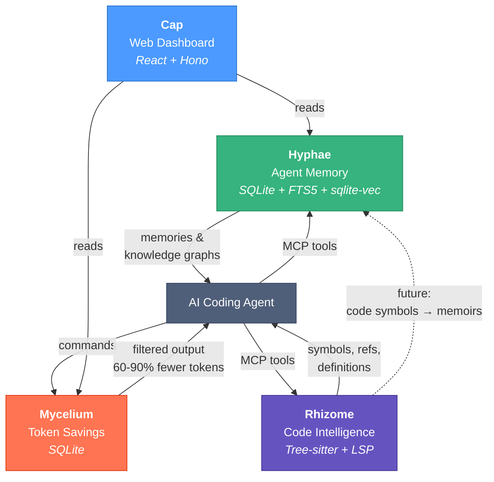
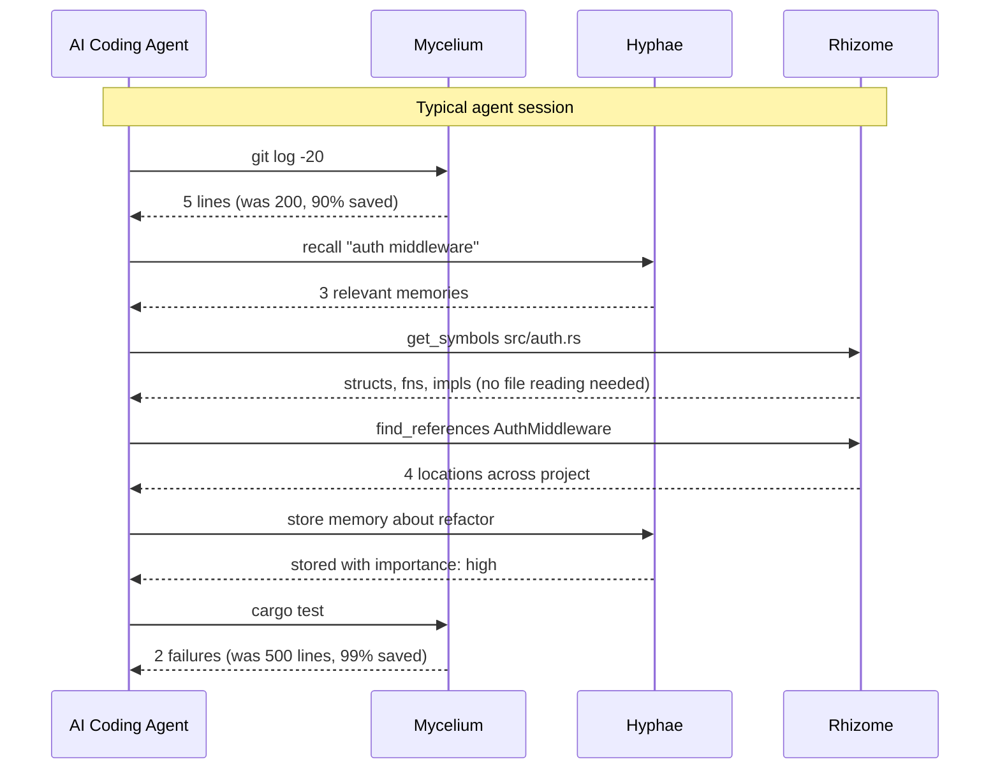

# Basidiocarp

Infrastructure for AI coding agents. Named after the fungal fruiting body — the visible structure that emerges from an underground mycelial network.

## Projects

### [Mycelium](https://github.com/basidiocarp/mycelium)
Token-optimized CLI proxy. Intercepts command output and compresses it before it reaches the LLM, cutting token usage by 60-90% on common dev operations (git, cargo, gh, docker, npm). Single Rust binary, integrates with Claude Code via hooks.

### [Hyphae](https://github.com/basidiocarp/hyphae)
Persistent memory for AI agents. Two complementary models: **episodic memories** (temporal, decay-based, topic-organized) and **semantic memoirs** (permanent knowledge graphs with typed concept relations). MCP server with 18 tools + CLI with 29 commands. Rust, SQLite, FTS5, sqlite-vec.

### [Rhizome](https://github.com/basidiocarp/rhizome)
Code intelligence MCP server. Gives agents symbol-level navigation — definitions, references, structure — instead of reading raw files. Dual backend: tree-sitter for instant offline parsing, LSP for cross-file intelligence when a language server is available. 9 languages, 12 tools. Rust.

### [Cap](https://github.com/basidiocarp/cap)
Web dashboard for the ecosystem. Browse and search agent memories, explore knowledge graphs, view token savings analytics. React, Mantine, Hono, Vite.

## How They Connect

## Agent Data Flow

## Built With

Rust (mycelium, hyphae, rhizome) and TypeScript (cap). All Rust projects target edition 2024, use clippy pedantic linting, and follow anyhow/thiserror error handling conventions.
