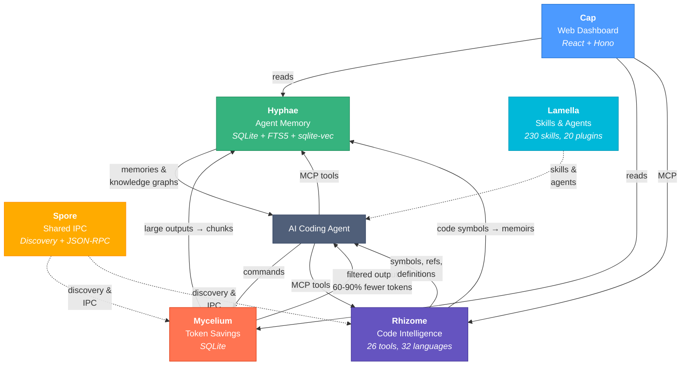
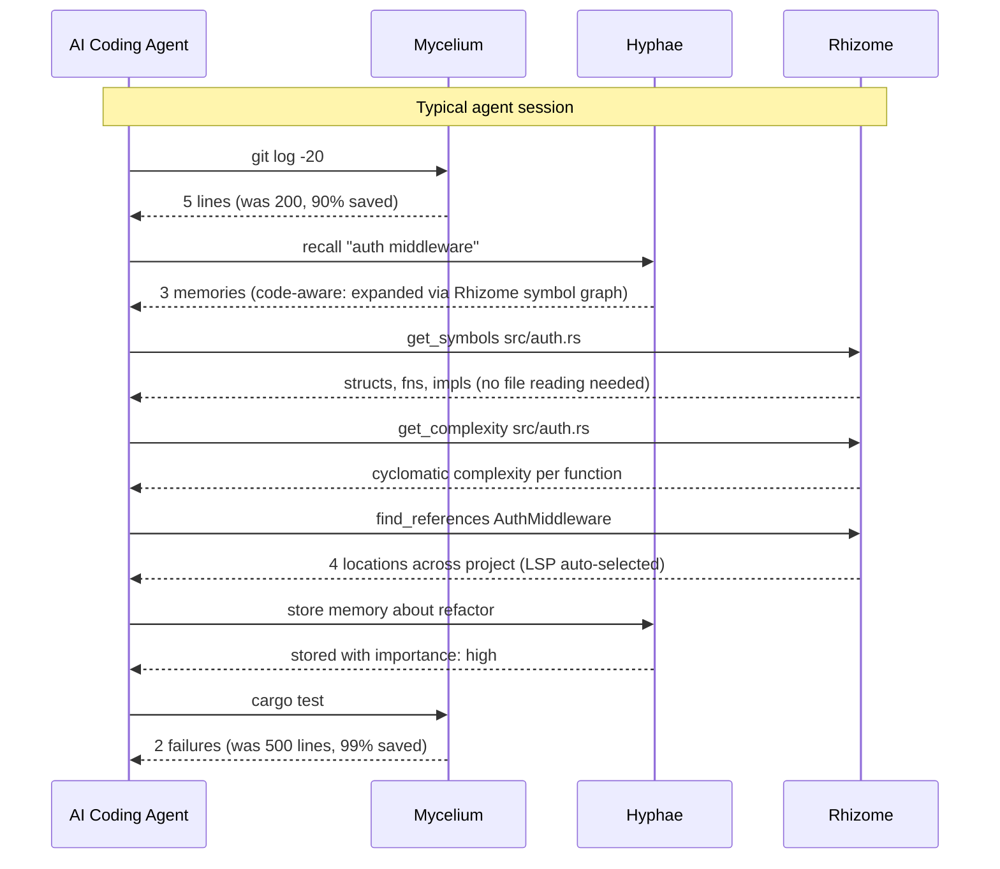

# Basidiocarp

Infrastructure for AI coding agents. Named after the fungal fruiting body — the visible structure that emerges from an underground mycelial network.

## Install

```bash
# Install everything (mycelium, hyphae, rhizome)
curl -fsSL https://raw.githubusercontent.com/basidiocarp/.github/main/install.sh | sh

# Install specific tools
curl -fsSL https://raw.githubusercontent.com/basidiocarp/.github/main/install.sh | sh -s -- --tools mycelium,hyphae

# Custom install directory
curl -fsSL https://raw.githubusercontent.com/basidiocarp/.github/main/install.sh | sh -s -- --prefix /usr/local/bin

# Pin a version
curl -fsSL https://raw.githubusercontent.com/basidiocarp/.github/main/install.sh | sh -s -- --version 0.3.0

# Uninstall
curl -fsSL https://raw.githubusercontent.com/basidiocarp/.github/main/install.sh | sh -s -- --uninstall
```

The installer downloads pre-built binaries, configures Claude Code (MCP servers + hooks), and verifies the installation. Supports macOS (arm64/x86_64) and Linux (x86_64/aarch64).

If you already have mycelium installed:

```bash
mycelium init --ecosystem
```

## Projects

### [Mycelium](https://github.com/basidiocarp/mycelium)
Token-optimized CLI proxy. Intercepts command output and compresses it before it reaches the LLM, cutting token usage by 60-90% on common dev operations. Routes large outputs to Hyphae for chunked storage instead of destructive filtering. Single Rust binary, integrates with Claude Code via hooks.

### [Hyphae](https://github.com/basidiocarp/hyphae)
Persistent memory for AI agents. Two complementary models: **episodic memories** (temporal, decay-based, topic-organized) and **semantic memoirs** (permanent knowledge graphs with typed concept relations). Code-aware recall expands search queries with Rhizome's symbol graph. MCP server with 20+ tools + CLI with 29 commands. Rust, SQLite, FTS5, sqlite-vec.

### [Rhizome](https://github.com/basidiocarp/rhizome)
Code intelligence MCP server. 26 tools across 32 programming languages. Dual backend: tree-sitter (instant offline parsing, zero setup) and LSP (cross-file references, rename, diagnostics — auto-installed). Backend auto-selected per tool call. Exports code symbol graphs to Hyphae as persistent knowledge. Rust.

### [Cap](https://github.com/basidiocarp/cap)
Web dashboard for the ecosystem. Browse memories, explore knowledge graphs, view token savings analytics, navigate code with symbol outlines, annotations, and complexity metrics. 8 pages, 15+ API endpoints. React, Mantine, Hono, Vite.

### [Spore](https://github.com/basidiocarp/spore)
Shared IPC library. Tool discovery, JSON-RPC 2.0 primitives, and subprocess MCP communication used by mycelium and rhizome. Rust.

### [Lamella](https://github.com/basidiocarp/lamella)
Plugin system for Claude Code. 230 curated skills, 175 agents, 213 commands across 20 plugins. Official Claude Code plugin format with marketplace support.

## How They Connect



## Agent Data Flow



## Built With

Rust (mycelium, hyphae, rhizome, spore) and TypeScript (cap). All Rust projects target edition 2024, use clippy pedantic linting, and follow anyhow/thiserror error handling conventions.
