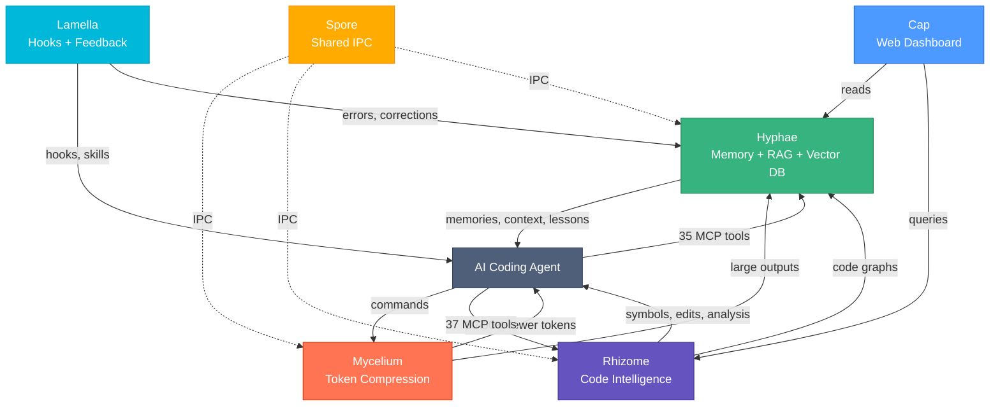
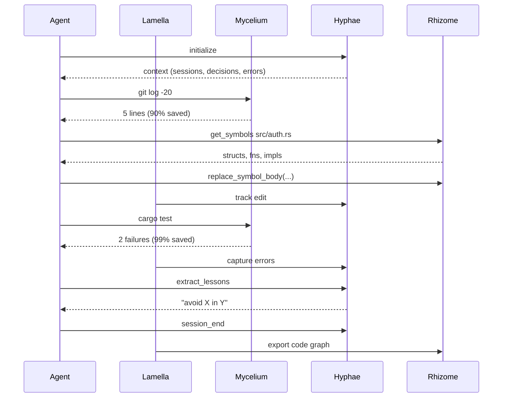

# Basidiocarp

Infrastructure for AI coding agents. Named after the fungal fruiting body — the visible structure that emerges from an underground mycelial network.

## Install

```bash
curl -fsSL https://raw.githubusercontent.com/basidiocarp/.github/main/install.sh | sh
```

The installer downloads pre-built binaries, auto-detects your MCP clients (Claude Code, Cursor, Windsurf, Continue, Claude Desktop), configures MCP servers and hooks, and verifies the installation.

```bash
mycelium init --ecosystem    # Configure everything
mycelium doctor              # Verify installation
```

## Documentation

| Guide | Description |
|-------|------------|
| [Technical Overview](#technical-overview) | Architecture, RAG, vector search, feedback loops |
| [LLM Training Guide](docs/LLM-TRAINING.md) | Fine-tuning, DPO, training data export from Basidiocarp |
| [Install & Update](#install) | Binaries, configuration, verification |

## Projects

| Project | What it does | Links |
|---------|-------------|-------|
| [Mycelium](https://github.com/basidiocarp/mycelium) | Token-optimized CLI proxy (60-90% savings, 70+ commands) | [Docs](https://github.com/basidiocarp/mycelium/tree/main/docs) |
| [Hyphae](https://github.com/basidiocarp/hyphae) | Persistent memory + RAG (35 MCP tools, vector DB, knowledge graphs) | [Docs](https://github.com/basidiocarp/hyphae/tree/main/docs) |
| [Rhizome](https://github.com/basidiocarp/rhizome) | Code intelligence (37 tools, 32 languages, tree-sitter + LSP) | [Docs](https://github.com/basidiocarp/rhizome/tree/main/docs) |
| [Cap](https://github.com/basidiocarp/cap) | Web dashboard (11 pages, 60+ API endpoints) | [Docs](https://github.com/basidiocarp/cap/tree/main/docs) |
| [Spore](https://github.com/basidiocarp/spore) | Shared IPC library (discovery, JSON-RPC, subprocess MCP) | — |
| [Lamella](https://github.com/basidiocarp/lamella) | Claude Code plugins (hooks, skills, feedback capture) | — |

## How They Connect



## Technical Overview

### Vector Database & Hybrid Search → [Hyphae](https://github.com/basidiocarp/hyphae)

SQLite + sqlite-vec + FTS5. Hybrid search pipeline: 30% BM25 full-text + 70% cosine vector similarity. Embeddings via fastembed (local) or HTTP API (Ollama/OpenAI).

### RAG Pipeline → [Hyphae](https://github.com/basidiocarp/hyphae) + [Lamella](https://github.com/basidiocarp/lamella)


Auto-indexing via Lamella hooks. Auto-context injection on MCP init.

### Memory Decay → [Hyphae](https://github.com/basidiocarp/hyphae)

`effective_rate = base_decay × importance_multiplier / (1 + access_count × 0.1)`

Critical memories never decay. Frequently accessed memories decay slower. Auto-decay on recall.

### Knowledge Graphs → [Hyphae](https://github.com/basidiocarp/hyphae) + [Rhizome](https://github.com/basidiocarp/rhizome)

Memoirs: permanent concept graphs with typed relations. Code graphs: auto-generated from tree-sitter analysis, exported to Hyphae.

### Tree-sitter + LSP → [Rhizome](https://github.com/basidiocarp/rhizome)

18 languages with tree-sitter grammars (10 with query patterns, 8 with generic fallback). 32 languages with LSP configs, 20+ with auto-install recipes. Backend auto-selected per tool call.

### Feedback Loop → [Hyphae](https://github.com/basidiocarp/hyphae) + [Lamella](https://github.com/basidiocarp/lamella)


Captures corrections, errors, test failures, PR reviews. `hyphae_extract_lessons` surfaces recurring patterns.

### LLM Training Data → [Guide](docs/LLM-TRAINING.md)

Basidiocarp captures data suitable for fine-tuning but doesn't train models. Memories become SFT instruction pairs. Corrections become DPO preference pairs. Export to JSONL, fine-tune with Together.ai or Axolotl, serve with Ollama.

### Token Optimization → [Mycelium](https://github.com/basidiocarp/mycelium)

70+ regex-based filters. Adaptive compression. Hook-based interception. 60-90% savings.

### MCP Protocol → All tools

JSON-RPC 2.0 over stdio, line-delimited framing. Hyphae: 35 tools. Rhizome: 37 tools.

## Agent Data Flow


