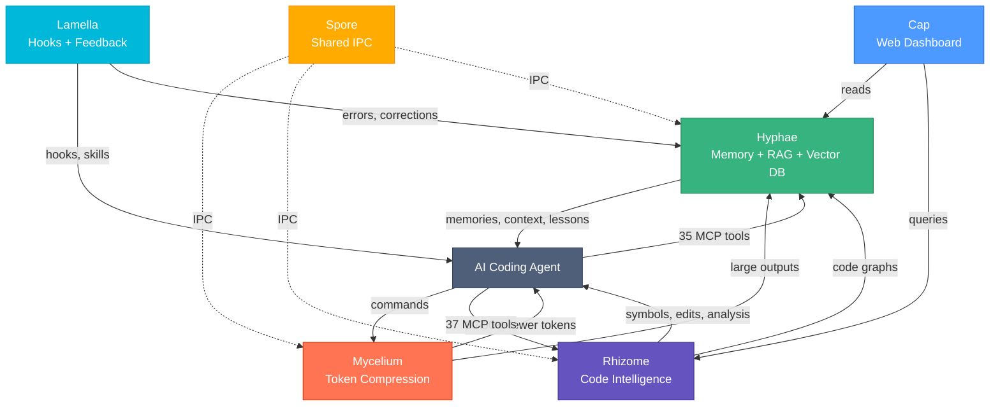
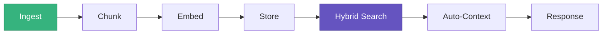
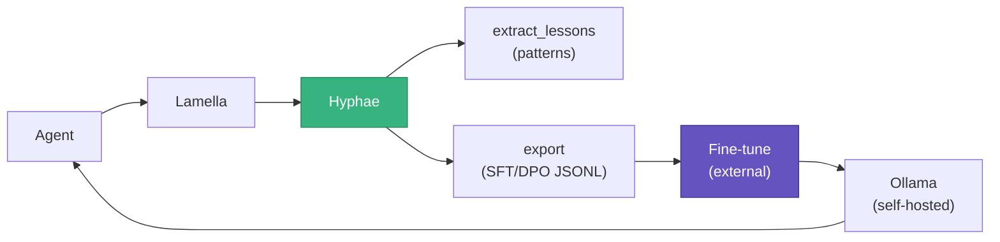
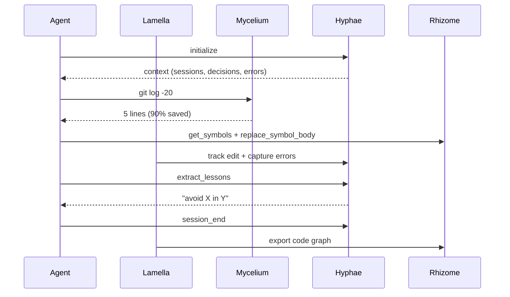

# Basidiocarp

Infrastructure for AI coding agents. Named after the fungal fruiting body — the visible structure that emerges from an underground mycelial network.

## Install

```bash
curl -fsSL https://raw.githubusercontent.com/basidiocarp/.github/main/install.sh | sh
```

Auto-detects MCP clients (Claude Code, Cursor, Windsurf, Continue, Claude Desktop), configures servers and hooks.

```bash
mycelium init --ecosystem    # Configure everything
mycelium doctor              # Verify installation
```

## Documentation

| Guide | Description |
|-------|------------|
| [Technical Overview](#technical-overview) | Architecture, RAG, vector search, feedback loops |
| [AI Concepts Guide](docs/AI-CONCEPTS.md) | Bedrock comparison, RAG vs supervised vs unsupervised learning, self-hosting your own model |
| [LLM Training Guide](docs/LLM-TRAINING.md) | Fine-tuning, DPO, training data export from Basidiocarp |
| [Hyphae: Training Data](https://github.com/basidiocarp/hyphae/blob/main/docs/TRAINING-DATA.md) | Data formats, volume estimates, SQL export queries |
| [Lamella: Feedback Capture](https://github.com/basidiocarp/lamella/blob/main/docs/FEEDBACK-CAPTURE.md) | Hook architecture, correction/error data flow |

## Projects

| Project | What it does | Links |
|---------|-------------|-------|
| [Mycelium](https://github.com/basidiocarp/mycelium) | Token-optimized CLI proxy (60-90% savings, 70+ commands) | [Docs](https://github.com/basidiocarp/mycelium/tree/main/docs) |
| [Hyphae](https://github.com/basidiocarp/hyphae) | Persistent memory + RAG (35 MCP tools, vector DB, knowledge graphs) | [Docs](https://github.com/basidiocarp/hyphae/tree/main/docs) |
| [Rhizome](https://github.com/basidiocarp/rhizome) | Code intelligence (37 tools, 32 languages, tree-sitter + LSP) | [Docs](https://github.com/basidiocarp/rhizome/tree/main/docs) |
| [Cap](https://github.com/basidiocarp/cap) | Web dashboard (11 pages, 60+ API endpoints) | [Docs](https://github.com/basidiocarp/cap/tree/main/docs) |
| [Spore](https://github.com/basidiocarp/spore) | Shared IPC library (discovery, JSON-RPC, subprocess MCP) | — |
| [Lamella](https://github.com/basidiocarp/lamella) | Claude Code plugins (hooks, skills, feedback capture) | [Docs](https://github.com/basidiocarp/lamella/blob/main/docs/FEEDBACK-CAPTURE.md) |

## How They Connect



## Technical Overview

### Vector Database & Hybrid Search → [Hyphae](https://github.com/basidiocarp/hyphae)

SQLite + sqlite-vec + FTS5. Hybrid pipeline: 30% BM25 full-text + 70% cosine vector. Embeddings via fastembed (local) or HTTP (Ollama/OpenAI).

### RAG Pipeline → [Hyphae](https://github.com/basidiocarp/hyphae) + [Lamella](https://github.com/basidiocarp/lamella)



Auto-indexing via hooks. Auto-context injection on session start. See [AI Concepts: When to Use RAG](docs/AI-CONCEPTS.md#when-to-use-rag-vs-supervised-learning-vs-unsupervised-learning).

### Memory Decay → [Hyphae](https://github.com/basidiocarp/hyphae)

`effective_rate = base_decay × importance_multiplier / (1 + access_count × 0.1)`

### Knowledge Graphs → [Hyphae](https://github.com/basidiocarp/hyphae) + [Rhizome](https://github.com/basidiocarp/rhizome)

Memoirs: permanent concept graphs. Code graphs: auto-generated from tree-sitter, exported to Hyphae.

### Tree-sitter + LSP → [Rhizome](https://github.com/basidiocarp/rhizome)

18 languages with tree-sitter grammars. 32 with LSP configs. Backend auto-selected per tool call.

### Feedback → Lessons → Training Data



Captures corrections, errors, test failures. `extract_lessons` surfaces patterns. Data exports as SFT/DPO pairs for fine-tuning. See [AI Concepts](docs/AI-CONCEPTS.md) and [LLM Training Guide](docs/LLM-TRAINING.md).

### Token Optimization → [Mycelium](https://github.com/basidiocarp/mycelium)

70+ filters. Adaptive compression. 60-90% savings.

## Agent Data Flow


