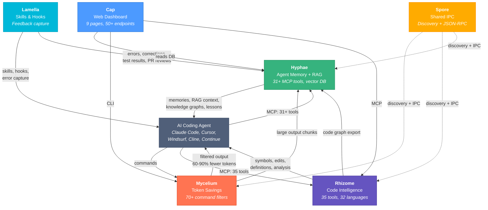
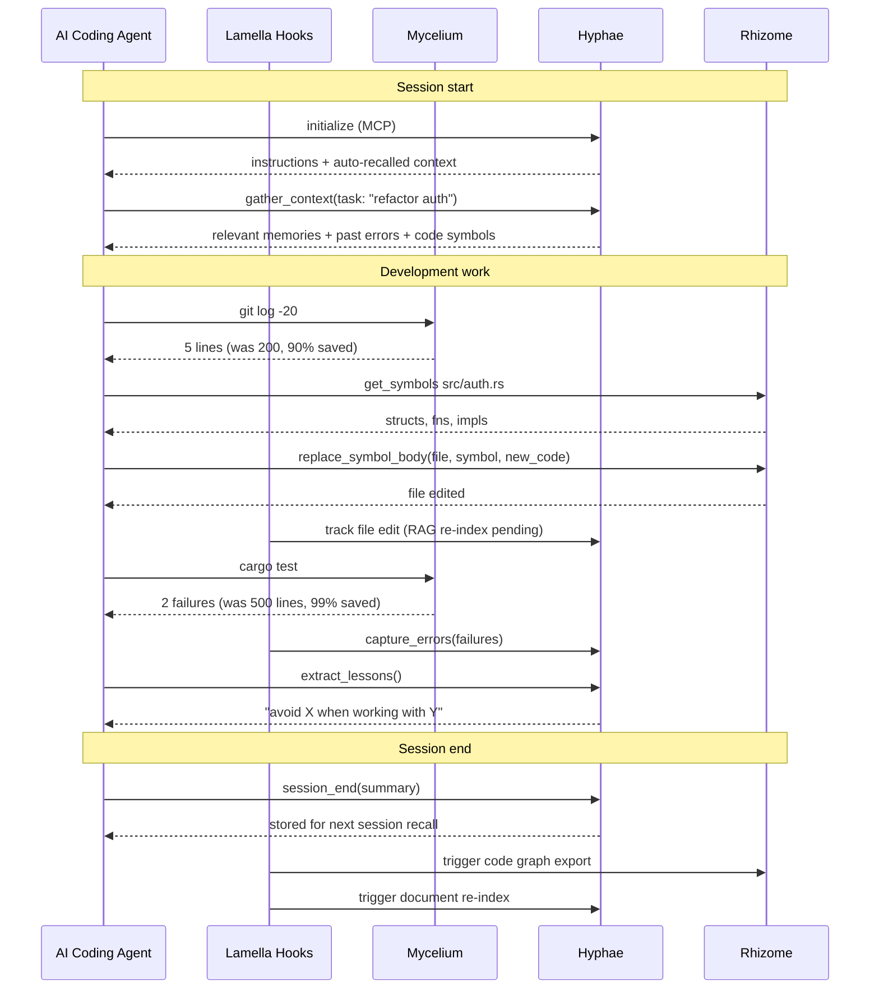

# Basidiocarp

Infrastructure for AI coding agents. Named after the fungal fruiting body — the visible structure that emerges from an underground mycelial network.

## Install

```bash
# Install everything (mycelium, hyphae, rhizome)
curl -fsSL https://raw.githubusercontent.com/basidiocarp/.github/main/install.sh | sh

# Install specific tools
curl -fsSL https://raw.githubusercontent.com/basidiocarp/.github/main/install.sh | sh -s -- --tools mycelium,hyphae

# Custom install directory
curl -fsSL https://raw.githubusercontent.com/basidiocarp/.github/main/install.sh | sh -s -- --prefix /usr/local/bin

# Uninstall
curl -fsSL https://raw.githubusercontent.com/basidiocarp/.github/main/install.sh | sh -s -- --uninstall
```

The installer downloads pre-built binaries, auto-detects your MCP clients (Claude Code, Cursor, Windsurf, Continue, Claude Desktop), configures MCP servers and hooks, and verifies the installation. Supports macOS (arm64/x86_64) and Linux (x86_64/aarch64).

### Configure

```bash
# Auto-detect all editors and configure everything
mycelium init --ecosystem

# Interactive guided setup (recommended for first time)
mycelium init --onboard

# Configure a specific editor
mycelium init --ecosystem --client cursor
mycelium init --ecosystem --client windsurf
mycelium init --ecosystem --client continue
mycelium init --ecosystem --client claude-desktop

# Print JSON config for any MCP client
mycelium init --ecosystem --client generic
```

### Verify

```bash
mycelium doctor    # Token proxy health
hyphae doctor      # Memory system health (DB integrity, FTS, MCP registration)
rhizome doctor     # Code intelligence health (parsers, LSP servers, export cache)
```

## Update

```bash
# Update all installed tools
curl -fsSL https://raw.githubusercontent.com/basidiocarp/.github/main/update.sh | sh

# Check for updates without installing
curl -fsSL https://raw.githubusercontent.com/basidiocarp/.github/main/update.sh | sh -s -- --check

# Or individually
mycelium self-update
hyphae self-update
rhizome self-update
```

## Technical Overview

The ecosystem combines several AI/ML and systems techniques to provide a complete infrastructure for coding agents. Each technique is implemented in a specific project and documented there in detail.

### Vector Database & Hybrid Search → [Hyphae](https://github.com/basidiocarp/hyphae)

Hyphae uses **SQLite + sqlite-vec** as an embedded vector database for semantic similarity search, combined with **FTS5** for full-text search:

| Layer | Technology | Purpose |
|-------|-----------|---------|
| Storage | SQLite (bundled, zero config) | Memories, memoirs, embeddings, chunks |
| Full-text search | FTS5 (BM25 ranking) | Keyword-based recall with relevance scoring |
| Vector search | sqlite-vec (HNSW index) | Cosine similarity for semantic search |
| Hybrid search | 30% FTS5 + 70% vector | Combines keyword precision with semantic understanding |
| Embeddings | fastembed (local, 384-dim) or HTTP API (Ollama/OpenAI-compatible) | Converts text to vectors for similarity search |

The hybrid pipeline: Query → embed → parallel FTS5 + vector search → weighted merge → re-rank by decay-adjusted weight.

### Retrieval-Augmented Generation (RAG) → [Hyphae](https://github.com/basidiocarp/hyphae) + [Lamella](https://github.com/basidiocarp/lamella)

The ecosystem provides a RAG pipeline for AI agents to ground their responses in project-specific knowledge:

```
Document Ingestion          Retrieval                    Generation
──────────────────    ─────────────────────    ──────────────────────
hyphae_ingest_file    hyphae_memory_recall     Agent uses retrieved
  ↓                   hyphae_search_docs       context in responses
Chunking strategies   hyphae_search_all          ↓
(sliding window,        ↓                     More accurate,
 by heading,          Hybrid search            grounded output
 by function)         (FTS5 + vector)
  ↓                     ↓
Embed chunks          Ranked results
  ↓                   with relevance
Store in SQLite       scores
```

**Auto-indexing**: The `capture-code-changes` Lamella hook automatically triggers `hyphae ingest-file` when 3+ document files (.md, .json, .yaml, .toml, etc.) are modified during a session. Code files are indexed through Rhizome's symbol extraction instead.

**Auto-context injection**: On MCP initialization, Hyphae appends recent sessions, key decisions, project context, and resolved errors to the agent's instructions — providing relevant context from the very first message without requiring manual recall.

### Memory Decay Model → [Hyphae](https://github.com/basidiocarp/hyphae)

Memories decay over time based on importance, simulating human memory:

```
effective_rate = base_decay × importance_multiplier / (1 + access_count × 0.1)
```

| Importance | Multiplier | Behavior |
|-----------|-----------|----------|
| Critical | 0 (never decays) | Permanent knowledge |
| High | 0.5x | Slow decay |
| Medium | 1x | Normal decay |
| Low | 2x | Fast decay |

Frequently accessed memories decay slower (the `access_count` denominator). Auto-decay runs on recall if >24h since last run. Only medium/low importance memories are prunable.

### Knowledge Graphs → [Hyphae](https://github.com/basidiocarp/hyphae) + [Rhizome](https://github.com/basidiocarp/rhizome)

**Memoirs** are permanent, structured knowledge graphs stored in Hyphae:

- **Concepts**: Named entities with definitions, labels, confidence scores, and revision tracking
- **Links**: Typed, weighted relationships between concepts (calls, contains, implements, imports)
- **BFS traversal**: `memoir_inspect` with configurable depth for graph exploration

**Code graphs** are automatically generated by Rhizome's tree-sitter analysis and exported to Hyphae:

```
Rhizome scans codebase → extracts symbols (functions, types, modules)
  → builds call/import/containment graph → exports to Hyphae memoir
  → agent can query with memoir_inspect, code_query
```

The `capture-code-changes` hook auto-triggers Rhizome export after 5+ file edits and a successful build.

### Tree-sitter Code Parsing → [Rhizome](https://github.com/basidiocarp/rhizome)

Rhizome uses **tree-sitter** for instant, offline code parsing — no language server required:

| Tier | Languages | How |
|------|-----------|-----|
| Full query patterns | Rust, Python, JS, TS, Go, Java, C, C++, Ruby, PHP | Language-specific S-expression queries |
| Generic fallback | Bash, C#, Elixir, Lua, Swift, Zig, Haskell, TOML | AST walker matching common node types |
| LSP only | Kotlin, Dart, Clojure, OCaml, Julia, + 9 more | Requires installed language server |

The generic fallback walks the parse tree looking for `function_definition`, `class_declaration`, `import_statement`, and other common node types that exist across most grammars. It extracts names from `name` fields or first identifier children.

### LSP Auto-Management → [Rhizome](https://github.com/basidiocarp/rhizome)

Rhizome automatically installs and manages Language Server Protocol servers:

- **20+ install recipes**: npm, pip/pipx, cargo, gem, go install, brew, dotnet, opam, ghcup, mix
- **Auto-detection**: Probes PATH for each language's LSP binary on startup
- **Auto-install**: Downloads missing servers to `~/.rhizome/bin/` when first needed
- **Backend auto-selection**: Tree-sitter for most operations, auto-upgrades to LSP for cross-file references, rename, diagnostics

### Feedback Loop & Lesson Extraction → [Hyphae](https://github.com/basidiocarp/hyphae) + [Lamella](https://github.com/basidiocarp/lamella)

The ecosystem captures agent behavior signals and extracts actionable patterns:

```
Agent Session
  │
  ├── Self-corrections detected ──→ capture-corrections.js ──→ Hyphae (corrections topic)
  ├── Errors encountered ─────────→ capture-errors.js ────────→ Hyphae (errors/active)
  ├── Errors resolved ────────────→ capture-errors.js ────────→ Hyphae (errors/resolved)
  ├── Test failures ──────────────→ capture-test-results.js ──→ Hyphae (tests/failed)
  ├── Test fixes ─────────────────→ capture-test-results.js ──→ Hyphae (tests/resolved)
  ├── PR review feedback ─────────→ capture-pr-reviews.js ────→ Hyphae (reviews/{n})
  └── Session summary ────────────→ session-summary.sh ───────→ Hyphae (session/{project})
                                                                    │
                                                                    ▼
                                                     hyphae_extract_lessons
                                                     Groups by keyword overlap
                                                     Finds common patterns
                                                     Returns: "When working with X,
                                                     avoid Y — resolved N times"
```

The `hyphae_extract_lessons` MCP tool reads accumulated feedback data and generates actionable rules. This is a **pattern extraction** approach (not reinforcement learning) — it identifies recurring mistakes from past sessions and surfaces them as lessons the agent can use to avoid repeating errors.

### Token Optimization → [Mycelium](https://github.com/basidiocarp/mycelium)

Mycelium reduces LLM token consumption by 60-90% through output compression:

- **Regex-based filters**: 70+ command-specific filters strip noise, formatting, and redundancy
- **Adaptive compression**: Small outputs (<50 lines) pass through, medium outputs are filtered, large outputs (>500 lines) are chunked and stored in Hyphae
- **Hook-based interception**: Transparent — the Claude Code PreToolUse hook rewrites commands through Mycelium before execution

### MCP (Model Context Protocol) → All tools

The ecosystem communicates via **MCP** (JSON-RPC 2.0 over stdio):

- **Hyphae**: 31+ tools for memory, memoirs, RAG, sessions, context gathering
- **Rhizome**: 35 tools for symbols, definitions, references, diagnostics, editing, export
- **Spore**: Shared library providing JSON-RPC primitives and subprocess management
- **Line-delimited JSON**: All MCP servers use newline-delimited framing (not Content-Length)

## Projects

### [Mycelium](https://github.com/basidiocarp/mycelium)
Token-optimized CLI proxy. Intercepts command output and compresses it before it reaches the LLM, cutting token usage by 60-90% on 70+ command types. Routes large outputs to Hyphae for chunked storage. Includes `mycelium context <task>` for smart context briefings and `mycelium init --onboard` for guided ecosystem setup. Single Rust binary, works with any MCP client.

### [Hyphae](https://github.com/basidiocarp/hyphae)
Persistent memory for AI agents with 31+ MCP tools. Two memory models: **episodic memories** (temporal, decay-based, cross-project sharing via `_shared` pool) and **semantic memoirs** (knowledge graphs with typed concept relations). RAG pipeline with hybrid search (FTS5 + vector). Auto-context injection on session start. Feedback signal capture and lesson extraction. Rust, SQLite, FTS5, sqlite-vec.

### [Rhizome](https://github.com/basidiocarp/rhizome)
Code intelligence MCP server with 35 tools across 32 languages. Dual backend: tree-sitter (instant offline parsing for 18 languages, zero setup) and LSP (cross-file references, rename, diagnostics — auto-installed). Includes 7 file editing tools, project summarization, and code graph export to Hyphae. Backend auto-selected per tool call. Rust.

### [Cap](https://github.com/basidiocarp/cap)
Web dashboard with 9+ pages and 50+ API endpoints. Memory browser with topic cards, knowledge graph explorer (force-graph with depth control), token savings analytics, code explorer with Find References and Tests, telemetry dashboard, LSP manager, ecosystem health monitor. React 19, Mantine 8, Hono, Vite.

### [Spore](https://github.com/basidiocarp/spore)
Shared IPC library. Tool discovery, JSON-RPC 2.0 primitives, project detection, and subprocess MCP communication. Used by mycelium, hyphae, and rhizome. Rust.

### [Lamella](https://github.com/basidiocarp/lamella)
Plugin system for Claude Code. Curated skills, agents, and commands. Real-time hooks that capture errors, corrections, test results, and PR reviews into Hyphae memory. Auto-triggers Rhizome export and Hyphae re-indexing on file changes. Official Claude Code plugin format.

## How They Connect



## Agent Data Flow



## Optional Extras

```bash
# Cap web dashboard
cd cap && npm run dev:all          # http://localhost:5173

# Import existing Claude Code memories
hyphae import-claude-memory

# Index past conversations for search
hyphae ingest-sessions

# Cross-project knowledge
hyphae project list               # See all projects
hyphae project search "auth"      # Search across projects

# Smart context briefing
mycelium context "refactor auth middleware"

# Extract lessons from past mistakes
# (via MCP: hyphae_extract_lessons)
```

## Built With

Rust (mycelium, hyphae, rhizome, spore) and TypeScript (cap). All Rust projects target edition 2024, use clippy pedantic linting, and follow anyhow/thiserror error handling conventions. 2,000+ tests across the ecosystem.
