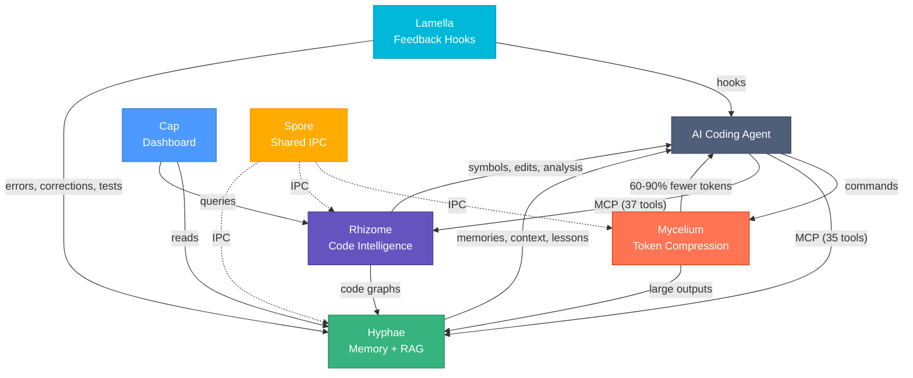
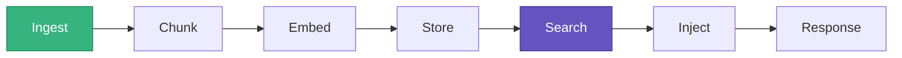
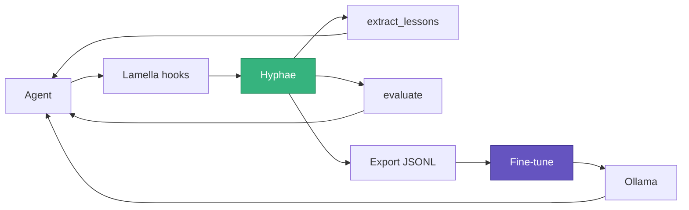
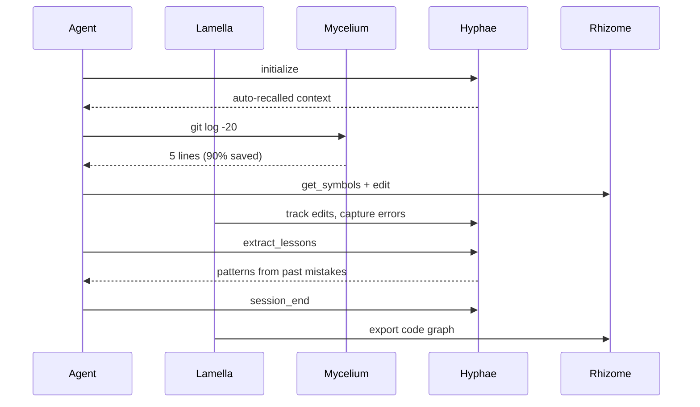

# Basidiocarp

Infrastructure for AI coding agents.

## Install

```bash
curl -fsSL https://raw.githubusercontent.com/basidiocarp/.github/main/install.sh | sh
mycelium init --ecosystem
```

Downloads binaries, detects your MCP clients (Claude Code, Cursor, Windsurf, Continue, Claude Desktop), registers servers, installs hooks. Run `mycelium doctor` to verify.

## Projects

| Project | Purpose | Tools |
|---------|---------|-------|
| [Mycelium](https://github.com/basidiocarp/mycelium) | Token compression — 60-90% savings on 70+ commands | [Docs](https://github.com/basidiocarp/mycelium/tree/main/docs) |
| [Hyphae](https://github.com/basidiocarp/hyphae) | Persistent memory, RAG, knowledge graphs, training data export — 39 MCP tools | [Docs](https://github.com/basidiocarp/hyphae/tree/main/docs) |
| [Rhizome](https://github.com/basidiocarp/rhizome) | Code intelligence — 37 MCP tools, 32 languages, 17 with dedicated queries | [Docs](https://github.com/basidiocarp/rhizome/tree/main/docs) |
| [Cap](https://github.com/basidiocarp/cap) | Web dashboard — 11 pages, 60+ API endpoints | [Docs](https://github.com/basidiocarp/cap/tree/main/docs) |
| [Spore](https://github.com/basidiocarp/spore) | Shared IPC — tool discovery, JSON-RPC, subprocess MCP | — |
| [Lamella](https://github.com/basidiocarp/lamella) | Hooks and feedback capture for Claude Code | [Docs](https://github.com/basidiocarp/lamella/blob/main/docs) |

## Guides

| Guide | What it covers |
|-------|---------------|
| [Integration Guide](docs/INTEGRATION.md) | Internal architecture, external data flow, protocols, failure modes |
| [AI Concepts](docs/AI-CONCEPTS.md) | ML fundamentals, Bedrock comparison, RAG vs supervised vs unsupervised, DPO, self-hosting |
| [LLM Training](docs/LLM-TRAINING.md) | Fine-tuning pipeline, data export, Axolotl/Together.ai, Ollama serving |
| [Hyphae Training Data](https://github.com/basidiocarp/hyphae/blob/main/docs/TRAINING-DATA.md) | Data formats, volume estimates, SQL export |
| [Lamella Feedback Capture](https://github.com/basidiocarp/lamella/blob/main/docs/FEEDBACK-CAPTURE.md) | Hook data flow, correction/error capture |

## Architecture



## Technical Overview

### Hybrid Search — [Hyphae](https://github.com/basidiocarp/hyphae)

SQLite + sqlite-vec + FTS5. Query pipeline: 30% BM25 full-text + 70% cosine vector similarity. Embeddings via fastembed (local, 384-dim) or HTTP API (Ollama, OpenAI-compatible).

### RAG — [Hyphae](https://github.com/basidiocarp/hyphae) + [Lamella](https://github.com/basidiocarp/lamella)



Three chunking strategies (sliding window, by heading, by function). Auto-indexing via Lamella hooks when documents change. Auto-context injection on session start — recent sessions, decisions, and errors appended to MCP instructions.

### Memory Decay — [Hyphae](https://github.com/basidiocarp/hyphae)

`effective_rate = base_decay × importance_multiplier / (1 + access_count × 0.1)`

Critical memories never decay. Frequently accessed ones decay slower. Auto-runs on recall.

### Knowledge Graphs — [Hyphae](https://github.com/basidiocarp/hyphae) + [Rhizome](https://github.com/basidiocarp/rhizome)

Memoirs store permanent concept graphs with typed relations. Rhizome auto-generates code graphs from tree-sitter analysis and exports them to Hyphae memoirs.

### Code Parsing — [Rhizome](https://github.com/basidiocarp/rhizome)

18 languages with tree-sitter grammars (10 with dedicated queries, 8 with generic fallback). 32 languages with LSP server configs, 20+ with auto-install. Backend auto-selected per tool call.

### Feedback Loop — [Lamella](https://github.com/basidiocarp/lamella) → [Hyphae](https://github.com/basidiocarp/hyphae)



Hooks capture corrections, errors, test failures, PR reviews. `extract_lessons` surfaces recurring patterns. `evaluate` measures agent improvement over time. Accumulated data exports as SFT/DPO pairs for fine-tuning. See the [AI Concepts](docs/AI-CONCEPTS.md) and [Training](docs/LLM-TRAINING.md) guides.

### Token Compression — [Mycelium](https://github.com/basidiocarp/mycelium)

70+ regex-based command filters. Adaptive: small outputs pass through, medium get filtered, large get chunked into Hyphae. 60-90% savings.

## Session Flow


