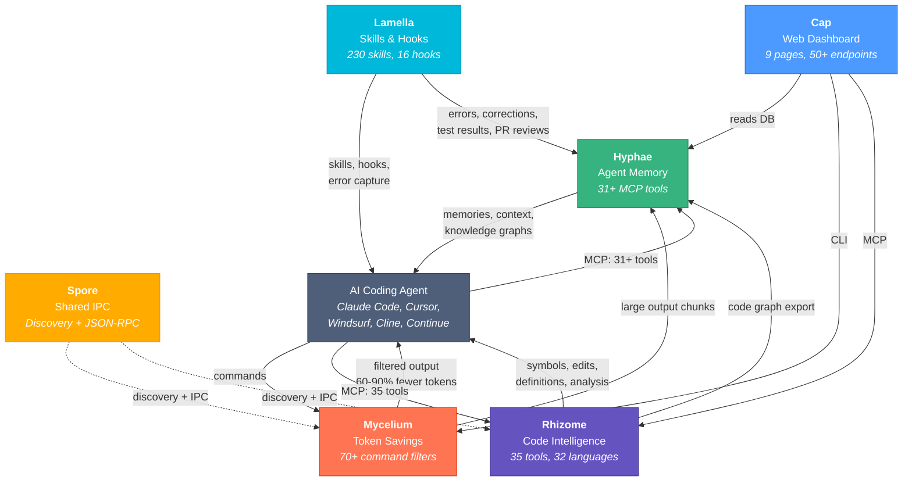
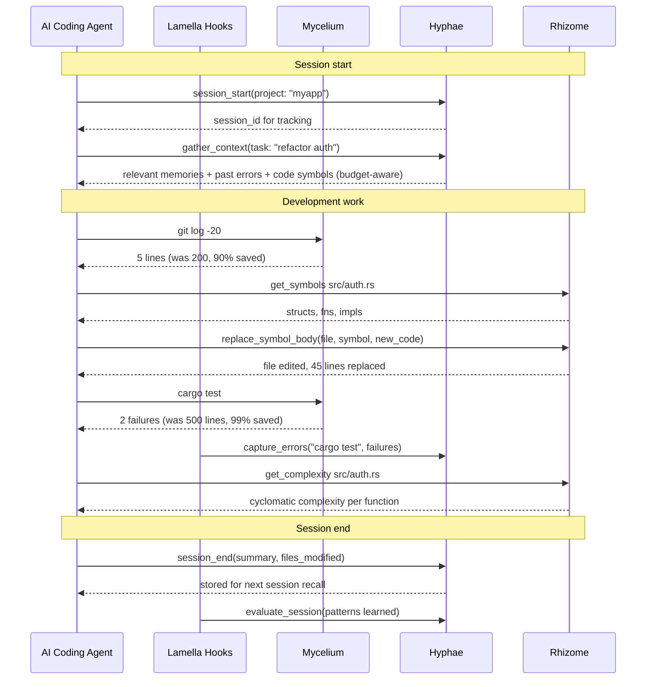

# Basidiocarp

Infrastructure for AI coding agents. Named after the fungal fruiting body — the visible structure that emerges from an underground mycelial network.

## Install

```bash
# Install everything (mycelium, hyphae, rhizome)
curl -fsSL https://raw.githubusercontent.com/basidiocarp/.github/main/install.sh | sh

# Install specific tools
curl -fsSL https://raw.githubusercontent.com/basidiocarp/.github/main/install.sh | sh -s -- --tools mycelium,hyphae

# Custom install directory
curl -fsSL https://raw.githubusercontent.com/basidiocarp/.github/main/install.sh | sh -s -- --prefix /usr/local/bin

# Uninstall
curl -fsSL https://raw.githubusercontent.com/basidiocarp/.github/main/install.sh | sh -s -- --uninstall
```

The installer downloads pre-built binaries, auto-detects your MCP clients (Claude Code, Cursor, Windsurf, Continue, Claude Desktop), configures MCP servers and hooks, and verifies the installation. Supports macOS (arm64/x86_64) and Linux (x86_64/aarch64).

### Configure

```bash
# Auto-detect all editors and configure everything
mycelium init --ecosystem

# Interactive guided setup (recommended for first time)
mycelium init --onboard

# Configure a specific editor
mycelium init --ecosystem --client cursor
mycelium init --ecosystem --client windsurf
mycelium init --ecosystem --client continue
mycelium init --ecosystem --client claude-desktop

# Print JSON config for any MCP client
mycelium init --ecosystem --client generic
```

### Verify

```bash
mycelium doctor    # Token proxy health
hyphae doctor      # Memory system health (DB integrity, FTS, MCP registration)
rhizome doctor     # Code intelligence health (parsers, LSP servers, export cache)
```

## Update

```bash
# Update all installed tools
curl -fsSL https://raw.githubusercontent.com/basidiocarp/.github/main/update.sh | sh

# Check for updates without installing
curl -fsSL https://raw.githubusercontent.com/basidiocarp/.github/main/update.sh | sh -s -- --check

# Or individually
mycelium self-update
hyphae self-update
rhizome self-update
```

## Projects

### [Mycelium](https://github.com/basidiocarp/mycelium)
Token-optimized CLI proxy. Intercepts command output and compresses it before it reaches the LLM, cutting token usage by 60-90% on 70+ command types. Routes large outputs to Hyphae for chunked storage. Includes `mycelium context <task>` for smart context briefings and `mycelium init --onboard` for guided ecosystem setup. Single Rust binary, works with any MCP client.

### [Hyphae](https://github.com/basidiocarp/hyphae)
Persistent memory for AI agents with 31+ MCP tools. Two memory models: **episodic memories** (temporal, decay-based, cross-project sharing via `_shared` pool) and **semantic memoirs** (knowledge graphs with typed concept relations). Code-aware recall expands search queries with Rhizome's symbol graph. Session lifecycle tracking (`session_start/end/context`). Imports Claude Code auto-memories. Conversation search across past sessions. HTTP embedding support (Ollama, OpenAI-compatible). Rust, SQLite, FTS5, sqlite-vec.

### [Rhizome](https://github.com/basidiocarp/rhizome)
Code intelligence MCP server with 35 tools across 32 languages. Dual backend: tree-sitter (instant offline parsing for 10 languages, zero setup) and LSP (cross-file references, rename, diagnostics — auto-installed). Includes 7 file editing tools (`replace_symbol_body`, `insert_after/before_symbol`, line-level edits, `create_file`), project summarization, and code graph export to Hyphae. Backend auto-selected per tool call. Rust.

### [Cap](https://github.com/basidiocarp/cap)
Web dashboard with 9+ pages and 50+ API endpoints. Memory browser, knowledge graph explorer (force-graph), token savings analytics, code explorer with annotations + complexity, ecosystem architecture diagram (ReactFlow), usage & cost tracking, agent telemetry, operational modes (Explore/Develop/Review), and quick context search. React 19, Mantine 8, Hono, Vite.

### [Spore](https://github.com/basidiocarp/spore)
Shared IPC library. Tool discovery, JSON-RPC 2.0 primitives, project detection, and subprocess MCP communication. Used by mycelium and rhizome. Rust.

### [Lamella](https://github.com/basidiocarp/lamella)
Plugin system for Claude Code. 230 curated skills, 175 agents, 213 commands across 20 plugins. Real-time hooks that capture errors, corrections, test results, and PR reviews into Hyphae memory. LSP configs for Rust, TypeScript, Python. Official Claude Code plugin format with marketplace support.

## How They Connect



## Agent Data Flow



## Optional Extras

```bash
# Cap web dashboard
cd cap && npm run dev:all          # http://localhost:5173

# Lamella plugins
cd lamella && make build-marketplace
# In Claude Code: /plugin marketplace add ./dist

# Import existing Claude Code memories
hyphae import-claude-memory

# Index past conversations for search
hyphae ingest-sessions

# Cross-project knowledge
hyphae project list               # See all projects
hyphae project search "auth"      # Search across projects

# Smart context briefing
mycelium context "refactor auth middleware"
```

## Built With

Rust (mycelium, hyphae, rhizome, spore) and TypeScript (cap). All Rust projects target edition 2024, use clippy pedantic linting, and follow anyhow/thiserror error handling conventions. 1,868+ tests across the ecosystem.
